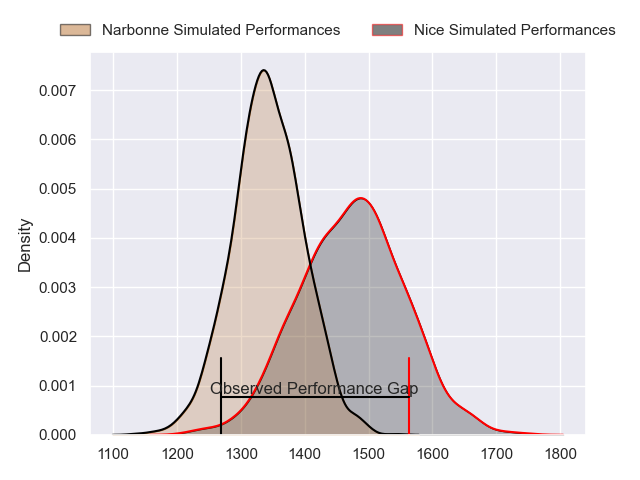
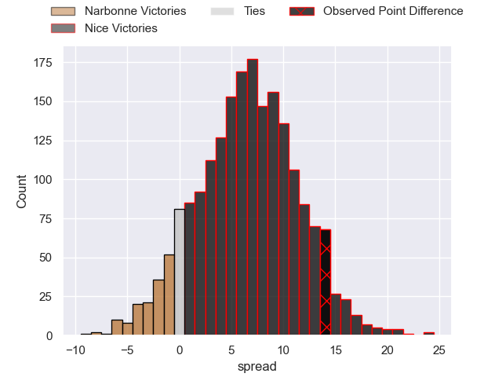
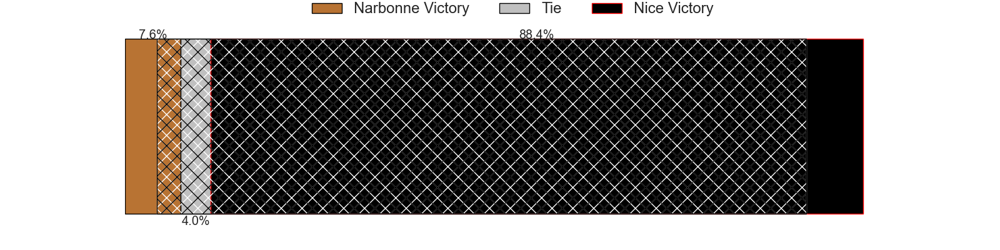
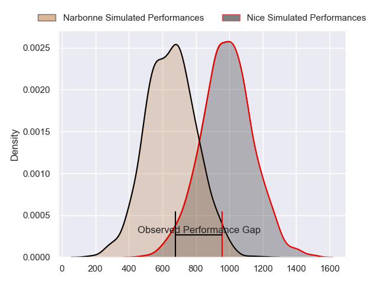
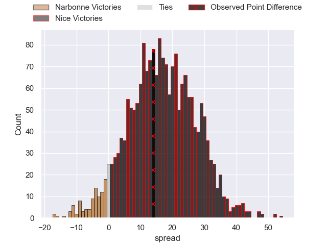
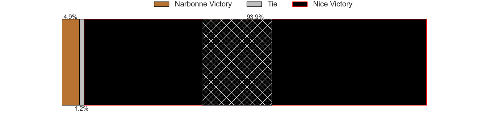
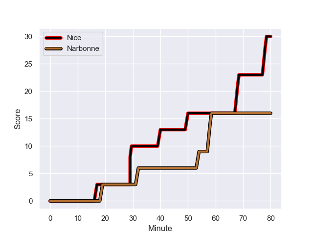
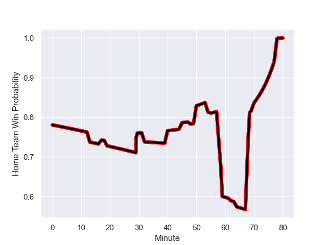

---  
layout: page  
title: Narbonne at Nice; 16-30  
date: 2024-01-27 18:00:00 -0500  
categories: "Nationale 2023" match review  
---
# Narbonne at Nice; 16-30

# Club Level Predictions

The first set of predictions treats a club as the smallest object, as the club develops its members, organizes a gameplan, and deploys its players as needed for each match. This club model has a prediction of 0.679, which translates to predicting Nice to win by 6.6.

Our Over/Under is 41.5 - and combined with the spread above, we have a predicted scoreline of 17 to 24

Each club has a rating and a rating deviation (similar to a Glicko rating), and expected performances can be generated. This allows for simulated matches and spreads like the ones below.
## Projected Performances - Club Model

## Projected Spreads - Club Model

## Projected Results - Club Model

# Player Level Predictions - Version 2

Treating teams instead as an entity made up of the currently active players, I have ratings for each player in an altogether different system. These can be combined to form team ratings once teamsheets are announced, weighting starters a bit higher than the reserves. After the match is played, players can be weighted by their minutes on the field, allowing for an accurate measure of the team's composition. With these compiled team ratings, we can make predictions, measure inaccuracy, and update the individual player ratings.
## Prediction with Player Minutes: Nice by 13.9

Nice by 10.5 on a neutral field
## Prediction without Player Minutes: Nice by 14.3

Nice by 10.9 on a neutral pitch

## Projected Performances - Player Model

## Projected Spreads - Player Model

## Projected Results - Player Model

## Scores over Time

## Win Probability over Time

There were 10 large changes in win probability in this match

|   Away Minutes | Away Player            |   Away elo |   Number |   Home elo | Home Player               |   Home Minutes |
|---------------:|:-----------------------|-----------:|---------:|-----------:|:--------------------------|---------------:|
|             45 | Geoffrey Moise         |      18.41 |        1 |      19.2  | Jules Martinez            |             54 |
|             50 | Christophe David       |      62.79 |        2 |      70.17 | Sione Anga'aelangi        |             59 |
|             55 | Mohammed Loukia        |      31.05 |        3 |      28.81 | Luvuyo Pupuma             |             54 |
|             80 | Marius Antonescu       |      53.12 |        4 |      71.33 | Yann Tivoli               |             80 |
|             48 | Dennis Visser          |      18.22 |        5 |     161.79 | Tom Murday                |             59 |
|             80 | Thibault Clauzade      |      49    |        6 |      87.03 | Louis Suaud               |             80 |
|             13 | Baptiste Abescat-Leroy |      34.3  |        7 |      49.47 | Arthur Vignolles          |             80 |
|             80 | Charles Malet          |      -2.65 |        8 |      56.5  | Martin Freytes            |             59 |
|             62 | Pierrick Nova          |      35.87 |        9 |      51.81 | Jules Solinas             |             64 |
|             80 | Tom Chauvet            |      38.23 |       10 |      59.16 | Mathis Viard              |             59 |
|             80 | Pierre-Hugo Ducom      |      22.32 |       11 |      80.8  | Andrzej Charlat           |             80 |
|             70 | Peter Betham           |     120.61 |       12 |      52.9  | Romain Riguet             |             80 |
|             80 | Pierre Nueno           |      39.05 |       13 |      59    | Nathan Courtade           |             80 |
|             45 | Clément Clavières      |      68.05 |       14 |      47.82 | Simon Delas               |             80 |
|             80 | Paul Auradou           |      49.15 |       15 |      49.33 | David Odiete              |             80 |
|             35 | Sylvain Abadie         |      30.3  |       16 |      57.09 | Sunia Vola                |             26 |
|             30 | Mehdi Boundjema        |      49.78 |       17 |      41.81 | Santiago Benjamin Ovejero |             21 |
|             25 | Jamie Hagan            |      44.61 |       18 |      44.88 | Nicolas Ciancio           |             26 |
|             32 | Mohamed Kbaier         |      35.08 |       19 |      78.61 | Adrien Vigne              |             21 |
|             67 | Luke Nakobukobua       |      75.18 |       20 |     -24.11 | Alban Conduche            |             21 |
|             18 | Pablo Barbaste         |      46.5  |       21 |      21.94 | Matéo Jeune-Joly          |             16 |
|             10 | James Kane             |      63.21 |       22 |      72.45 | Laijiasa Bolenaivalu      |             21 |
|             35 | Sébastien Giorgis      |      17.13 |       23 |     nan    | nan                       |            nan |

