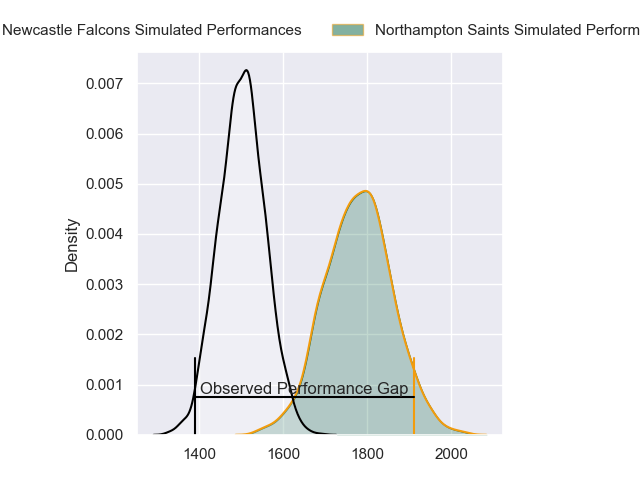
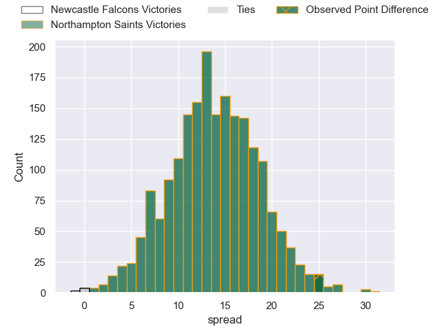
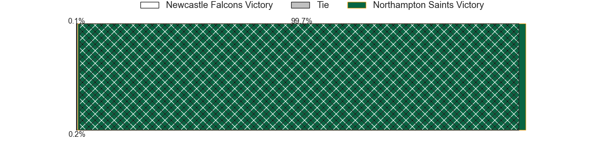
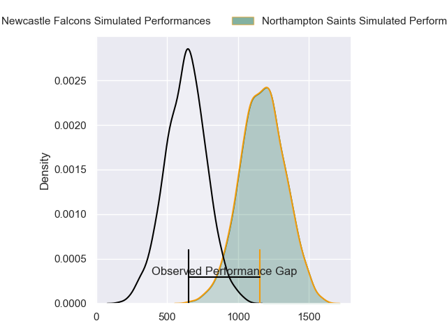
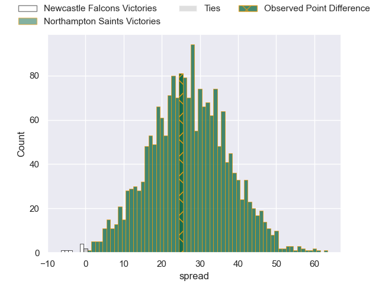
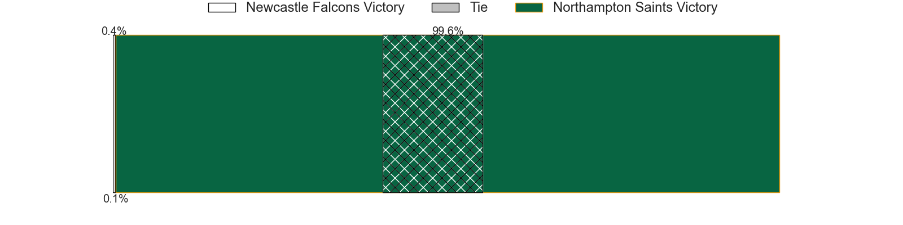
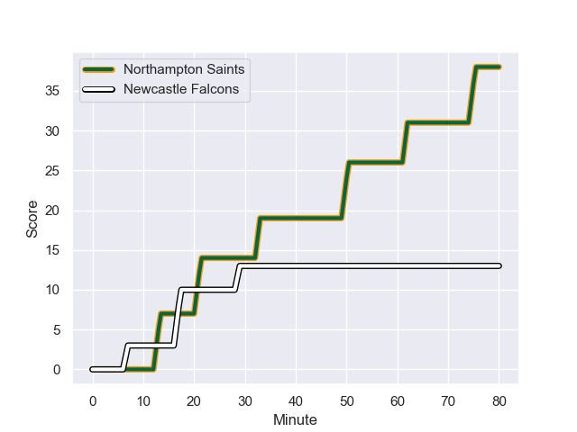
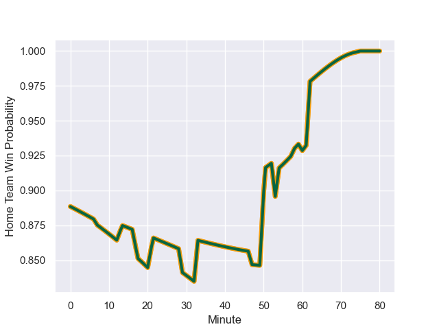

---  
layout: page  
title: Newcastle Falcons at Northampton Saints; 13-38  
date: 2024-01-27 18:00:00 -0500  
categories: "Gallagher Premiership 2023" match review  
---
# Newcastle Falcons at Northampton Saints; 13-38

# Club Level Predictions

The first set of predictions treats a club as the smallest object, as the club develops its members, organizes a gameplan, and deploys its players as needed for each match. This club model has a prediction of 0.827, which translates to predicting Northampton Saints to win by 13.8.

Our Over/Under is 50.5 - and combined with the spread above, we have a predicted scoreline of 19 to 32

Each club has a rating and a rating deviation (similar to a Glicko rating), and expected performances can be generated. This allows for simulated matches and spreads like the ones below.
## Projected Performances - Club Model

## Projected Spreads - Club Model

## Projected Results - Club Model

# Player Level Predictions - Version 2

Treating teams instead as an entity made up of the currently active players, I have ratings for each player in an altogether different system. These can be combined to form team ratings once teamsheets are announced, weighting starters a bit higher than the reserves. After the match is played, players can be weighted by their minutes on the field, allowing for an accurate measure of the team's composition. With these compiled team ratings, we can make predictions, measure inaccuracy, and update the individual player ratings.
## Prediction with Player Minutes: Northampton Saints by 22.7

Northampton Saints by 15.1 on a neutral field
## Prediction without Player Minutes: Northampton Saints by 23.3

Northampton Saints by 15.7 on a neutral pitch

## Projected Performances - Player Model

## Projected Spreads - Player Model

## Projected Results - Player Model

## Scores over Time

## Win Probability over Time

There were 3 large changes in win probability in this match

|   Away Minutes | Away Player         |   Away elo |   Number |   Home elo | Home Player         |   Home Minutes |
|---------------:|:--------------------|-----------:|---------:|-----------:|:--------------------|---------------:|
|             58 | Phil Brantingham    |      27.66 |        1 |     101.93 | Alex Waller         |             53 |
|             60 | Bryan Byrne         |      57.05 |        2 |      64.07 | Sam Matavesi        |             69 |
|             47 | Murray McCallum     |      45.12 |        3 |       8.81 | Trevor Davison      |             62 |
|             58 | John Hawkins        |      14.76 |        4 |      93.71 | Temo Mayanavanua    |             49 |
|             80 | Sebastian de Chaves |      -4.91 |        5 |      57.25 | Chunya Munga        |             80 |
|             73 | Sam Cross           |      47.77 |        6 |     112.17 | Courtney Lawes      |             62 |
|             80 | Guy Pepper          |      36.23 |        7 |      57.21 | Lewis Ludlam        |             60 |
|             80 | Callum Chick        |       8.7  |        8 |     117.57 | Sam Graham          |             80 |
|             54 | Hugh O'Sullivan     |      34.23 |        9 |       4.66 | Tom James           |             80 |
|             80 | Brett Connon        |      41.87 |       10 |      30    | Charlie Savala      |             80 |
|             47 | Ben Stevenson       |      43.35 |       11 |     112.78 | Ollie Sleightholme  |             80 |
|             47 | Cameron Hutchison   |      55.64 |       12 |      53.02 | Tom Litchfield      |             80 |
|             80 | Matias Moroni       |     118.67 |       13 |      75.63 | Burger Odendaal     |             67 |
|             80 | Adam Radwan         |      99.66 |       14 |      91.83 | Gabriel Hamer-Webb  |             64 |
|             80 | Elliott Obatoyinbo  |      22.57 |       15 |      64.13 | Rory Hutchinson     |             80 |
|             22 | Adam Brocklebank    |      -1.7  |       16 |      51.19 | Tarek Haffar        |             27 |
|             20 | Michael van Vuuren  |      51.8  |       17 |      44.24 | Robbie Smith        |             11 |
|             33 | Eduardo Bello       |      26.16 |       18 |      27.79 | Elliot Millar-Mills |             18 |
|             22 | Tim Cardall         |      41.99 |       19 |      93.69 | Alex Moon           |             31 |
|              7 | Josh Bainbridge     |       2.83 |       20 |      34.2  | Angus Scott-Young   |             18 |
|             26 | Sam Stuart          |     -18.15 |       21 |      56.57 | Juarno Augustus     |             20 |
|             33 | Mateo Carreras      |      60.25 |       22 |       0.75 | Callum Braley       |             13 |
|             33 | Rory Jennings       |      57.37 |       23 |      51.91 | Josh Matavesi       |             16 |

