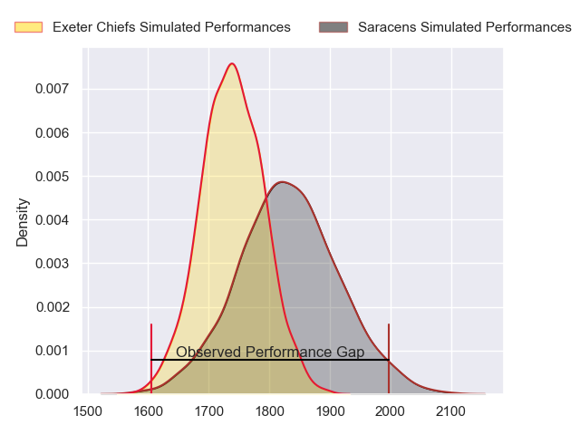
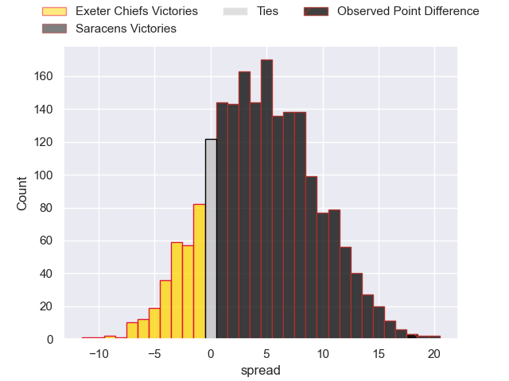
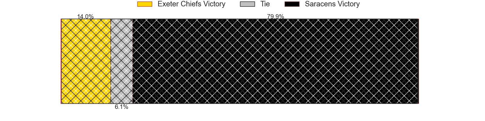
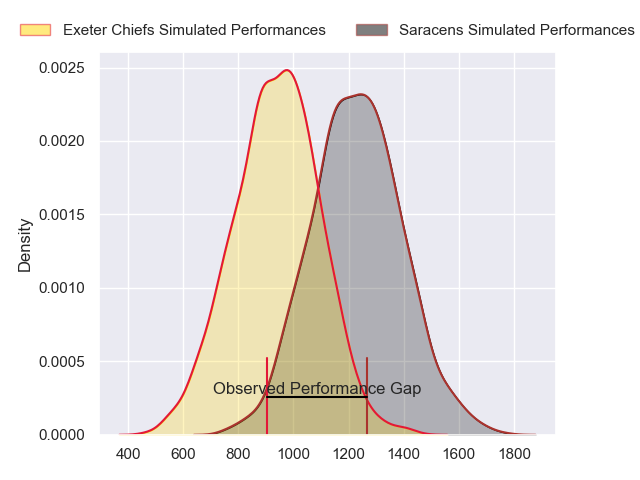
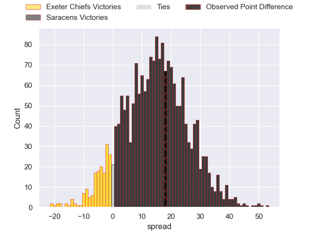
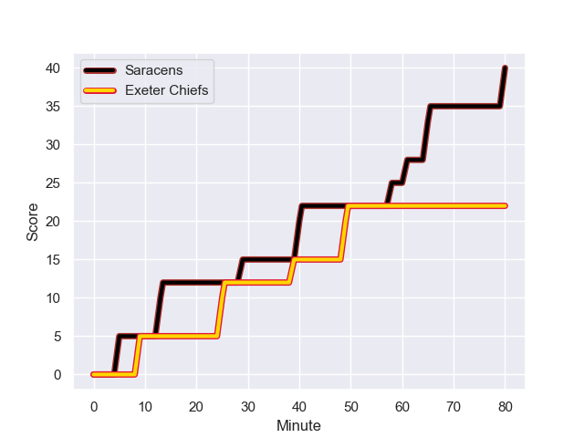
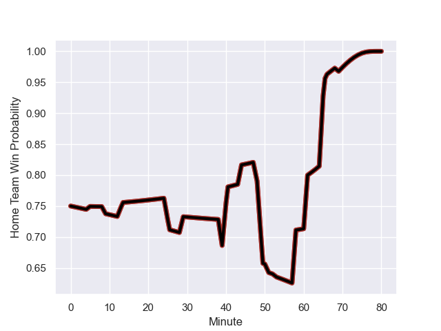

---  
layout: page  
title: Exeter Chiefs at Saracens; 22-40  
date: 2024-01-27 18:00:00 -0500  
categories: "Gallagher Premiership 2023" match review  
---
# Exeter Chiefs at Saracens; 22-40

# Club Level Predictions

The first set of predictions treats a club as the smallest object, as the club develops its members, organizes a gameplan, and deploys its players as needed for each match. This club model has a prediction of 0.622, which translates to predicting Saracens to win by 4.4.

Our Over/Under is 48.5 - and combined with the spread above, we have a predicted scoreline of 22 to 26

Each club has a rating and a rating deviation (similar to a Glicko rating), and expected performances can be generated. This allows for simulated matches and spreads like the ones below.
## Projected Performances - Club Model

## Projected Spreads - Club Model

## Projected Results - Club Model

# Player Level Predictions - Version 2

Treating teams instead as an entity made up of the currently active players, I have ratings for each player in an altogether different system. These can be combined to form team ratings once teamsheets are announced, weighting starters a bit higher than the reserves. After the match is played, players can be weighted by their minutes on the field, allowing for an accurate measure of the team's composition. With these compiled team ratings, we can make predictions, measure inaccuracy, and update the individual player ratings.
## Prediction with Player Minutes: Saracens by 12.1

Saracens by 5.0 on a neutral field
## Prediction without Player Minutes: Saracens by 10.3

Saracens by 3.3 on a neutral pitch

## Projected Performances - Player Model

## Projected Spreads - Player Model

## Projected Results - Player Model

## Scores over Time

## Win Probability over Time

There were 13 large changes in win probability in this match

|   Away Minutes | Away Player       |   Away elo |   Number |   Home elo | Home Player          |   Home Minutes |
|---------------:|:------------------|-----------:|---------:|-----------:|:---------------------|---------------:|
|             66 | Alec Hepburn      |      65.39 |        1 |     104.62 | Logovi'i Mulipola    |             51 |
|             53 | Jack Yeandle      |      87.37 |        2 |      42.58 | James Hadfield       |             80 |
|             48 | Marcus Street     |      26.07 |        3 |      57.74 | Christian Judge      |             51 |
|             53 | Rusiate Tuima     |      31.96 |        4 |      48.22 | Theo McFarland       |             80 |
|             80 | Dafydd Jenkins    |      98.57 |        5 |      40.99 | Hugh Tizard          |             78 |
|             80 | Lewis Pearson     |      53.25 |        6 |      93.35 | Juan Martin Gonzalez |             80 |
|             80 | Jacques Vermeulen |      85.6  |        7 |      35.63 | Andy Christie        |             80 |
|             66 | Greg Fisilau      |      82.88 |        8 |     140.55 | Billy Vunipola       |             69 |
|             53 | Stu Townsend      |      89.33 |        9 |      71.16 | Ivan van Zyl         |             77 |
|             80 | Harvey Skinner    |      56.39 |       10 |     129.95 | Owen Farrell         |             80 |
|             66 | Olly Woodburn     |     121.78 |       11 |      61.68 | Alex Lewington       |             80 |
|             80 | Ollie Devoto      |      41.36 |       12 |      19.58 | Olly Hartley         |             55 |
|             80 | Zack Wimbush      |      46.65 |       13 |     100.39 | Nick Tompkins        |             80 |
|             80 | Ben Hammersley    |      63.7  |       14 |      42.01 | Rotimi Segun         |             44 |
|             80 | Josh Hodge        |       1.68 |       15 |      62.62 | Alex Goode           |             80 |
|             14 | Danny Southworth  |      51.16 |       16 |      47.76 | Sam Crean            |             26 |
|             27 | Dan Frost         |      64.07 |       17 |      94.5  | Oli Hoskins          |             29 |
|             32 | Josh Iosefa-Scott |      98.91 |       18 |      27.98 | Ollie Stonham        |              2 |
|             27 | Jack Dunne        |      22.22 |       19 |      27.74 | Toby Knight          |             11 |
|             14 | Ross Vintcent     |      52.57 |       20 |      30.87 | Gareth Simpson       |              3 |
|             27 | Tom Cairns        |      59.88 |       21 |      43.07 | Lucio Cinti          |             25 |
|             14 | Arthur Relton     |      55.14 |       22 |     105.32 | Tom Parton           |             36 |
|            nan | nan               |     nan    |       23 |      50.98 | Eroni Mawi           |              3 |

