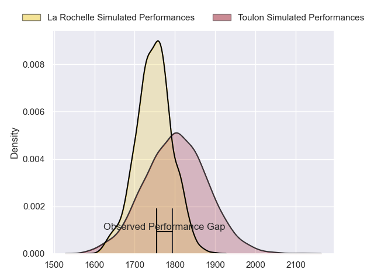
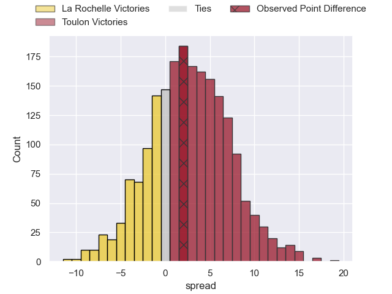
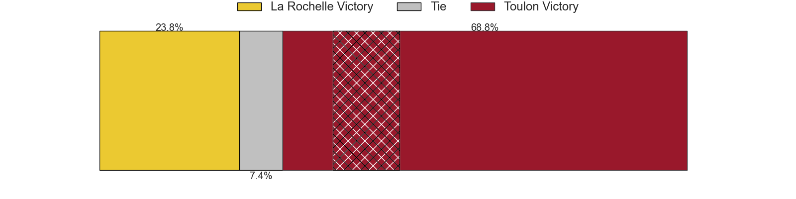
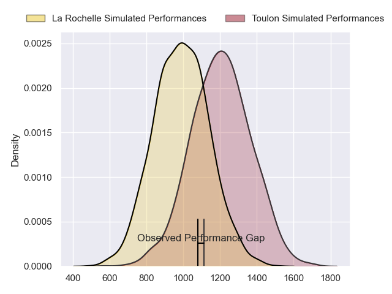
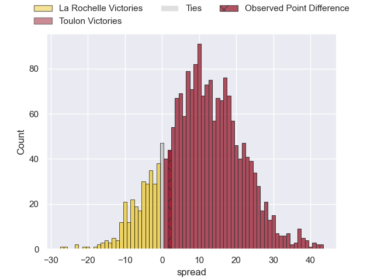
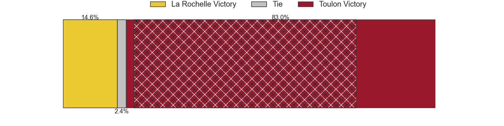
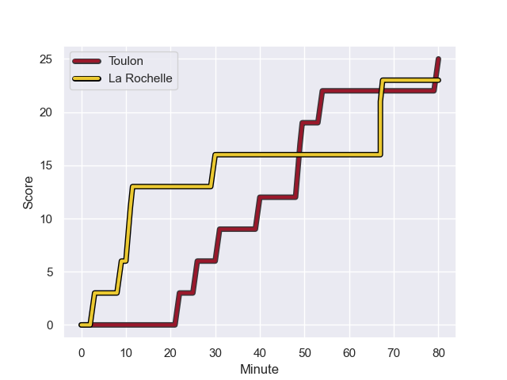
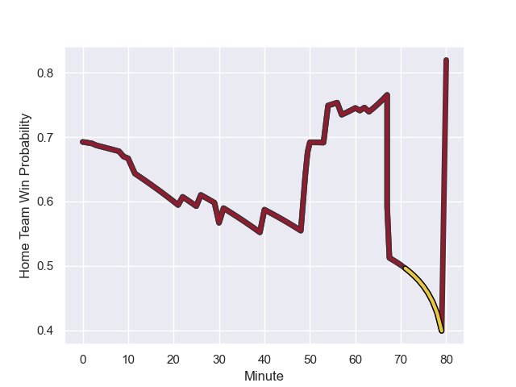

---  
layout: page  
title: La Rochelle at Toulon; 23-25  
date: 2024-01-27 18:00:00 -0500  
categories: "Top 14 Orange 2023" match review  
---
# La Rochelle at Toulon; 23-25

# Club Level Predictions

The first set of predictions treats a club as the smallest object, as the club develops its members, organizes a gameplan, and deploys its players as needed for each match. This club model has a prediction of 0.577, which translates to predicting Toulon to win by 2.7.

Our Over/Under is 36.5 - and combined with the spread above, we have a predicted scoreline of 17 to 20

Each club has a rating and a rating deviation (similar to a Glicko rating), and expected performances can be generated. This allows for simulated matches and spreads like the ones below.
## Projected Performances - Club Model

## Projected Spreads - Club Model

## Projected Results - Club Model

# Player Level Predictions - Version 2

Treating teams instead as an entity made up of the currently active players, I have ratings for each player in an altogether different system. These can be combined to form team ratings once teamsheets are announced, weighting starters a bit higher than the reserves. After the match is played, players can be weighted by their minutes on the field, allowing for an accurate measure of the team's composition. With these compiled team ratings, we can make predictions, measure inaccuracy, and update the individual player ratings.
## Prediction with Player Minutes: Toulon by 8.9

Toulon by 1.7 on a neutral field
## Prediction without Player Minutes: Toulon by 9.1

Toulon by 1.9 on a neutral pitch

## Projected Performances - Player Model

## Projected Spreads - Player Model

## Projected Results - Player Model

## Scores over Time

## Win Probability over Time

There were 9 large changes in win probability in this match

|   Away Minutes | Away Player           |   Away elo |   Number |   Home elo | Home Player                    |   Home Minutes |
|---------------:|:----------------------|-----------:|---------:|-----------:|:-------------------------------|---------------:|
|             69 | Louis Penverne        |      46.5  |        1 |      73.93 | Dany Priso                     |             53 |
|             50 | Tolu Latu             |      84.84 |        2 |      51.75 | Teddy Baubigny                 |             53 |
|             50 | Aleksandre Kuntelia   |      33.71 |        3 |      58.7  | Beka Gigashvili                |             61 |
|             80 | Thomas Lavault        |      78.29 |        4 |      76.87 | David Ribbans                  |             80 |
|             57 | Remi Picquette        |      39.28 |        5 |      70.69 | Brian Alainu'uese              |             63 |
|             80 | Judicael Cancoriet    |      38.43 |        6 |      84.17 | Cornell du Preez               |             80 |
|             80 | Levani Botia          |     106.25 |        7 |      49.72 | Esteban Abadie                 |             80 |
|             66 | Yoan Tanga            |      58.06 |        8 |      95.69 | Facundo Isa                    |             63 |
|             57 | Teddy Iribaren        |      91.77 |        9 |      71.86 | Ben White                      |             57 |
|             80 | Ihaia West            |      34.84 |       10 |      22.89 | Jérémy Sinzelle                |             80 |
|             80 | Jack Nowell           |     103.18 |       11 |      97.33 | Leicester Fainga'anuku         |             80 |
|             57 | Simeli Daunivucu      |      47.04 |       12 |      64.15 | Duncan Paia'aua                |             80 |
|             80 | Ulupano Seuteni       |      43.3  |       13 |     134.43 | Waisea Nayacalevu Vuidravuwalu |             70 |
|             80 | Teddy Thomas          |      72.74 |       14 |      41.3  | Gael Drean                     |             80 |
|             57 | Brice Dulin           |     108.94 |       15 |      64.66 | Melvyn Jaminet                 |             80 |
|             30 | Quentin Lespiaucq     |      55.57 |       16 |      88.62 | Christopher Tolofua            |             27 |
|             30 | Georges-Henri Colombe |       0.35 |       17 |      36.56 | Bruce Devaux                   |             27 |
|             23 | Will Skelton          |      97.89 |       18 |      29.47 | Vasil Lobzhanidze              |             23 |
|             23 | Tawera Kerr-Barlow    |     113.23 |       19 |      34.22 | Kieran Brookes                 |             19 |
|             23 | Antoine Hastoy        |      42.48 |       20 |      43.99 | Matthias Halagahu              |             17 |
|             23 | Dillyn Leyds          |     109.31 |       21 |      85.5  | Selevasio Tolofua              |             17 |
|             14 | Matthias Haddad       |      46.25 |       22 |      60.45 | Seta Tuicuvu                   |             10 |
|             11 | Karl Sorin            |      40.94 |       23 |     nan    | nan                            |            nan |

