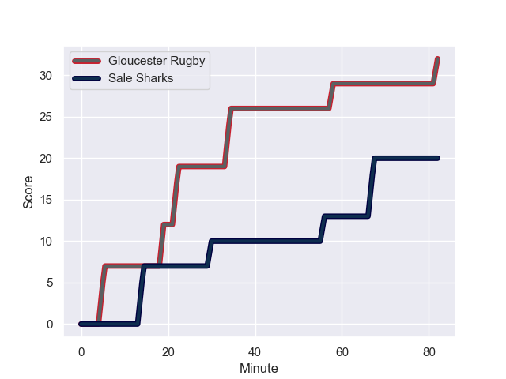
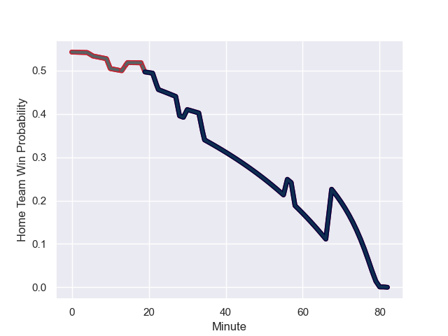

---  
layout: page  
title: Sale Sharks at Gloucester Rugby; 20-32  
date: 2024-01-28 18:00:00 -0500  
categories: "Gallagher Premiership 2023" match review  
---
# Sale Sharks at Gloucester Rugby; 20-32

# Club Level Predictions

The first set of predictions treats a club as the smallest object, as the club develops its members, organizes a gameplan, and deploys its players as needed for each match. This club model has a prediction of 0.486, which translates to predicting Sale Sharks to win by 0.5.

Our Over/Under is 45.5 - and combined with the spread above, we have a predicted scoreline of 23 to 22

Each club has a rating and a rating deviation (similar to a Glicko rating), and expected performances can be generated. This allows for simulated matches and spreads like the ones below.
## Projected Performances - Club Model

## Projected Spreads - Club Model

## Projected Results - Club Model

# Player Level Predictions - Version 2

Treating teams instead as an entity made up of the currently active players, I have ratings for each player in an altogether different system. These can be combined to form team ratings once teamsheets are announced, weighting starters a bit higher than the reserves. After the match is played, players can be weighted by their minutes on the field, allowing for an accurate measure of the team's composition. With these compiled team ratings, we can make predictions, measure inaccuracy, and update the individual player ratings.
## Prediction with Player Minutes: Gloucester Rugby by 1.9

Sale Sharks by 6.2 on a neutral field
## Prediction without Player Minutes: Sale Sharks by 2.1

Sale Sharks by 10.2 on a neutral pitch

## Projected Performances - Player Model

## Projected Spreads - Player Model

## Projected Results - Player Model

## Scores over Time

## Win Probability over Time

There were 8 large changes in win probability in this match

|   Away Minutes | Away Player          |   Away elo |   Number |   Home elo | Home Player         |   Home Minutes |
|---------------:|:---------------------|-----------:|---------:|-----------:|:--------------------|---------------:|
|             40 | Simon McIntyre       |      84.22 |        1 |      10.7  | Jamal Ford-Robinson |             69 |
|             56 | Agustin Creevy       |      91.05 |        2 |      64.74 | George McGuigan     |             61 |
|             40 | Nic Schonert         |      40.91 |        3 |      71.08 | Kirill Gotovtsev    |             71 |
|             10 | Cobus Wiese          |      87.14 |        4 |      50.43 | Freddie Clarke      |             75 |
|             80 | Josh Beaumont        |      62.29 |        5 |      51.1  | Matias Alemanno     |             80 |
|             80 | Ernst van Rhyn       |      95.7  |        6 |     104.22 | Ruan Ackermann      |             68 |
|             80 | Sam Dugdale          |      35.08 |        7 |      41.74 | Lewis Ludlow        |             80 |
|             28 | Daniel du Preez      |      84.21 |        8 |      50.61 | Zach Mercer         |             80 |
|             56 | Gus Warr             |      42.18 |        9 |      56.15 | Caolan Englefield   |             72 |
|             80 | Robert du Preez      |      40.42 |       10 |      57.81 | Charlie Atkinson    |             80 |
|             80 | Arron Reed           |      83.01 |       11 |      87.77 | Ollie Thorley       |             80 |
|             80 | Sam Bedlow           |      80.11 |       12 |       6.67 | Sebastien Atkinson  |             80 |
|             80 | Sam James            |      99.18 |       13 |      53.36 | Chris Harris        |             80 |
|             52 | Telusa Veainu        |     143.65 |       14 |      43.48 | Alex Hearle         |             80 |
|             80 | Joe Carpenter        |      26.45 |       15 |      83.66 | Santiago Carreras   |             80 |
|             42 | Tumy Onasanya        |      47.86 |       16 |      26.29 | Harry Elrington     |             13 |
|             26 | Tommy Taylor         |      16.12 |       17 |      30.09 | Sebastian Blake     |             21 |
|             42 | James Harper         |      60.39 |       18 |      17.21 | Ciaran Knight       |             11 |
|             72 | Ben Bamber           |      52.41 |       19 |      82.86 | Albert Tuisue       |              7 |
|             40 | Rouben Birch         |       3.44 |       20 |      34.24 | Jack Clement        |             14 |
|             26 | Anerin (Nye) Thomas  |      29.06 |       21 |       5.58 | Stephen Varney      |             10 |
|             30 | Rekeiti Ma'asi-White |      48.33 |       22 |     nan    | nan                 |            nan |
|             14 | Tom Curry            |      74.02 |       23 |     nan    | nan                 |            nan |

