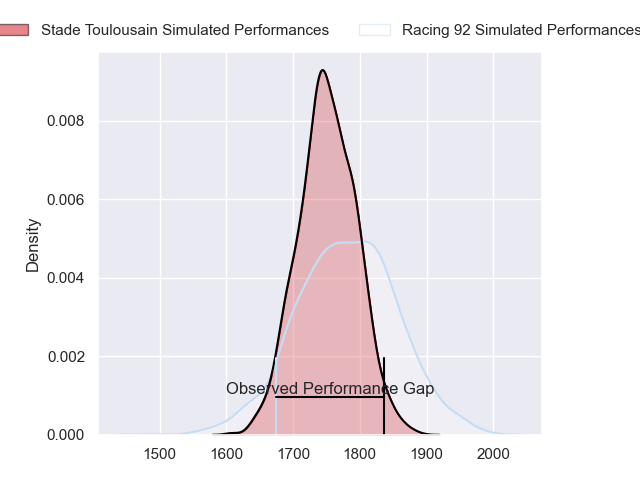
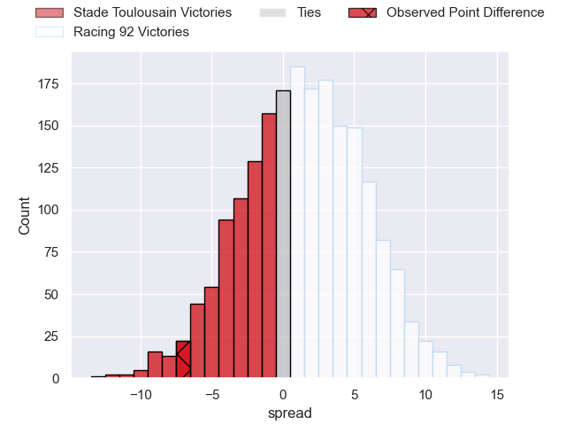
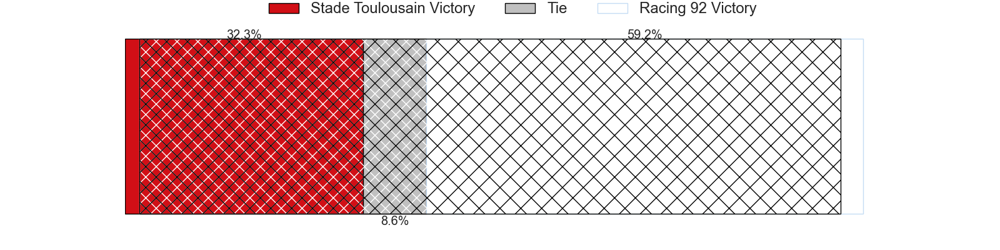
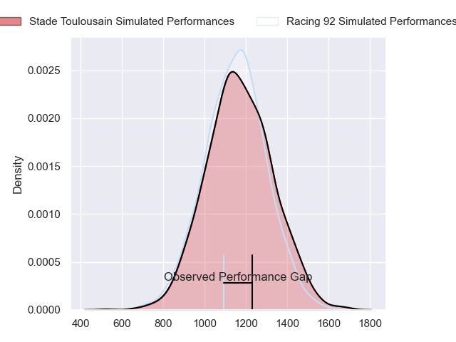
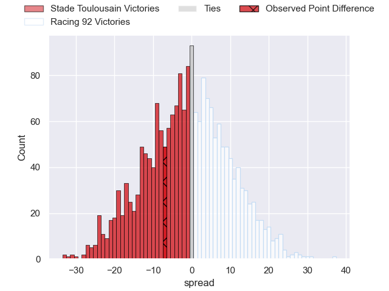
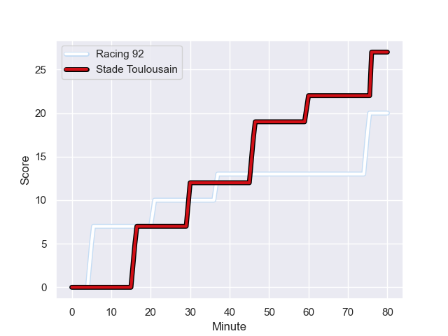
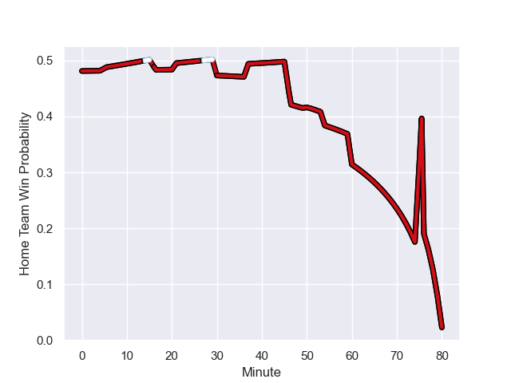

---  
layout: page  
title: Stade Toulousain at Racing 92; 27-20  
date: 2024-01-28 18:00:00 -0500  
categories: "Top 14 Orange 2023" match review  
---
# Stade Toulousain at Racing 92; 27-20

# Club Level Predictions

The first set of predictions treats a club as the smallest object, as the club develops its members, organizes a gameplan, and deploys its players as needed for each match. This club model has a prediction of 0.546, which translates to predicting Racing 92 to win by 1.6.

Our Over/Under is 45.5 - and combined with the spread above, we have a predicted scoreline of 22 to 24

Each club has a rating and a rating deviation (similar to a Glicko rating), and expected performances can be generated. This allows for simulated matches and spreads like the ones below.
## Projected Performances - Club Model

## Projected Spreads - Club Model

## Projected Results - Club Model

# Player Level Predictions - Version 2

Treating teams instead as an entity made up of the currently active players, I have ratings for each player in an altogether different system. These can be combined to form team ratings once teamsheets are announced, weighting starters a bit higher than the reserves. After the match is played, players can be weighted by their minutes on the field, allowing for an accurate measure of the team's composition. With these compiled team ratings, we can make predictions, measure inaccuracy, and update the individual player ratings.
## Prediction with Player Minutes: Stade Toulousain by 0.8

Stade Toulousain by 8.1 on a neutral field
## Prediction without Player Minutes: Racing 92 by 0.2

Stade Toulousain by 7.2 on a neutral pitch

## Projected Performances - Player Model

## Projected Spreads - Player Model

## Projected Results - Player Model

## Scores over Time

## Win Probability over Time

There were 10 large changes in win probability in this match

|   Away Minutes | Away Player          |   Away elo |   Number |   Home elo | Home Player        |   Home Minutes |
|---------------:|:---------------------|-----------:|---------:|-----------:|:-------------------|---------------:|
|             69 | Rodrigue Neti        |      26.94 |        1 |      42.29 | Hassane Kolingar   |             54 |
|             69 | Guillaume Cramont    |      60.3  |        2 |     108.85 | Camille Chat       |             54 |
|             54 | Nepo Laulala         |      71.82 |        3 |      51.57 | Trevor Nyakane     |             54 |
|             80 | Richie Arnold        |      30.04 |        4 |      77.07 | Boris Palu         |             80 |
|             54 | Piula Faasalele      |      58.29 |        5 |      22.04 | Veikoso Poloniati  |             65 |
|             80 | Jack Willis          |     112.43 |        6 |      31.27 | Ibrahim Diallo     |             50 |
|             69 | Alban Placines       |      27.64 |        7 |     108.39 | Siya Kolisi        |             80 |
|             63 | Alexandre Roumat     |      92.78 |        8 |      98.6  | Wenceslas Lauret   |             80 |
|             80 | Antoine Dupont       |     140.99 |        9 |      61.02 | Clovis Le bail     |             58 |
|             80 | Juan Cruz Mallia     |     104.26 |       10 |      42.02 | Martin Méliande    |             80 |
|             80 | Ange Capuozzo        |      99.74 |       11 |      46.98 | Donovan Taofifenua |             51 |
|             79 | Pita Ahki            |      22.24 |       12 |     118.36 | Henry Chavancy     |             65 |
|             63 | Sofiane Guitoune     |      87.66 |       13 |      29.84 | Olivier Klemenczak |             80 |
|             80 | Arthur Retiere       |      88.05 |       14 |      43.26 | Henry Arundell     |             80 |
|             80 | Blair Kinghorn       |     157.9  |       15 |      87.38 | Tristan Tedder     |             80 |
|             26 | Joel Merkler         |      56.25 |       16 |      42.03 | Maxime Baudonne    |             30 |
|             26 | Joshua Brennan       |      41.65 |       17 |      48.76 | Max Spring         |             29 |
|             17 | Léo Banos            |      77.94 |       18 |     103.3  | Eddy Ben Arous     |             26 |
|             17 | Pierre-Louis Barassi |      77.59 |       19 |      51.97 | Janick Tarrit      |             26 |
|             11 | Theo Ntamack         |      51.92 |       20 |      58.62 | Gia Kharaishvili   |             26 |
|             11 | Ian Boubila          |      31.25 |       21 |      56.18 | James Hall         |             22 |
|             11 | Paul Mallez          |      54.75 |       22 |      81.24 | Anthime Hemery     |             15 |
|              1 | Paul Graou           |      34.79 |       23 |      37.41 | Francis Saili      |             15 |

