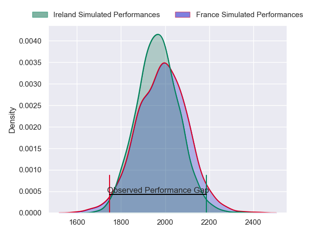
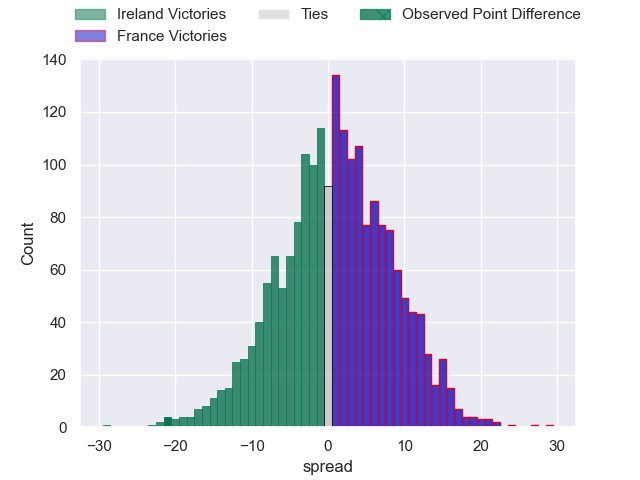
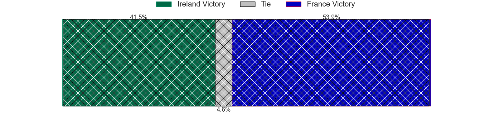
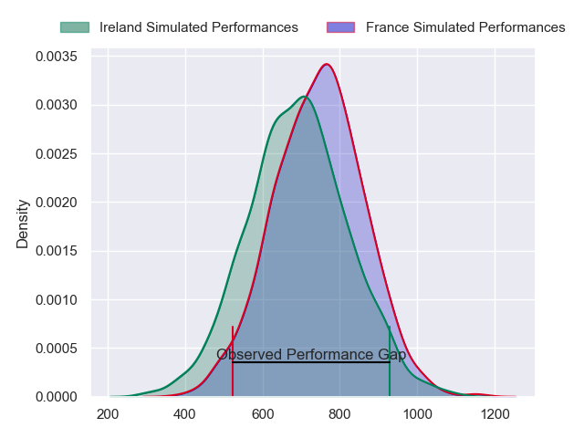
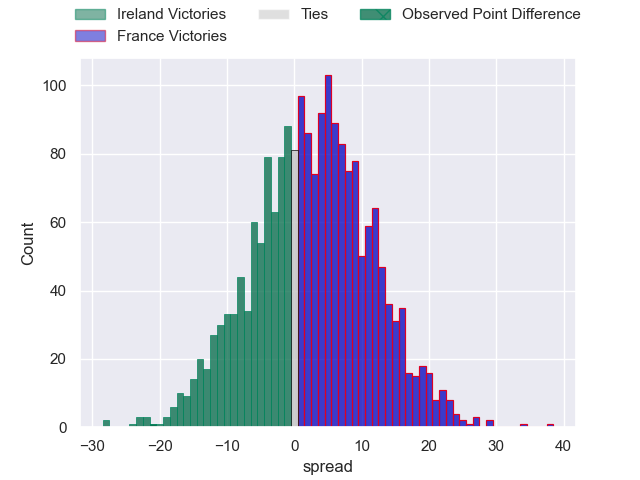
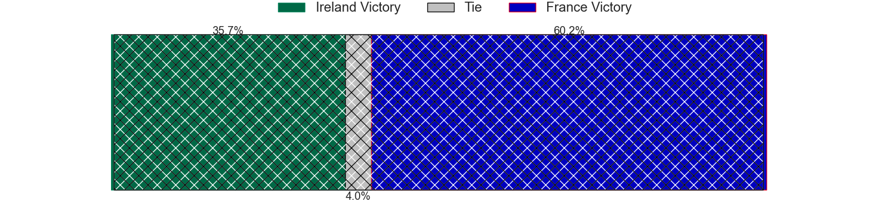

---  
layout: page  
title: Ireland at France; 38-17  
date: 2024-02-02 18:00:00 -0500  
categories: "Six Nations Championship 2024" match review  
---
# Ireland at France; 38-17

# Club Level Predictions

The first set of predictions treats a club as the smallest object, as the club develops its members, organizes a gameplan, and deploys its players as needed for each match. This club model has a prediction of 0.528, which translates to predicting France to win by 1.0.

Our Over/Under is 57.5 - and combined with the spread above, we have a predicted scoreline of 28 to 29

Each club has a rating and a rating deviation (similar to a Glicko rating), and expected performances can be generated. This allows for simulated matches and spreads like the ones below.
## Projected Performances - Club Model

## Projected Spreads - Club Model

## Projected Results - Club Model

# Player Level Predictions - Version 2

Treating teams instead as an entity made up of the currently active players, I have ratings for each player in an altogether different system. These can be combined to form team ratings once teamsheets are announced, weighting starters a bit higher than the reserves. After the match is played, players can be weighted by their minutes on the field, allowing for an accurate measure of the team's composition. With these compiled team ratings, we can make predictions, measure inaccuracy, and update the individual player ratings.
## Prediction with Player Minutes: France by 5.7

France by 2.0 on a neutral field
## Prediction without Player Minutes: France by 6.7

France by 3.0 on a neutral pitch

## Projected Performances - Player Model

## Projected Spreads - Player Model

## Projected Results - Player Model

|   Away Minutes | Away Player         |   Away Percentile |   Number |   Home Percentile | Home Player          |   Home Minutes |
|---------------:|:--------------------|------------------:|---------:|------------------:|:---------------------|---------------:|
|             54 | Andrew Porter       |             95.44 |        1 |             96.34 | Cyril Baille         |             62 |
|             64 | Dan Sheehan         |             82.12 |        2 |             95.8  | Peato Mauvaka        |             53 |
|             64 | Tadhg Furlong       |             98.84 |        3 |             99.82 | Uini Atonio          |             53 |
|             67 | Joe McCarthy        |             86.98 |        4 |             57.79 | Paul Gabrillagues    |             53 |
|             80 | Tadhg Beirne        |             99.53 |        5 |             24.77 | Paul Willemse        |             80 |
|             64 | Peter O'Mahony      |             98.59 |        6 |             98.26 | Francois Cros        |             64 |
|             64 | Josh van der Flier  |             99.13 |        7 |             24.02 | Charles Ollivon      |             64 |
|             80 | Caelan Doris        |             97.66 |        8 |             98.83 | Gregory Alldritt     |             80 |
|             71 | Jamison Gibson-Park |             98.21 |        9 |             99.6  | Maxime Lucu          |             64 |
|             80 | Jack Crowley        |             58.94 |       10 |             97.1  | Matthieu Jalibert    |             80 |
|             80 | James Lowe          |            100    |       11 |             83.02 | Yoram Moefana        |             80 |
|             80 | Bundee Aki          |             60.45 |       12 |             96.3  | Jonathan Danty       |             64 |
|             80 | Robbie Henshaw      |             94.15 |       13 |             95.34 | Gael Fickou          |             80 |
|             80 | Calvin Nash         |             91.56 |       14 |             95.25 | Damian Penaud        |             80 |
|             80 | Hugo Keenan         |             99.76 |       15 |             95.7  | Thomas Ramos         |             80 |
|             16 | Ronan Kelleher      |             93.25 |       16 |             98.72 | Julien Marchand      |             27 |
|             26 | Cian Healy          |             93.48 |       17 |             96.87 | Reda Wardi           |             18 |
|             16 | Finlay Bealham      |            nan    |       18 |             97.32 | Dorian Aldegheri     |             27 |
|             13 | James Ryan          |             95.93 |       19 |            nan    | Posolo Tuilagi       |             27 |
|             16 | Ryan Baird          |             86.41 |       20 |             83.14 | Cameron Woki         |             16 |
|             16 | Jack Conan          |             98.13 |       21 |             26.74 | Paul Boudehent       |             16 |
|              9 | Conor Murray        |            nan    |       22 |             72.76 | Nolann Le Garrec     |             16 |
|              0 | Ciaran Frawley      |             68.6  |       23 |             75.74 | Louis Bielle-Biarrey |             16 |

