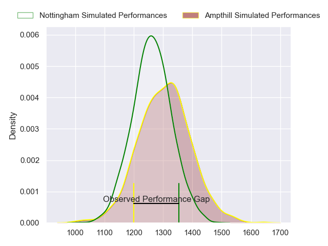
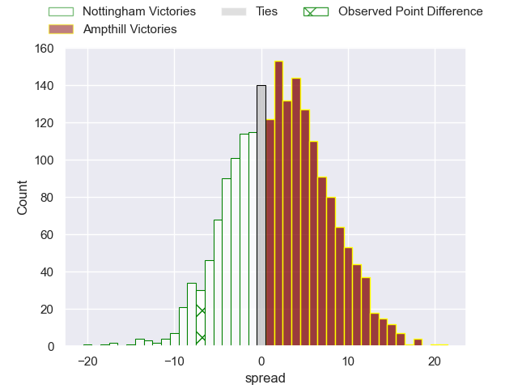
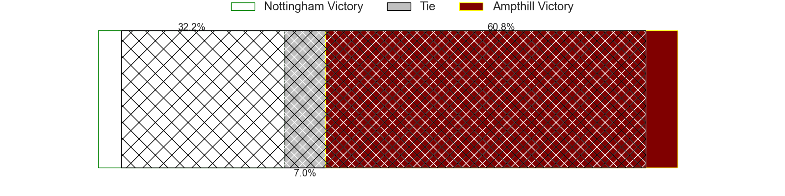
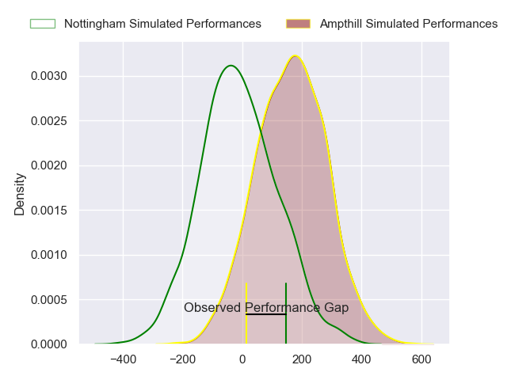
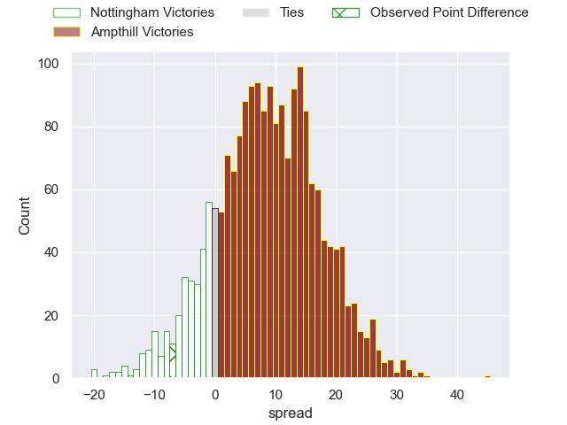
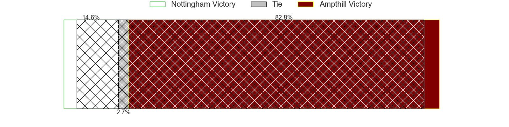

---  
layout: page  
title: Nottingham at Ampthill; 43-36  
date: 2024-02-03 18:00:00 -0500  
categories: "RFU Championship 2023" match review  
---
# Nottingham at Ampthill; 43-36

# Club Level Predictions

The first set of predictions treats a club as the smallest object, as the club develops its members, organizes a gameplan, and deploys its players as needed for each match. This club model has a prediction of 0.561, which translates to predicting Ampthill to win by 2.2.

Our Over/Under is 55.5 - and combined with the spread above, we have a predicted scoreline of 27 to 29

Each club has a rating and a rating deviation (similar to a Glicko rating), and expected performances can be generated. This allows for simulated matches and spreads like the ones below.
## Projected Performances - Club Model

## Projected Spreads - Club Model

## Projected Results - Club Model

# Player Level Predictions - Version 2

Treating teams instead as an entity made up of the currently active players, I have ratings for each player in an altogether different system. These can be combined to form team ratings once teamsheets are announced, weighting starters a bit higher than the reserves. After the match is played, players can be weighted by their minutes on the field, allowing for an accurate measure of the team's composition. With these compiled team ratings, we can make predictions, measure inaccuracy, and update the individual player ratings.
## Prediction without Player Minutes: Ampthill by 8.3

Ampthill by 5.6 on a neutral pitch

## Projected Performances - Player Model

## Projected Spreads - Player Model

## Projected Results - Player Model

|   Away Minutes | Away Player               |   Away Percentile |   Number |   Home Percentile | Home Player              |   Home Minutes |
|---------------:|:--------------------------|------------------:|---------:|------------------:|:-------------------------|---------------:|
|             55 | Archie Van der Flier      |             63.78 |        1 |             13.87 | Dominic Hardman          |             66 |
|             25 | Antonio TJ Harris         |             72.94 |        2 |              6.95 | Samson Adejimi           |             60 |
|             80 | Xavier Valentine          |             66.67 |        3 |             55.95 | James Johnston           |             55 |
|             80 | Sebastien Ferreira        |              3.31 |        4 |             27.46 | Joe Peard                |             54 |
|             56 | Come Clayver Joussain     |             51.95 |        5 |             56.57 | Kaden Pearce-Paul        |             80 |
|             65 | Sam Green                 |             46.15 |        6 |             19.5  | Ollie Stonham            |             80 |
|             80 | Emeka Ilione              |             34.45 |        7 |              8.45 | Josh Smart               |             12 |
|             80 | Richard Clift             |             58.63 |        8 |             39.24 | Morgan Strong            |             80 |
|             75 | Micheal Stronge           |             25.85 |        9 |             84.17 | Peter White              |             54 |
|             21 | Morgan Bunting            |             16.34 |       10 |             30.49 | Gwyn Parks               |             60 |
|             80 | Harry Graham              |             61.59 |       11 |             22.54 | Ben Harris               |             80 |
|             50 | Javiah Pohe               |             15.95 |       12 |             31.06 | Francis Moore            |             60 |
|             80 | Jack Stapley              |              2.88 |       13 |             19.9  | Brandon Jackson-Richards |             80 |
|             80 | David Williams            |             30.69 |       14 |             40.95 | Tobias Elliott           |             80 |
|             80 | Ellis Mee                 |             64.58 |       15 |             50.36 | Tomas Bacon              |             80 |
|             55 | Harry Clayton             |             80.44 |       16 |             24.7  | Izaiha Moore-Aiono       |             26 |
|             59 | Matthew Arden             |            nan    |       17 |             55.31 | Charlie Bracken          |             26 |
|             30 | Dafydd-Rhys Tiueti        |             47.12 |       18 |             44.86 | Harvey Beaton            |             25 |
|             25 | Kai Owen                  |             49.01 |       19 |             23.41 | Josh Barton              |             20 |
|             24 | Thomas Manz               |             51.01 |       20 |             24.23 | Josh Skelcey             |             20 |
|             15 | Iosefa Danny Wayne Fiaola |             52    |       21 |             22.85 | Beck Cutting             |             20 |
|              5 | Josh Goodwin              |             29.76 |       22 |             45.59 | Jasper McGuire           |             14 |
|            nan | nan                       |            nan    |       23 |             61.06 | Sid Blackmore            |             68 |

