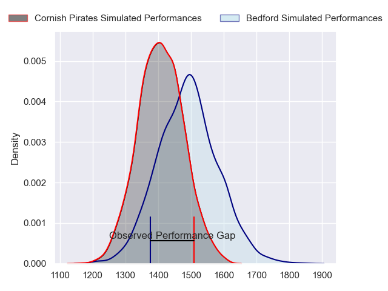
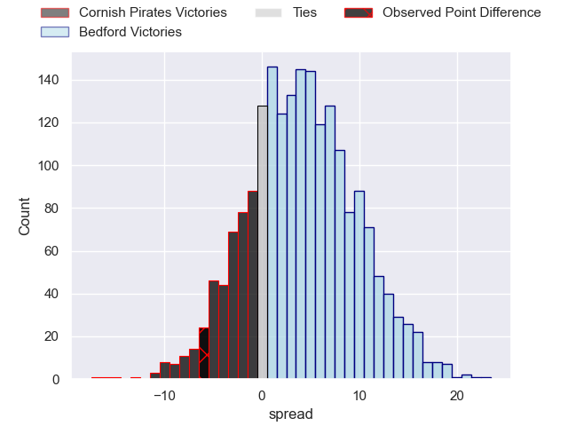
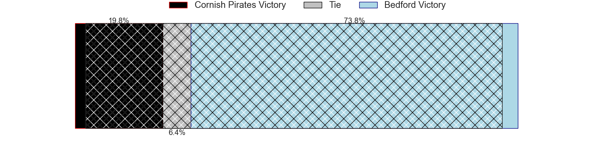
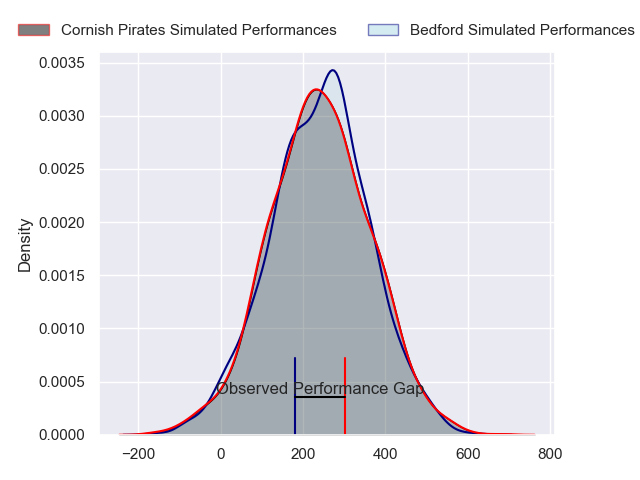
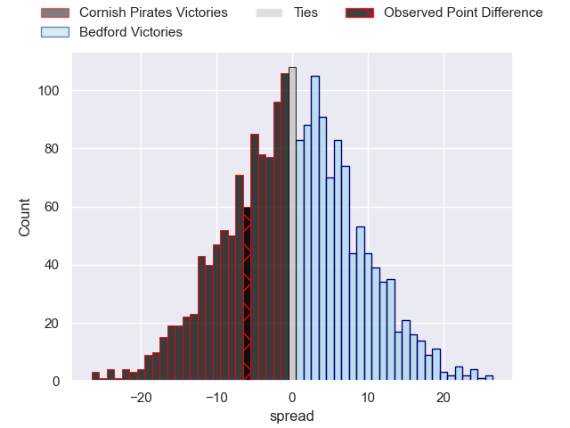

---  
layout: page  
title: Cornish Pirates at Bedford; 27-21  
date: 2024-02-03 18:00:00 -0500  
categories: "RFU Championship 2023" match review  
---
# Cornish Pirates at Bedford; 27-21

# Club Level Predictions

The first set of predictions treats a club as the smallest object, as the club develops its members, organizes a gameplan, and deploys its players as needed for each match. This club model has a prediction of 0.616, which translates to predicting Bedford to win by 4.2.

Our Over/Under is 47.5 - and combined with the spread above, we have a predicted scoreline of 22 to 26

Each club has a rating and a rating deviation (similar to a Glicko rating), and expected performances can be generated. This allows for simulated matches and spreads like the ones below.
## Projected Performances - Club Model

## Projected Spreads - Club Model

## Projected Results - Club Model

# Player Level Predictions - Version 2

Treating teams instead as an entity made up of the currently active players, I have ratings for each player in an altogether different system. These can be combined to form team ratings once teamsheets are announced, weighting starters a bit higher than the reserves. After the match is played, players can be weighted by their minutes on the field, allowing for an accurate measure of the team's composition. With these compiled team ratings, we can make predictions, measure inaccuracy, and update the individual player ratings.
## Prediction without Player Minutes: Bedford by 0.9

Cornish Pirates by 2.4 on a neutral pitch

## Projected Performances - Player Model

## Projected Spreads - Player Model

## Projected Results - Player Model

|   Away Minutes | Away Player          |   Away Percentile |   Number |   Home Percentile | Home Player     |   Home Minutes |
|---------------:|:---------------------|------------------:|---------:|------------------:|:----------------|---------------:|
|             55 | Lefty Zigiriadis     |             78.38 |        1 |             61.89 | Joey Conway     |             48 |
|             55 | Morgan Nelson        |             75.32 |        2 |             60.33 | James Fish      |              1 |
|             55 | Finlay Richardson    |             71.44 |        3 |             64.32 | Bryan O'Connor  |             48 |
|             40 | Will Britton         |             14.91 |        4 |             75.74 | Robin Williams  |             67 |
|             80 | Steele Robert Barker |             76.57 |        5 |             81.07 | Alex Woolford   |             48 |
|             80 | Peter Everett        |             66.96 |        6 |              9.97 | Luke Frost      |             80 |
|             71 | Will Gibson          |             83.64 |        7 |             50.92 | Kieran Curran   |             59 |
|             59 | Hugh Bokenham        |             65.25 |        8 |             16.08 | Joe Howard      |             80 |
|             55 | Alex Schwarz         |             62.32 |        9 |             85.17 | Alex Day        |             66 |
|             80 | Tom Pittman          |             71.46 |       10 |             81.46 | William Maisey  |             80 |
|             71 | Matthew McNab        |             30.16 |       11 |             83.17 | Dean Adamson    |             80 |
|             80 | Joe Elderkin         |             55.52 |       12 |             27.7  | Jamie Elliott   |             48 |
|             80 | Joseph Jenkins       |             63.43 |       13 |             29.86 | Jordan Venter   |             80 |
|             80 | Robin Wedlake        |             71.64 |       14 |             43.92 | Sean French     |             80 |
|             80 | Will Trewin          |             76.39 |       15 |             44.58 | Matthew Worley  |             80 |
|             40 | Josh King            |             59.53 |       16 |             55.94 | Jacob Fields    |             79 |
|             25 | Matt Johnson         |             74.5  |       17 |             55.69 | Jac Arthur      |             32 |
|             25 | Ruaridh Dawson       |             63.73 |       18 |             40    | Louis Grimoldby |             32 |
|             25 | Jack Andrew          |             76.67 |       19 |             75.32 | Ed Prowse       |             32 |
|             25 | Rhys Williams        |            nan    |       20 |             16.4  | Jamie Jack      |             32 |
|             21 | David Douglas Bridge |            nan    |       21 |             10.64 | Cameron King    |             21 |
|              9 | Jack Nowell          |             96.28 |       22 |             18.44 | James Lennon    |             14 |
|              9 | Harry Dugmore        |             50.49 |       23 |             33.85 | Geordie Irvine  |             13 |

