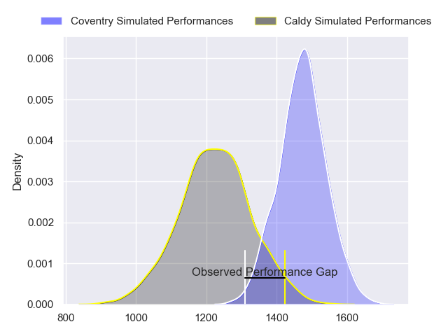
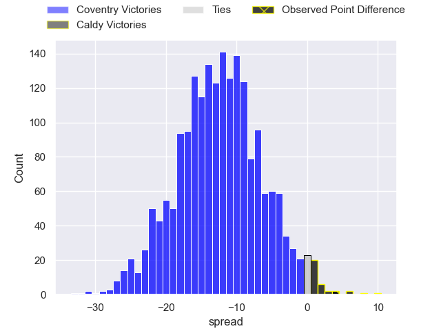
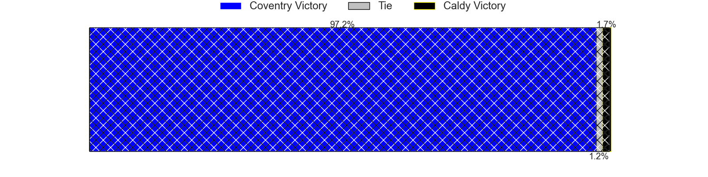
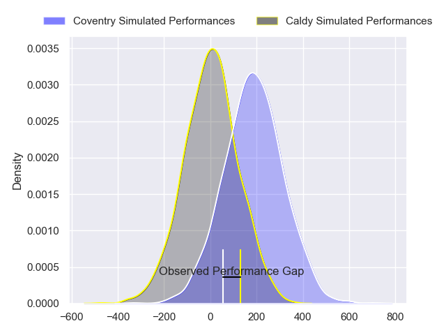
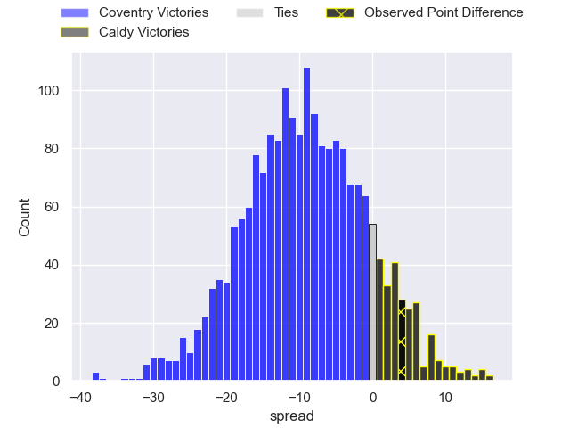
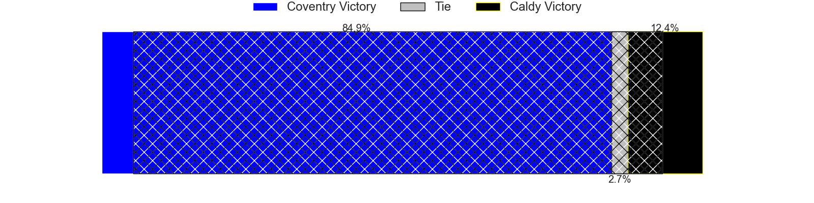

---  
layout: page  
title: Coventry at Caldy; 22-26  
date: 2024-02-03 18:00:00 -0500  
categories: "RFU Championship 2023" match review  
---
# Coventry at Caldy; 22-26

# Club Level Predictions

The first set of predictions treats a club as the smallest object, as the club develops its members, organizes a gameplan, and deploys its players as needed for each match. This club model has a prediction of 0.201, which translates to predicting Coventry to win by 12.2.

Our Over/Under is 52.5 - and combined with the spread above, we have a predicted scoreline of 33 to 20

Each club has a rating and a rating deviation (similar to a Glicko rating), and expected performances can be generated. This allows for simulated matches and spreads like the ones below.
## Projected Performances - Club Model

## Projected Spreads - Club Model

## Projected Results - Club Model

# Player Level Predictions - Version 2

Treating teams instead as an entity made up of the currently active players, I have ratings for each player in an altogether different system. These can be combined to form team ratings once teamsheets are announced, weighting starters a bit higher than the reserves. After the match is played, players can be weighted by their minutes on the field, allowing for an accurate measure of the team's composition. With these compiled team ratings, we can make predictions, measure inaccuracy, and update the individual player ratings.
## Prediction without Player Minutes: Coventry by 9.9

Coventry by 12.3 on a neutral pitch

## Projected Performances - Player Model

## Projected Spreads - Player Model

## Projected Results - Player Model

|   Away Minutes | Away Player          |   Away Percentile |   Number |   Home Percentile | Home Player      |   Home Minutes |
|---------------:|:---------------------|------------------:|---------:|------------------:|:-----------------|---------------:|
|             50 | Elliott Chilvers     |             29.28 |        1 |             23.33 | Adam Aigbokhae   |             50 |
|             65 | Jordon Poole         |             81.9  |        2 |             15.17 | Oliver Hearn     |             80 |
|             55 | Adam Nicol           |             20.63 |        3 |             16.04 | Joe Sproston     |             50 |
|             80 | James Tyas           |             31.36 |        4 |             54.2  | Callum Atkinson  |             80 |
|             50 | Rhys Anstey          |             25.21 |        5 |             26.63 | Thomas Sanders   |             80 |
|             80 | Obinna Nkwocha       |             18.31 |        6 |             27.74 | Martin Gerrard   |             74 |
|             50 | Paddy Ryan           |             41.6  |        7 |             66.2  | Ciaran Booth     |             60 |
|             50 | Senitiki Nayalo      |             94.33 |        8 |             24.82 | Josiah Dickinson |             80 |
|             62 | Will Lane            |             56.91 |        9 |             12.42 | Chris Pilgrim    |             52 |
|             80 | Patrick Pellegrini   |             72.44 |       10 |             20.72 | Rhys Hayes       |             80 |
|             80 | James Martin         |             86.77 |       11 |             67.3  | Louis Beer       |             80 |
|             80 | Lucas Titherington   |             42.69 |       12 |             45.56 | Michael Barlow   |             52 |
|             80 | Will Wand            |             33.33 |       13 |             40.89 | Connor Wilkinson |             80 |
|             80 | David Opoku-Fordjour |             14.39 |       14 |             15.77 | Nick Royle       |             80 |
|             80 | Tobi Wilson          |             47.95 |       15 |             55.18 | Matt Kilcourse   |             29 |
|             30 | Tom Ball             |             73.78 |       16 |             10.98 | Lewis Barker     |             51 |
|             30 | Jack Bartlett        |             34.04 |       17 |             15.14 | Nathan Rushton   |             30 |
|             30 | Vilikesa Nairau      |             37.93 |       18 |             66.13 | Monty Weatherby  |             30 |
|             30 | Matt Kvesic          |             16.9  |       19 |             28.86 | Joseph Murray    |             28 |
|             25 | Eliot Salt           |             27.57 |       20 |              4.8  | Michael Cartmill |             28 |
|             15 | Will Biggs           |             56.86 |       21 |              6.93 | Callum Ridgway   |             20 |
|             18 | Finlay Ogden         |            nan    |       22 |             30.53 | Sam Olyott       |              6 |

