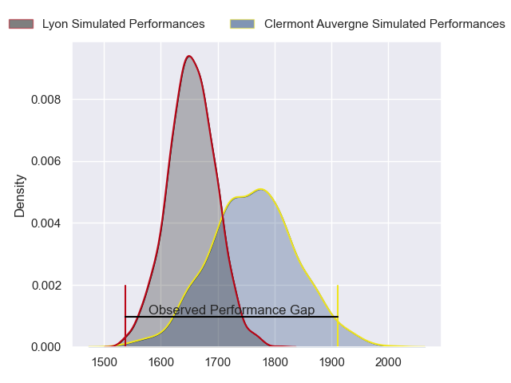
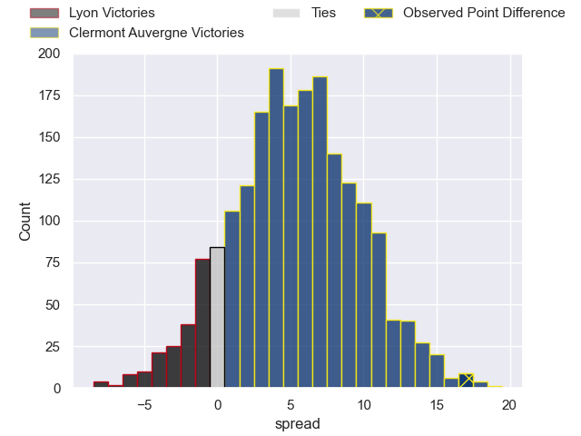
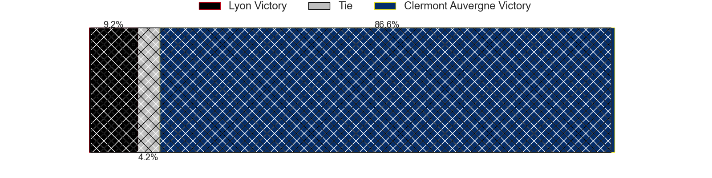
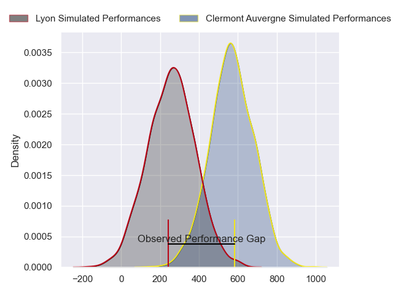
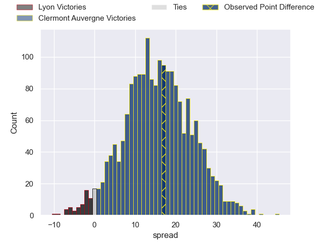
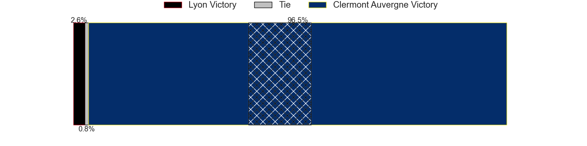

---  
layout: page  
title: Lyon at Clermont Auvergne; 21-38  
date: 2024-02-03 18:00:00 -0500  
categories: "Top 14 Orange 2023" match review  
---
# Lyon at Clermont Auvergne; 21-38

# Club Level Predictions

The first set of predictions treats a club as the smallest object, as the club develops its members, organizes a gameplan, and deploys its players as needed for each match. This club model has a prediction of 0.648, which translates to predicting Clermont Auvergne to win by 5.3.

Our Over/Under is 67.5 - and combined with the spread above, we have a predicted scoreline of 31 to 36

Each club has a rating and a rating deviation (similar to a Glicko rating), and expected performances can be generated. This allows for simulated matches and spreads like the ones below.
## Projected Performances - Club Model

## Projected Spreads - Club Model

## Projected Results - Club Model

# Player Level Predictions - Version 2

Treating teams instead as an entity made up of the currently active players, I have ratings for each player in an altogether different system. These can be combined to form team ratings once teamsheets are announced, weighting starters a bit higher than the reserves. After the match is played, players can be weighted by their minutes on the field, allowing for an accurate measure of the team's composition. With these compiled team ratings, we can make predictions, measure inaccuracy, and update the individual player ratings.
## Prediction without Player Minutes: Clermont Auvergne by 18.6

Clermont Auvergne by 11.1 on a neutral pitch

## Projected Performances - Player Model

## Projected Spreads - Player Model

## Projected Results - Player Model

|   Away Minutes | Away Player            |   Away Percentile |   Number |   Home Percentile | Home Player          |   Home Minutes |
|---------------:|:-----------------------|------------------:|---------:|------------------:|:---------------------|---------------:|
|             48 | Jerome Rey             |             27.03 |        1 |             86.49 | Etienne Falgoux      |             50 |
|             54 | Guillaume Marchand     |             23.03 |        2 |             97.07 | Folau Fainga'a       |             65 |
|             48 | Paulo Tafili           |             42.07 |        3 |             90.99 | Rabah Slimani        |             65 |
|             80 | Joel Kpoku             |             55.15 |        4 |             95.98 | Rob Simmons          |             80 |
|             54 | Mickael Guillard       |             63.43 |        5 |             93.96 | Tomas Lavanini       |             48 |
|             61 | Marvin Okuya           |             47.13 |        6 |             91.98 | Peceli Yato Senibitu |             48 |
|             80 | Theo William           |             15.49 |        7 |             94.15 | Fritz Lee            |             80 |
|             80 | Liam Allen             |             58.16 |        8 |             79.43 | Marcos Kremer        |             80 |
|             60 | Baptiste Couilloud     |             92.18 |        9 |             94.19 | Sebastien Bezy       |             60 |
|             48 | Leo Berdeu             |             64.63 |       10 |             92.93 | Anthony Belleau      |             50 |
|             80 | Vincent Rattez         |             95.56 |       11 |             33.76 | Alivereti Raka       |             80 |
|             80 | Semi Radradra          |             99.4  |       12 |             97.12 | George Moala         |             80 |
|             80 | Alfred Parisien        |             52.52 |       13 |             30.7  | Pierre Fouyssac      |             48 |
|             48 | Xavier Mignot          |             58.52 |       14 |             78.2  | Joris Jurand         |             80 |
|             80 | Thaakir Abrahams       |             21.69 |       15 |             79.52 | Alex Newsome         |             80 |
|             32 | Feao Fotuaika          |             54.59 |       16 |             73.46 | Killian Tixeront     |             32 |
|             32 | Thibault Regard        |             91.25 |       17 |             80.36 | Thibaud Lanen        |             32 |
|             32 | Paddy Jackson          |             77.07 |       18 |             70.62 | Leon Darricarrere    |             32 |
|             32 | Hamza Kaabeche         |              8.11 |       19 |             90.73 | Benjamin Urdapilleta |             30 |
|             26 | Loann Goujon           |             53.14 |       20 |             42.88 | Giorgi Beria         |             30 |
|             26 | Liam Coltman           |             75.87 |       21 |             39.48 | Baptiste Jauneau     |             20 |
|             20 | Joe Powell             |             62.93 |       22 |            nan    | Giorgi Dzmanashvili  |             15 |
|             19 | Louis-Antonin Agostini |            nan    |       23 |             27.61 | Yohan Beheregaray    |             15 |

