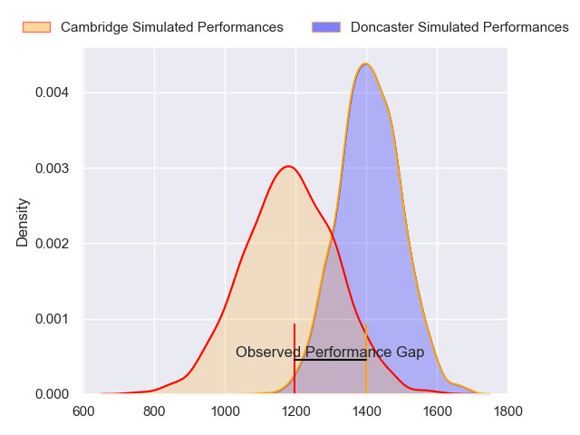
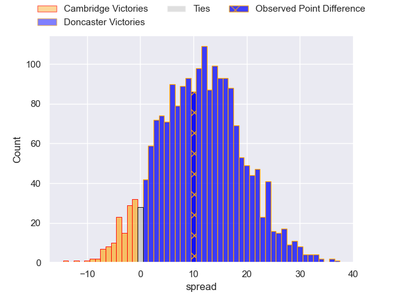
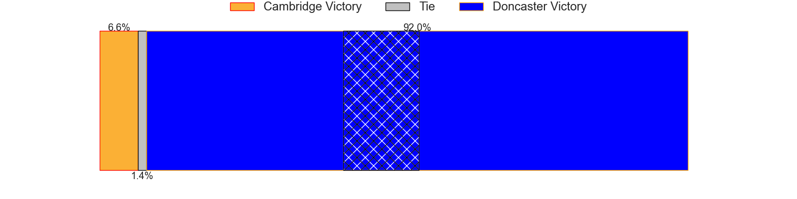
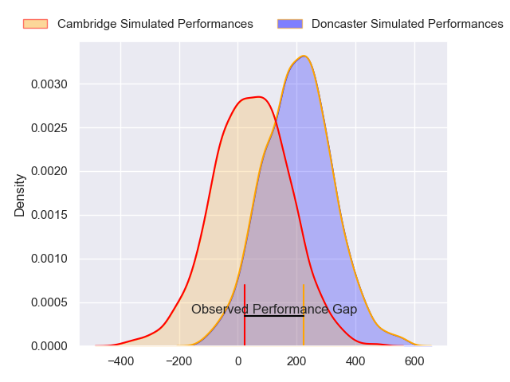
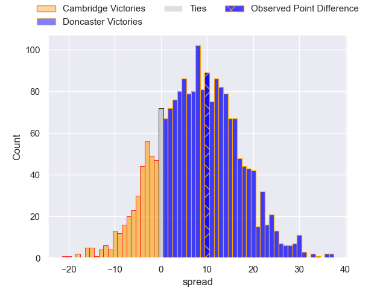

---  
layout: page  
title: Cambridge at Doncaster; 19-29  
date: 2024-02-03 18:00:00 -0500  
categories: "RFU Championship 2023" match review  
---
# Cambridge at Doncaster; 19-29

# Club Level Predictions

The first set of predictions treats a club as the smallest object, as the club develops its members, organizes a gameplan, and deploys its players as needed for each match. This club model has a prediction of 0.771, which translates to predicting Doncaster to win by 11.4.

Our Over/Under is 62.5 - and combined with the spread above, we have a predicted scoreline of 25 to 37

Each club has a rating and a rating deviation (similar to a Glicko rating), and expected performances can be generated. This allows for simulated matches and spreads like the ones below.
## Projected Performances - Club Model

## Projected Spreads - Club Model

## Projected Results - Club Model

# Player Level Predictions - Version 2

Treating teams instead as an entity made up of the currently active players, I have ratings for each player in an altogether different system. These can be combined to form team ratings once teamsheets are announced, weighting starters a bit higher than the reserves. After the match is played, players can be weighted by their minutes on the field, allowing for an accurate measure of the team's composition. With these compiled team ratings, we can make predictions, measure inaccuracy, and update the individual player ratings.
## Prediction without Player Minutes: Doncaster by 7.7

Doncaster by 4.3 on a neutral pitch

## Projected Performances - Player Model

## Projected Spreads - Player Model

## Projected Results - Player Model

|   Away Minutes | Away Player          |   Away Percentile |   Number |   Home Percentile | Home Player              |   Home Minutes |
|---------------:|:---------------------|------------------:|---------:|------------------:|:-------------------------|---------------:|
|             50 | Huw Owen             |             59.91 |        1 |             67.48 | Conor Davidson           |             76 |
|             55 | Benjamin Brownlie    |             53.02 |        2 |             35.83 | George Roberts           |             60 |
|             80 | Billy Walker         |             20.9  |        3 |             30.9  | Corrie Barrett           |             60 |
|             80 | Kieran Frost         |             39.76 |        4 |             70.18 | Charlie Beckett          |             47 |
|             58 | Gareth Baxter        |             58.7  |        5 |              9.35 | Ehize Ehizode            |             60 |
|             80 | George Bretag-Norris |             47.67 |        6 |             16.79 | Harry Wilson             |             80 |
|             55 | Jared Cardew         |             10.62 |        7 |             44.64 | Rhys Tait                |             66 |
|             66 | Nahum Merigan        |             45.15 |        8 |             57.21 | Jack Digby               |             80 |
|             80 | Kieran Duffin        |             39.28 |        9 |              4.01 | Ollie Fox                |             47 |
|             80 | Steffan James        |             40.73 |       10 |             84.39 | Billy McBryde            |             80 |
|             80 | Josef Green          |             46.14 |       11 |             54.81 | Westleigh Alleyne Holden |             80 |
|             80 | Jamie Benson         |             24.58 |       12 |             74.82 | Sam Bedlow               |             80 |
|             80 | Sam Hanks            |             11.87 |       13 |             60.19 | Joe Margetts             |             80 |
|             80 | Kwaku Asiedu         |             33.44 |       14 |             17.46 | Jack Metcalf             |             60 |
|             80 | Elias Caven          |             21.2  |       15 |             87.95 | Russell Bennett          |             80 |
|             30 | Jake Elwood          |             36.58 |       16 |             33.14 | Fyn Brown                |             33 |
|             25 | Matthew Dawson       |             28.49 |       17 |             81.16 | Alex Dolly               |             33 |
|             25 | Morgan Veness        |             12.43 |       18 |             83.91 | Evan Mintern             |             20 |
|             22 | Ben Adams            |             10.18 |       19 |            nan    | Cameron Terry            |             20 |
|             14 | Anthony Maka         |             36.41 |       20 |             88.11 | Andrew Foster            |             20 |
|            nan | nan                  |            nan    |       21 |            nan    | Vereimi Qorowale         |             20 |
|            nan | nan                  |            nan    |       22 |             46.63 | Adam Hopkinson           |             14 |
|            nan | nan                  |            nan    |       23 |             60.69 | Harri Morris             |              4 |

