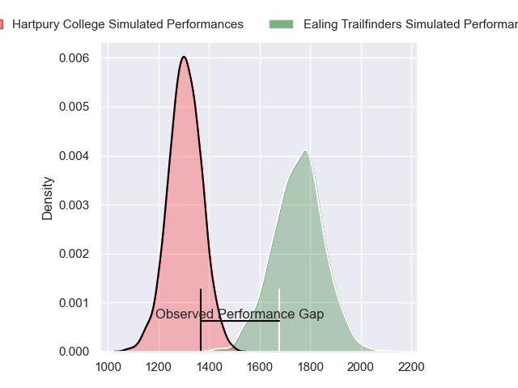
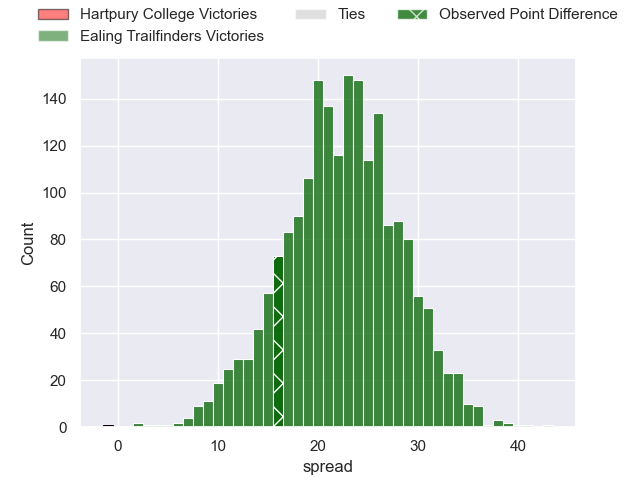
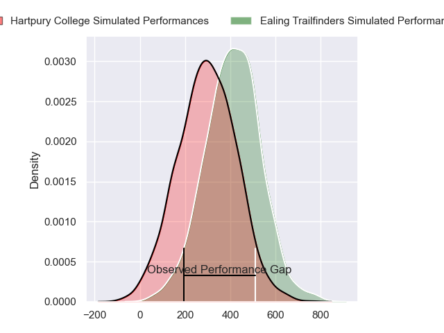
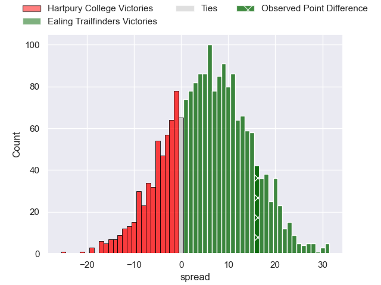
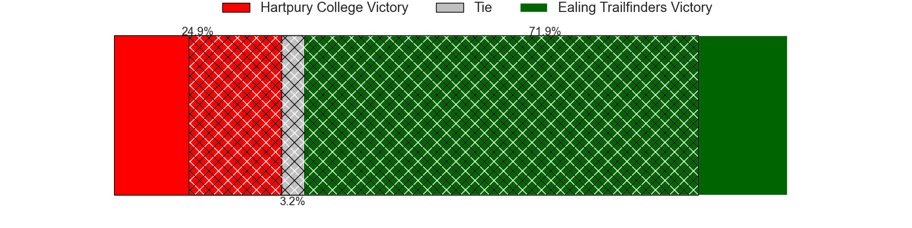

---  
layout: page  
title: Hartpury College at Ealing Trailfinders; 20-36  
date: 2024-02-03 18:00:00 -0500  
categories: "RFU Championship 2023" match review  
---
# Hartpury College at Ealing Trailfinders; 20-36

# Club Level Predictions

The first set of predictions treats a club as the smallest object, as the club develops its members, organizes a gameplan, and deploys its players as needed for each match. This club model has a prediction of 0.925, which translates to predicting Ealing Trailfinders to win by 22.3.

Our Over/Under is 69.5 - and combined with the spread above, we have a predicted scoreline of 24 to 46

Each club has a rating and a rating deviation (similar to a Glicko rating), and expected performances can be generated. This allows for simulated matches and spreads like the ones below.
## Projected Performances - Club Model

## Projected Spreads - Club Model

## Projected Results - Club Model

# Player Level Predictions - Version 2

Treating teams instead as an entity made up of the currently active players, I have ratings for each player in an altogether different system. These can be combined to form team ratings once teamsheets are announced, weighting starters a bit higher than the reserves. After the match is played, players can be weighted by their minutes on the field, allowing for an accurate measure of the team's composition. With these compiled team ratings, we can make predictions, measure inaccuracy, and update the individual player ratings.
## Prediction without Player Minutes: Ealing Trailfinders by 8.3

Ealing Trailfinders by 5.1 on a neutral pitch

## Projected Performances - Player Model

## Projected Spreads - Player Model

## Projected Results - Player Model

|   Away Minutes | Away Player           |   Away Percentile |   Number |   Home Percentile | Home Player          |   Home Minutes |
|---------------:|:----------------------|------------------:|---------:|------------------:|:---------------------|---------------:|
|             53 | Aristot Benz-Salomon  |             81.71 |        1 |             86.94 | Kyle John Whyte      |             54 |
|             60 | William Crane         |             78.43 |        2 |             69.29 | Matthew Cornish      |             68 |
|             80 | Jonathan Benz-Salomon |             77.12 |        3 |             46.49 | Jimmy Roots          |             54 |
|             80 | Dale Lemon            |             73.85 |        4 |             95.5  | Bobby de Wee         |             80 |
|             80 | Jack Davies           |             85.21 |        5 |             95.86 | Barney Maddison      |             79 |
|             80 | Samuel Lewis          |             30.12 |        6 |             71.83 | Rob Farrar           |             62 |
|             80 | Harry Short           |             81.91 |        7 |             55.58 | Richard Hardwick     |             80 |
|             56 | Josh Gray             |             82.51 |        8 |              5.91 | Callum Chick         |             80 |
|             63 | Michael Austin        |             74.55 |        9 |             90.38 | Craig Hampson        |             79 |
|             80 | Harry Bazalgette      |             85.37 |       10 |             98.05 | Craig Willis         |             26 |
|             80 | Louis Hillman-Cooper  |             51.64 |       11 |             98.84 | Tom Collins          |             80 |
|             76 | Morgan Adderly-Jones  |             65.35 |       12 |             91.49 | Pat Howard           |             80 |
|             60 | Robbie Smith          |             14.15 |       13 |             74.34 | Reuben Bird-Tulloch  |             80 |
|             80 | Charlie Powell        |             87.41 |       14 |             99.47 | James Cordy-Redden   |             80 |
|             80 | Alex Morgan           |             38.8  |       15 |             60    | Michael Dykes        |             80 |
|             27 | Mikey Summerfield     |             67.21 |       16 |             86.69 | Billy Twelvetrees    |             54 |
|             24 | Jarrad Hayler         |             69.01 |       17 |             72.07 | George Davis         |             26 |
|             20 | Ethan Hunt            |             67.46 |       18 |             46.13 | Will Goodrick-Clarke |             26 |
|             20 | Tommy Mathews         |             65.06 |       19 |             58.61 | Jordan Reid          |             18 |
|             17 | Matty Jones           |             42.69 |       20 |            nan    | Henry Walker         |             12 |
|              4 | Sam Smith             |             69.18 |       21 |             88.18 | Lloyd Williams       |              1 |
|            nan | nan                   |            nan    |       22 |             76.45 | Daniel Cutmore       |              1 |

