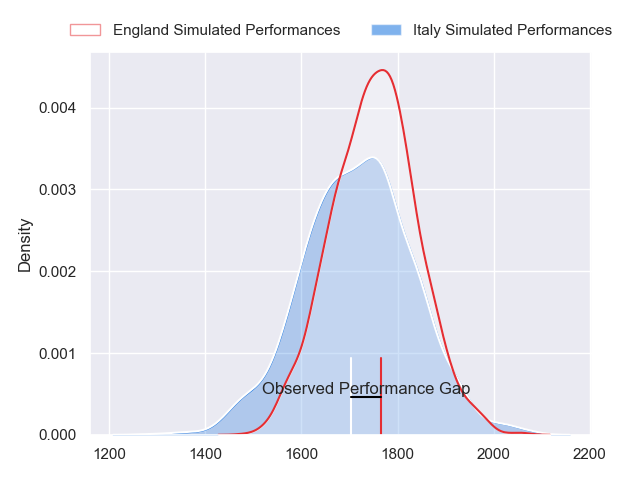
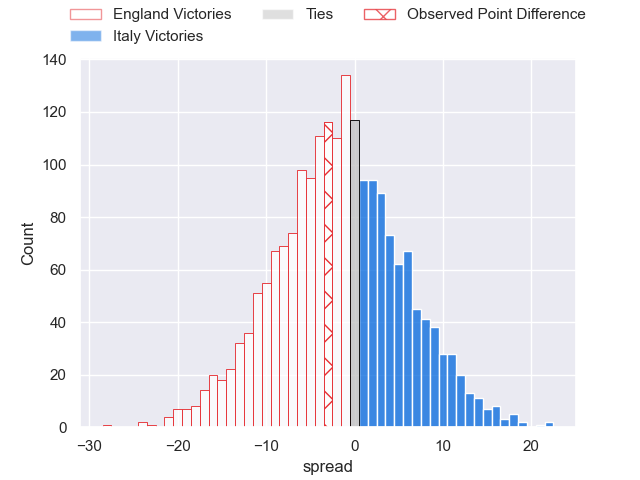
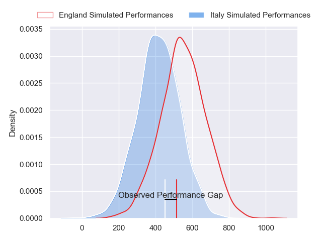
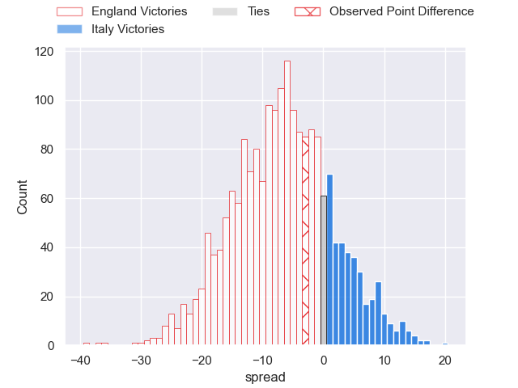
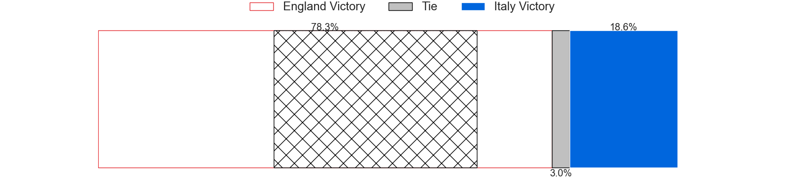

---  
layout: page  
title: England at Italy; 27-24  
date: 2024-02-03 18:00:00 -0500  
categories: "Six Nations Championship 2024" match review  
---
# England at Italy; 27-24

# Club Level Predictions

The first set of predictions treats a club as the smallest object, as the club develops its members, organizes a gameplan, and deploys its players as needed for each match. This club model has a prediction of 0.454, which translates to predicting England to win by 1.7.

Our Over/Under is 45.5 - and combined with the spread above, we have a predicted scoreline of 24 to 22

Each club has a rating and a rating deviation (similar to a Glicko rating), and expected performances can be generated. This allows for simulated matches and spreads like the ones below.
## Projected Performances - Club Model

## Projected Spreads - Club Model

## Projected Results - Club Model

# Player Level Predictions - Version 2

Treating teams instead as an entity made up of the currently active players, I have ratings for each player in an altogether different system. These can be combined to form team ratings once teamsheets are announced, weighting starters a bit higher than the reserves. After the match is played, players can be weighted by their minutes on the field, allowing for an accurate measure of the team's composition. With these compiled team ratings, we can make predictions, measure inaccuracy, and update the individual player ratings.
## Prediction without Player Minutes: England by 4.7

England by 8.3 on a neutral pitch

## Projected Performances - Player Model

## Projected Spreads - Player Model

## Projected Results - Player Model

|   Away Minutes | Away Player               |   Away Percentile |   Number |   Home Percentile | Home Player        |   Home Minutes |
|---------------:|:--------------------------|------------------:|---------:|------------------:|:-------------------|---------------:|
|             76 | Joe Marler                |             98.2  |        1 |             56.04 | Danilo Fischetti   |             67 |
|             74 | Jamie George              |             97.26 |        2 |             78.98 | Gianmarco Lucchesi |             53 |
|             56 | Will Stuart               |             22.07 |        3 |             57.75 | Pietro Ceccarelli  |             46 |
|             86 | Maro Itoje                |             94.32 |        4 |             40    | Niccolo Cannone    |             86 |
|             73 | Ollie Chessum             |             77.75 |        5 |             95.03 | Federico Ruzza     |             73 |
|             86 | Ethan Roots               |             73.67 |        6 |             84.18 | Sebastian Negri    |             67 |
|             67 | Sam Underhill             |             84.72 |        7 |             91.25 | Michele Lamaro     |             86 |
|             86 | Ben Earl                  |             93.14 |        8 |             90.31 | Lorenzo Cannone    |             46 |
|             59 | Alex Mitchell             |             94.59 |        9 |             77.96 | Alessandro Garbisi |             53 |
|             67 | George Ford               |             94.39 |       10 |             73.17 | Paolo Garbisi      |             86 |
|             86 | Elliot Daly               |             79.58 |       11 |             97.35 | Monty Ioane        |             86 |
|             86 | Fraser Dingwall           |             90.77 |       12 |             79.74 | Tommaso Menoncello |             86 |
|             86 | Henry Slade               |             96.88 |       13 |             88.49 | Juan Ignacio Brex  |             86 |
|             78 | Tommy Freeman             |             95.45 |       14 |             38.73 | Lorenzo Pani       |             69 |
|             86 | Freddie Steward           |             43.61 |       15 |             73.73 | Tommaso Allan      |             86 |
|             12 | Theo Dan                  |             38.21 |       16 |             98.17 | Giacomo Nicotera   |             33 |
|             10 | Beno Obano                |             84.32 |       17 |            nan    | Mirco Spagnolo     |             19 |
|             30 | Dan Cole                  |             38.02 |       18 |             51.17 | Giosue Zilocchi    |             40 |
|             13 | Alex Coles                |             31.83 |       19 |             45.56 | Andrea Zambonin    |             13 |
|             19 | Chandler Cunningham-South |             70.96 |       20 |             70.86 | Alessandro Izekor  |             19 |
|             27 | Danny Care                |            100    |       21 |             67.5  | Manuel Zuliani     |             40 |
|             19 | Fin Smith                 |             86.83 |       22 |             19.44 | Stephen Varney     |             33 |
|              8 | Immanuel Feyi-Waboso      |             73.44 |       23 |             50.96 | Federico Mori      |             17 |

