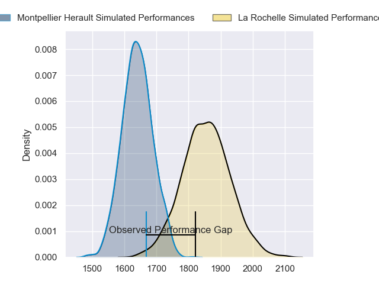
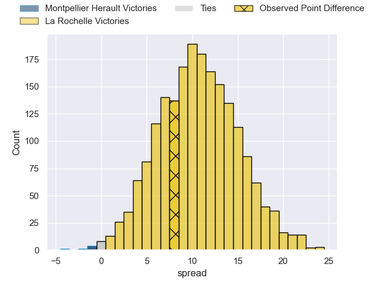
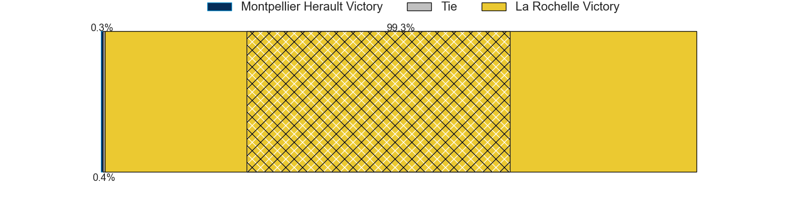
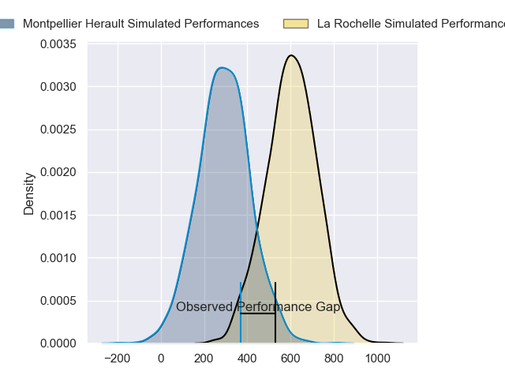
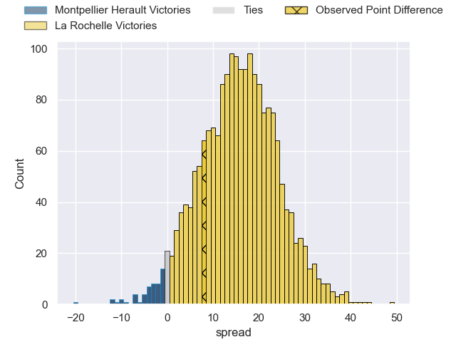
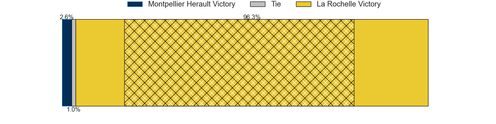

---  
layout: page  
title: Montpellier Herault at La Rochelle; 10-18  
date: 2024-02-03 18:00:00 -0500  
categories: "Top 14 Orange 2023" match review  
---
# Montpellier Herault at La Rochelle; 10-18

# Club Level Predictions

The first set of predictions treats a club as the smallest object, as the club develops its members, organizes a gameplan, and deploys its players as needed for each match. This club model has a prediction of 0.773, which translates to predicting La Rochelle to win by 10.8.

Our Over/Under is 50.5 - and combined with the spread above, we have a predicted scoreline of 20 to 30

Each club has a rating and a rating deviation (similar to a Glicko rating), and expected performances can be generated. This allows for simulated matches and spreads like the ones below.
## Projected Performances - Club Model

## Projected Spreads - Club Model

## Projected Results - Club Model

# Player Level Predictions - Version 2

Treating teams instead as an entity made up of the currently active players, I have ratings for each player in an altogether different system. These can be combined to form team ratings once teamsheets are announced, weighting starters a bit higher than the reserves. After the match is played, players can be weighted by their minutes on the field, allowing for an accurate measure of the team's composition. With these compiled team ratings, we can make predictions, measure inaccuracy, and update the individual player ratings.
## Prediction without Player Minutes: La Rochelle by 18.6

La Rochelle by 11.5 on a neutral pitch

## Projected Performances - Player Model

## Projected Spreads - Player Model

## Projected Results - Player Model

|   Away Minutes | Away Player                 |   Away Percentile |   Number |   Home Percentile | Home Player           |   Home Minutes |
|---------------:|:----------------------------|------------------:|---------:|------------------:|:----------------------|---------------:|
|             45 | Enzo Forletta               |             76.49 |        1 |             51.26 | Louis Penverne        |             66 |
|             52 | Brandon Paenga-Amosa        |             79.71 |        2 |             89.21 | Tolu Latu             |             53 |
|             41 | Titi Lamositele             |             56.85 |        3 |             39.28 | Aleksandre Kuntelia   |             53 |
|             45 | Florian Verhaeghe           |             57.51 |        4 |             88.88 | Thomas Lavault        |             80 |
|             45 | Bastien Chalureau           |             82.96 |        5 |             99.41 | Will Skelton          |             66 |
|             80 | Yacouba Camara              |             92.52 |        6 |             41.06 | Judicael Cancoriet    |             80 |
|             45 | Alexandre Becognee          |             46.91 |        7 |             98.05 | Levani Botia          |             80 |
|             80 | Marco Tauleigne             |             85.34 |        8 |             70.45 | Yoan Tanga            |             61 |
|             80 | Léo Coly                    |             25.45 |        9 |             99    | Tawera Kerr-Barlow    |             75 |
|             80 | Louis Carbonel              |             50.98 |       10 |             61.22 | Antoine Hastoy        |             69 |
|             80 | Julien Tisseron             |             55.13 |       11 |             98.1  | Dillyn Leyds          |             80 |
|             25 | Jan Serfontein              |             83.45 |       12 |             51.44 | Ihaia West            |             80 |
|             80 | Geoffrey Doumayrou          |             98.8  |       13 |             96.28 | Jack Nowell           |             13 |
|             80 | Arthur Vincent              |             68.99 |       14 |             91.75 | Teddy Thomas          |             80 |
|             48 | Anthony Bouthier            |             78.55 |       15 |             99.28 | Brice Dulin           |             80 |
|             55 | Sam Simmonds                |             73.29 |       16 |             57.43 | Simeli Daunivucu      |             67 |
|             39 | Luka Japaridze              |             70.09 |       17 |             73.49 | Quentin Lespiaucq     |             27 |
|             35 | Clément Doumenc             |             71.18 |       18 |              3.87 | Georges-Henri Colombe |             27 |
|             35 | Nicolaas Janse van Rensburg |             83.86 |       19 |             44.31 | Matthias Haddad       |             19 |
|             35 | Tyler Duguid                |             45.33 |       20 |             65.8  | Remi Picquette        |             14 |
|             35 | Gregory Fichten             |             19.37 |       21 |            nan    | Alexandre Kaddouri    |             14 |
|             32 | Cobus Reinach               |             92.99 |       22 |             51.71 | Hugo Reus             |             11 |
|             28 | Baptiste Erdocio            |              6.4  |       23 |             75.98 | Thomas Berjon         |              5 |

