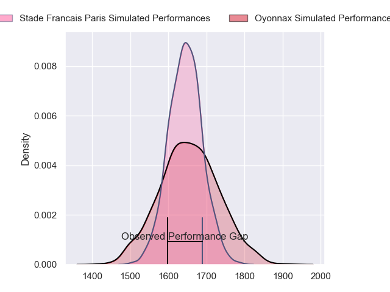
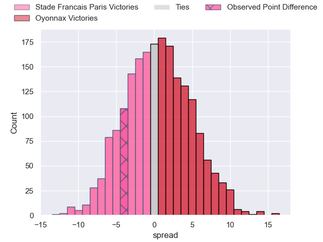
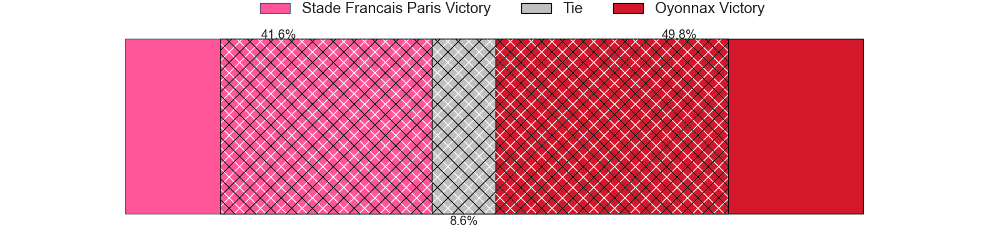
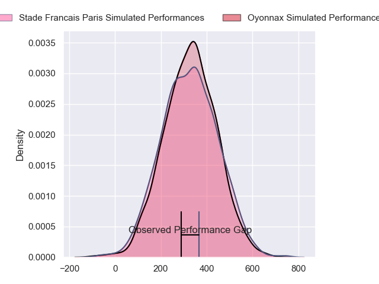
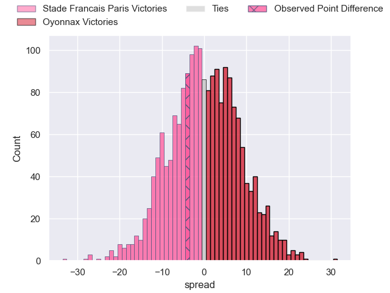
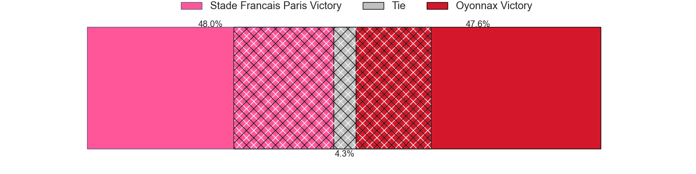

---  
layout: page  
title: Stade Francais Paris at Oyonnax; 23-19  
date: 2024-02-03 18:00:00 -0500  
categories: "Top 14 Orange 2023" match review  
---
# Stade Francais Paris at Oyonnax; 23-19

# Club Level Predictions

The first set of predictions treats a club as the smallest object, as the club develops its members, organizes a gameplan, and deploys its players as needed for each match. This club model has a prediction of 0.512, which translates to predicting Oyonnax to win by 0.4.

Our Over/Under is 43.5 - and combined with the spread above, we have a predicted scoreline of 22 to 22

Each club has a rating and a rating deviation (similar to a Glicko rating), and expected performances can be generated. This allows for simulated matches and spreads like the ones below.
## Projected Performances - Club Model

## Projected Spreads - Club Model

## Projected Results - Club Model

# Player Level Predictions - Version 2

Treating teams instead as an entity made up of the currently active players, I have ratings for each player in an altogether different system. These can be combined to form team ratings once teamsheets are announced, weighting starters a bit higher than the reserves. After the match is played, players can be weighted by their minutes on the field, allowing for an accurate measure of the team's composition. With these compiled team ratings, we can make predictions, measure inaccuracy, and update the individual player ratings.
## Prediction without Player Minutes: Oyonnax by 0.8

Stade Francais Paris by 6.8 on a neutral pitch

## Projected Performances - Player Model

## Projected Spreads - Player Model

## Projected Results - Player Model

|   Away Minutes | Away Player             |   Away Percentile |   Number |   Home Percentile | Home Player         |   Home Minutes |
|---------------:|:------------------------|------------------:|---------:|------------------:|:--------------------|---------------:|
|             67 | Moses Alo-Emile         |             73.96 |        1 |             84.59 | Tommy Raynaud       |             67 |
|             53 | Mickael Ivaldi          |             94.52 |        2 |             18.46 | Benjamin Geledan    |             44 |
|             67 | Paul Alo-Emile          |             84.23 |        3 |             23.6  | Christopher Vaotoa  |             73 |
|             75 | Pierre-Henri Azagoh     |             68.64 |        4 |             68.76 | Ewan Thomas Johnson |             80 |
|             80 | Tanginoa Halaifonua     |             28.99 |        5 |             66.39 | Hugo Fabregue       |             80 |
|             80 | Sekou Macalou           |             93.17 |        6 |             59.26 | Kevin Lebreton      |              8 |
|             80 | Mathieu Hirigoyen       |              6.28 |        7 |             47.56 | Loïc Credoz         |             80 |
|             45 | Giovanni Habel-Kueffner |             89.83 |        8 |             62.17 | Rory Grice          |             65 |
|             54 | Brad Weber              |             96.79 |        9 |             85.57 | Charlie Cassang     |             51 |
|             54 | Joris Segonds           |             71.95 |       10 |             91.71 | Domingo Miotti      |             73 |
|             80 | Lester Etien            |             84.55 |       11 |             75.24 | Daniel Ikpefan      |             80 |
|             67 | Julien Delbouis         |             84.17 |       12 |             76.14 | Lucas Mensa         |             54 |
|             80 | Jeremy Ward             |             91.85 |       13 |             77.1  | Theo Millet         |             80 |
|             80 | Joe Marchant            |             88.25 |       14 |             19.05 | Gavin Stark         |             80 |
|             80 | Leo Barre               |             75.66 |       15 |              8.67 | Justin Bouraux      |             80 |
|             35 | Julien Ory              |             42.25 |       16 |              7.93 | Victor Lebas        |             72 |
|             26 | Rory Kockott            |             98.6  |       17 |             25.78 | Teddy Durand        |             36 |
|             26 | Zack Henry              |             77.56 |       18 |             95.59 | Jonathan Ruru       |             29 |
|             13 | Pierre Boudehent        |             52.88 |       19 |             22.42 | Pedro Bettencourt   |             26 |
|             13 | Francisco Gomez Kodela  |             95.59 |       20 |             13.48 | Loic Godener        |             15 |
|             13 | Clement Castets         |             24.95 |       21 |             61.53 | Antoine Abraham     |             13 |
|              5 | Ryan Chapuis            |              4.12 |       22 |             61.46 | Jules Soulan        |              7 |
|             27 | Lucas Peyresblanques    |             20.84 |       23 |             39.01 | Thibault Berthaud   |              7 |

