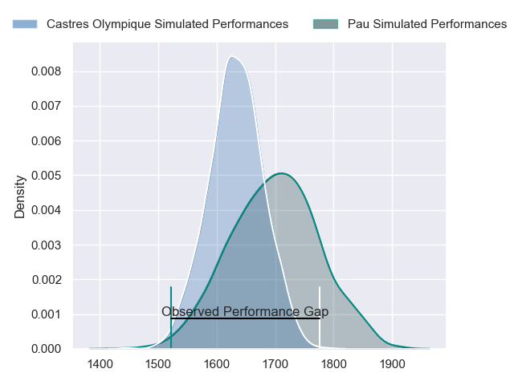
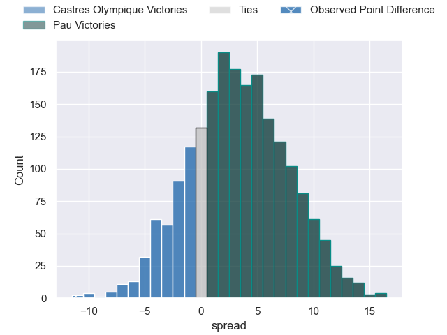
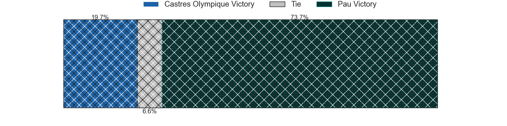
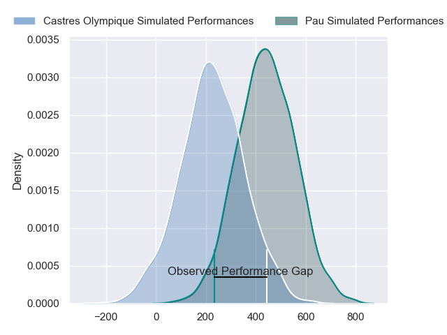
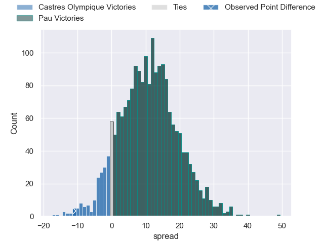
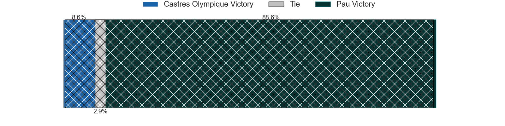

---  
layout: page  
title: Castres Olympique at Pau; 44-33  
date: 2024-02-03 18:00:00 -0500  
categories: "Top 14 Orange 2023" match review  
---
# Castres Olympique at Pau; 44-33

# Club Level Predictions

The first set of predictions treats a club as the smallest object, as the club develops its members, organizes a gameplan, and deploys its players as needed for each match. This club model has a prediction of 0.598, which translates to predicting Pau to win by 3.5.

Our Over/Under is 44.5 - and combined with the spread above, we have a predicted scoreline of 20 to 24

Each club has a rating and a rating deviation (similar to a Glicko rating), and expected performances can be generated. This allows for simulated matches and spreads like the ones below.
## Projected Performances - Club Model

## Projected Spreads - Club Model

## Projected Results - Club Model

# Player Level Predictions - Version 2

Treating teams instead as an entity made up of the currently active players, I have ratings for each player in an altogether different system. These can be combined to form team ratings once teamsheets are announced, weighting starters a bit higher than the reserves. After the match is played, players can be weighted by their minutes on the field, allowing for an accurate measure of the team's composition. With these compiled team ratings, we can make predictions, measure inaccuracy, and update the individual player ratings.
## Prediction without Player Minutes: Pau by 12.4

Pau by 4.4 on a neutral pitch

## Projected Performances - Player Model

## Projected Spreads - Player Model

## Projected Results - Player Model

|   Away Minutes | Away Player          |   Away Percentile |   Number |   Home Percentile | Home Player         |   Home Minutes |
|---------------:|:---------------------|------------------:|---------:|------------------:|:--------------------|---------------:|
|             58 | Loïs Guerois         |             55.86 |        1 |             10.27 | Guram Papidze       |             73 |
|             74 | Pierre Colonna       |             37.84 |        2 |             47.71 | Youri Delhommel     |             52 |
|             58 | Henry Thomas         |             62.52 |        3 |             82.52 | Siate Tokolahi      |             52 |
|             80 | Leone Nakarawa       |             94.91 |        4 |             19.29 | Guillaume Ducat     |             48 |
|             72 | Tom Staniforth       |             78.7  |        5 |             99.29 | Samuel Whitelock    |             80 |
|             80 | Baptiste Delaporte   |             80.72 |        6 |              5.85 | Thibault Hamonou    |             41 |
|             58 | Baptiste Cope        |             56.55 |        7 |             97.51 | Luke Whitelock      |             80 |
|             58 | Yann Peysson         |             70.69 |        8 |             43.26 | Beka Gorgadze       |             64 |
|             72 | Santiago Arata       |             70.14 |        9 |             98    | Dan Robson          |             56 |
|             80 | Louis Le Brun        |             68.05 |       10 |             86.1  | Joe Simmonds        |             80 |
|             80 | Geoffrey Palis       |             95.98 |       11 |              4.13 | Samuel Ezeala       |             80 |
|             74 | Adrea Cocagi         |             88.97 |       12 |             57.07 | Nathan Decron       |             80 |
|             80 | Vilimoni Botitu      |             63.91 |       13 |             32.01 | Emilien Gailleton   |             80 |
|             80 | Nathanael Hulleu     |             83.7  |       14 |              5.5  | Théo Attissogbe     |             80 |
|             80 | Pierre Popelin       |             65.3  |       15 |             73.25 | Jack Maddocks       |             80 |
|             22 | Abraham Papali'i     |             42.08 |       16 |             68.69 | Lekima Tagitagivalu |             39 |
|             22 | Levan Chilachava     |             75.23 |       17 |             17.28 | Hugo Auradou        |             32 |
|             22 | Antoine Tichit       |             85.5  |       18 |              6.31 | Nicolas Corato      |             28 |
|             22 | Mathieu Babillot     |             43.12 |       19 |             17.92 | Lucas Rey           |             28 |
|              8 | Florent Vanverberghe |             66.27 |       20 |             86.17 | Thibault Daubagna   |             24 |
|              8 | Jeremy Fernandez     |             28.66 |       21 |             52.65 | Reece Hewat         |             16 |
|              6 | Filipo Nakosi        |             85.82 |       22 |             47.75 | Siegfried Fisi'ihoi |              7 |
|              6 | Loris Zarantonello   |             40.4  |       23 |            nan    | nan                 |            nan |

