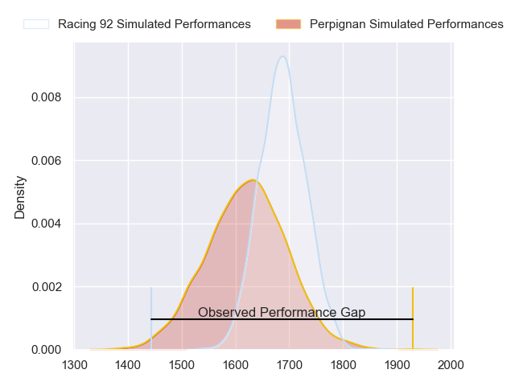
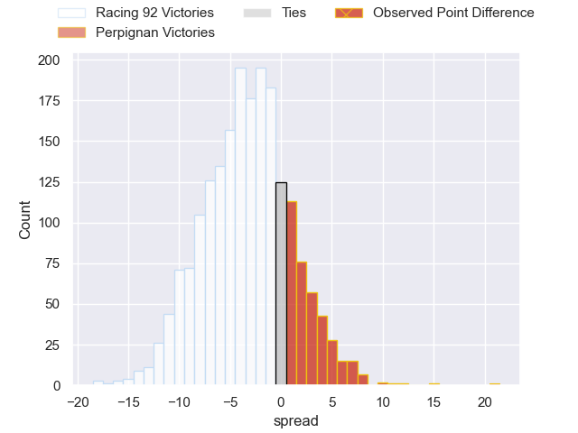
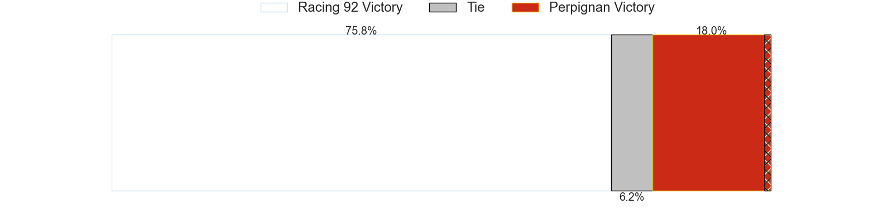
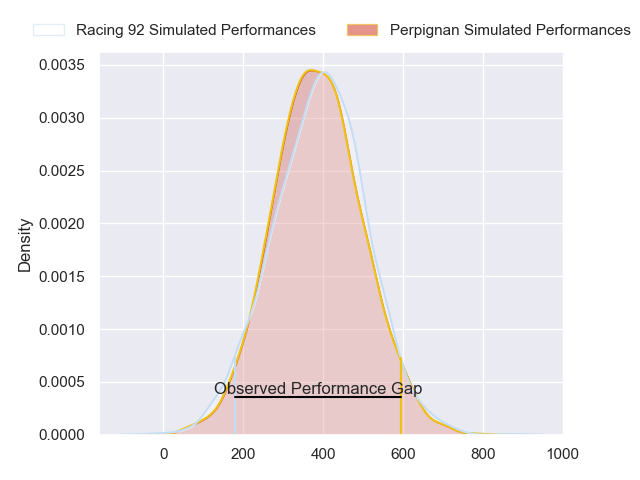
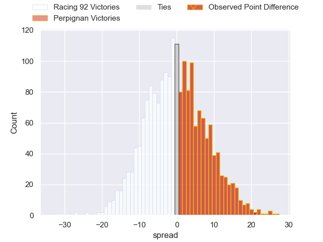
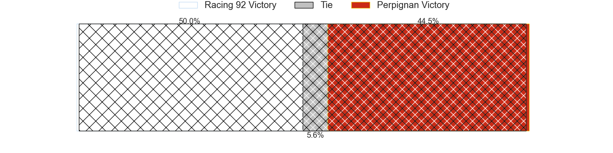

---  
layout: page  
title: Racing 92 at Perpignan; 5-26  
date: 2024-02-03 18:00:00 -0500  
categories: "Top 14 Orange 2023" match review  
---
# Racing 92 at Perpignan; 5-26

# Club Level Predictions

The first set of predictions treats a club as the smallest object, as the club develops its members, organizes a gameplan, and deploys its players as needed for each match. This club model has a prediction of 0.405, which translates to predicting Racing 92 to win by 3.4.

Our Over/Under is 52.5 - and combined with the spread above, we have a predicted scoreline of 28 to 25

Each club has a rating and a rating deviation (similar to a Glicko rating), and expected performances can be generated. This allows for simulated matches and spreads like the ones below.
## Projected Performances - Club Model

## Projected Spreads - Club Model

## Projected Results - Club Model

# Player Level Predictions - Version 2

Treating teams instead as an entity made up of the currently active players, I have ratings for each player in an altogether different system. These can be combined to form team ratings once teamsheets are announced, weighting starters a bit higher than the reserves. After the match is played, players can be weighted by their minutes on the field, allowing for an accurate measure of the team's composition. With these compiled team ratings, we can make predictions, measure inaccuracy, and update the individual player ratings.
## Prediction with Player Minutes: Perpignan by 1.1

Racing 92 by 7.6 on a neutral field
## Prediction without Player Minutes: Perpignan by 0.4

Racing 92 by 8.3 on a neutral pitch

## Projected Performances - Player Model

## Projected Spreads - Player Model

## Projected Results - Player Model

|   Away Minutes | Away Player        |   Away Percentile |   Number |   Home Percentile | Home Player           |   Home Minutes |
|---------------:|:-------------------|------------------:|---------:|------------------:|:----------------------|---------------:|
|             40 | Eddy Ben Arous     |             97.77 |        1 |             36.64 | Xavier Chiocci        |             48 |
|             40 | Janick Tarrit      |             50.91 |        2 |             86.31 | Seilala Lam           |             48 |
|             40 | Thomas Laclayat    |             76.76 |        3 |             38.52 | Nemo Roelofse         |             48 |
|             80 | Boris Palu         |             89.19 |        4 |             91.16 | Marvin Orie           |             80 |
|             25 | Veikoso Poloniati  |              7.67 |        5 |             36.86 | Mathieu Tanguy        |             68 |
|             80 | Wenceslas Lauret   |             95.43 |        6 |             60.43 | Alan Brazo            |             48 |
|             40 | Maxime Baudonne    |             40.65 |        7 |             64.57 | Jacobus van Tonder    |             51 |
|             80 | Kitione Kamikamica |             77.34 |        8 |             78.5  | Joaquin Oviedo        |             80 |
|             40 | Clovis Le bail     |             54.67 |        9 |             80.72 | Tom Ecochard          |             69 |
|             80 | Martin Méliande    |             18.84 |       10 |             85.02 | Jake McIntyre         |             80 |
|             80 | Juan Imhoff        |             98.84 |       11 |             50.42 | Lucas Dubois          |             80 |
|             80 | Henry Chavancy     |             98.92 |       12 |             99.76 | Jeronimo de la Fuente |             80 |
|             65 | Francis Saili      |             15.77 |       13 |              8    | Alivereti Duguivalu   |             80 |
|             65 | Vinaya Habosi      |             46.1  |       14 |             64.35 | Tavite Veredamu       |             48 |
|             80 | Tristan Tedder     |             69.21 |       15 |             69.93 | Louis Dupichot        |             80 |
|             55 | Anthime Hemery     |             74.53 |       16 |             46.2  | Sacha Lotrian         |             32 |
|             40 | Gia Kharaishvili   |             57.82 |       17 |              9.38 | Akato Fakatika        |             32 |
|             40 | Camille Chat       |             94.34 |       18 |             68.61 | Ignacio Ruiz          |             32 |
|             40 | Hassane Kolingar   |             31.46 |       19 |             90.19 | So'otala Fa'aso'o     |             32 |
|             40 | Ibrahim Diallo     |             17.5  |       20 |             87.93 | Patrick Sobela        |             29 |
|             40 | Max Spring         |             59.9  |       21 |              1.51 | Shahn Eru             |             12 |
|             15 | Olivier Klemenczak |             20.79 |       22 |             10.87 | Matteo Rodor          |             11 |
|             15 | Christian Wade     |             94.83 |       23 |             94.73 | Mathieu Acebes        |             32 |

