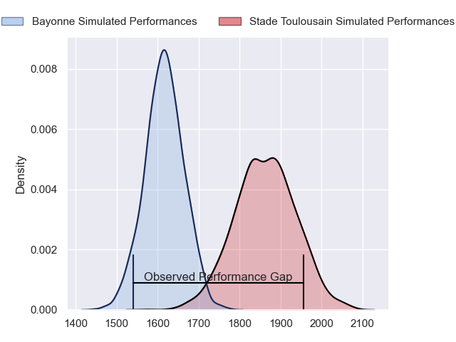
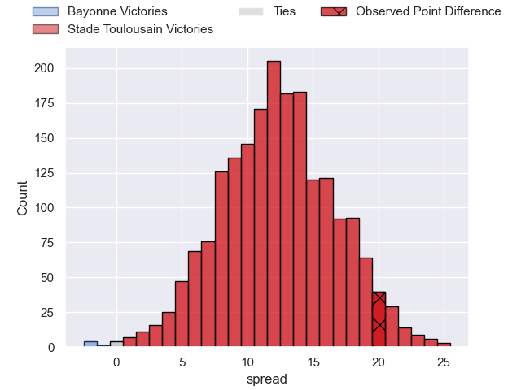
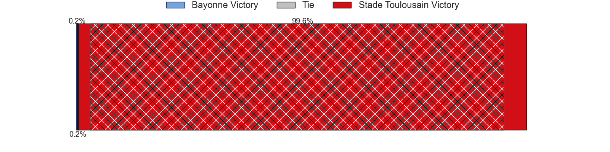
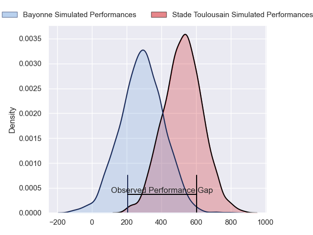
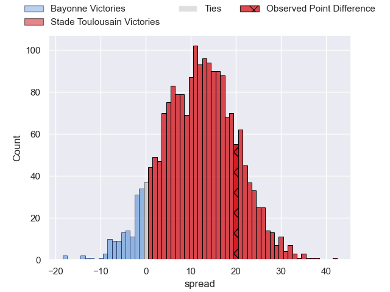
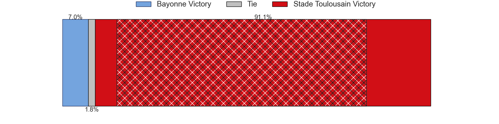

---  
layout: page  
title: Bayonne at Stade Toulousain; 26-46  
date: 2024-02-03 18:00:00 -0500  
categories: "Top 14 Orange 2023" match review  
---
# Bayonne at Stade Toulousain; 26-46

# Club Level Predictions

The first set of predictions treats a club as the smallest object, as the club develops its members, organizes a gameplan, and deploys its players as needed for each match. This club model has a prediction of 0.802, which translates to predicting Stade Toulousain to win by 12.3.

Our Over/Under is 46.5 - and combined with the spread above, we have a predicted scoreline of 17 to 29

Each club has a rating and a rating deviation (similar to a Glicko rating), and expected performances can be generated. This allows for simulated matches and spreads like the ones below.
## Projected Performances - Club Model

## Projected Spreads - Club Model

## Projected Results - Club Model

# Player Level Predictions - Version 2

Treating teams instead as an entity made up of the currently active players, I have ratings for each player in an altogether different system. These can be combined to form team ratings once teamsheets are announced, weighting starters a bit higher than the reserves. After the match is played, players can be weighted by their minutes on the field, allowing for an accurate measure of the team's composition. With these compiled team ratings, we can make predictions, measure inaccuracy, and update the individual player ratings.
## Prediction with Player Minutes: Stade Toulousain by 13.2

Stade Toulousain by 5.8 on a neutral field
## Prediction without Player Minutes: Stade Toulousain by 14.6

Stade Toulousain by 7.2 on a neutral pitch

## Projected Performances - Player Model

## Projected Spreads - Player Model

## Projected Results - Player Model

|   Away Minutes | Away Player           |   Away Percentile |   Number |   Home Percentile | Home Player          |   Home Minutes |
|---------------:|:----------------------|------------------:|---------:|------------------:|:---------------------|---------------:|
|             47 | Swan Cormenier        |             53.53 |        1 |             39.41 | Rodrigue Neti        |             70 |
|             61 | Vincent Giudicelli    |             13.14 |        2 |             62.23 | Guillaume Cramont    |             63 |
|             55 | Luke Tagi             |             79.27 |        3 |             96.07 | Nepo Laulala         |             50 |
|             51 | Arthur Iturria        |             89.65 |        4 |             70.12 | Richie Arnold        |             80 |
|             80 | Thomas Ceyte          |             68.02 |        5 |             80    | Piula Faasalele      |             49 |
|             47 | Pierre Huguet         |             47.17 |        6 |             63.37 | Alban Placines       |             53 |
|             80 | Baptiste Heguy        |             90.65 |        7 |             93.37 | Jack Willis          |             54 |
|             80 | Uzair Cassiem         |             82.01 |        8 |             96.26 | Alexandre Roumat     |             80 |
|             80 | Maxime Machenaud      |             91.65 |        9 |             34.99 | Paul Graou           |             75 |
|             80 | Camille Lopez         |             94.93 |       10 |             99.76 | Antoine Dupont       |             80 |
|             76 | Remy Baget            |             88.5  |       11 |             92.41 | Arthur Retiere       |             80 |
|             51 | Eneriko Buliruarua    |              7.05 |       12 |             51.02 | Pita Ahki            |             80 |
|             80 | Guillaume Martocq     |             16.13 |       13 |             95.22 | Sofiane Guitoune     |             61 |
|             80 | Arnaud Erbinartegaray |             63.92 |       14 |             70.04 | Setareki Bituniyata  |             80 |
|             80 | Cheikh Tiberghien     |             18.38 |       15 |             96.9  | Juan Cruz Mallia     |             80 |
|             33 | Remi Bourdeau         |             95.22 |       16 |             42.39 | Joshua Brennan       |             31 |
|             33 | Matis Perchaud        |             55.67 |       17 |             58.62 | Joel Merkler         |             30 |
|             29 | Lucas Paulos          |             75.81 |       18 |             52.39 | Theo Ntamack         |             27 |
|             29 | Aurelien Callandret   |             75.53 |       19 |             80.87 | Léo Banos            |             26 |
|             25 | Tevita Tatafu         |             49.87 |       20 |             78.61 | Pierre-Louis Barassi |             19 |
|             19 | Thomas Acquier        |             87.23 |       21 |             17.15 | Ian Boubila          |             17 |
|              4 | Gela Aprasidze        |             59.64 |       22 |             66.31 | Paul Mallez          |             10 |
|            nan | nan                   |            nan    |       23 |              2.66 | Baptiste Germain     |              5 |

