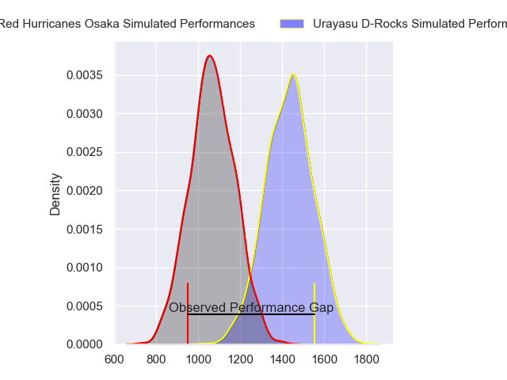
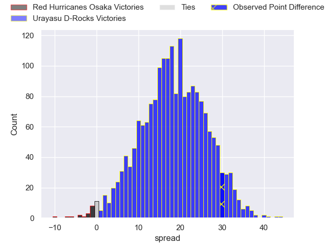
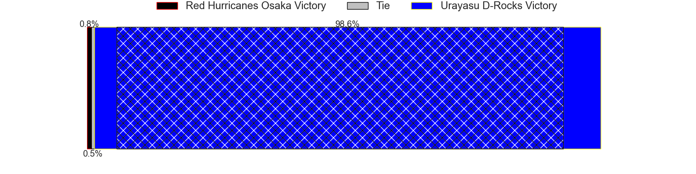
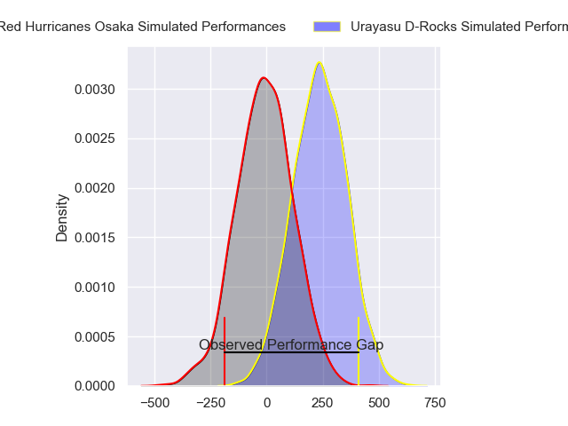
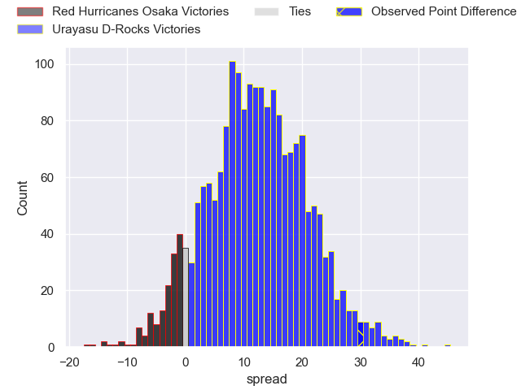
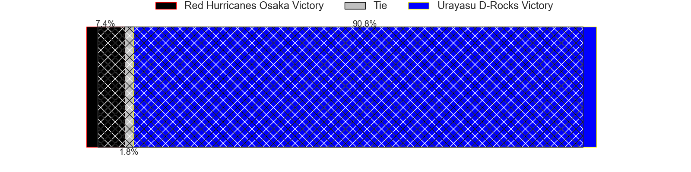

---  
layout: page  
title: Red Hurricanes Osaka at Urayasu D-Rocks; 15-45  
date: 2024-02-03 18:00:00 -0500  
categories: "Japan Rugby League One D2 2023" match review  
---
# Red Hurricanes Osaka at Urayasu D-Rocks; 15-45

# Club Level Predictions

The first set of predictions treats a club as the smallest object, as the club develops its members, organizes a gameplan, and deploys its players as needed for each match. This club model has a prediction of 0.883, which translates to predicting Urayasu D-Rocks to win by 18.4.

Our Over/Under is 64.5 - and combined with the spread above, we have a predicted scoreline of 23 to 41

Each club has a rating and a rating deviation (similar to a Glicko rating), and expected performances can be generated. This allows for simulated matches and spreads like the ones below.
## Projected Performances - Club Model

## Projected Spreads - Club Model

## Projected Results - Club Model

# Player Level Predictions - Version 2

Treating teams instead as an entity made up of the currently active players, I have ratings for each player in an altogether different system. These can be combined to form team ratings once teamsheets are announced, weighting starters a bit higher than the reserves. After the match is played, players can be weighted by their minutes on the field, allowing for an accurate measure of the team's composition. With these compiled team ratings, we can make predictions, measure inaccuracy, and update the individual player ratings.
## Prediction without Player Minutes: Urayasu D-Rocks by 13.0

Urayasu D-Rocks by 9.8 on a neutral pitch

## Projected Performances - Player Model

## Projected Spreads - Player Model

## Projected Results - Player Model

|   Away Minutes | Away Player          |   Away Percentile |   Number |   Home Percentile | Home Player          |   Home Minutes |
|---------------:|:---------------------|------------------:|---------:|------------------:|:---------------------|---------------:|
|             58 | Hiromichi Sakamoto   |             14.41 |        1 |             53.96 | Kazuki Ban           |             54 |
|             58 | Hisamitsu Shimada    |             56.67 |        2 |             58.87 | Asaeli Samisoni      |             58 |
|             40 | Munekata Sashida     |             57.03 |        3 |             67.39 | Kim Ryom             |             54 |
|             56 | Michael Allardice    |             22.49 |        4 |             18.22 | Levi Douglas         |             58 |
|             80 | Tatsunari Fujita     |             13.37 |        5 |             81.78 | Wimpie van der Walt  |             80 |
|             80 | Toru Sugishita       |             15.71 |        6 |              0.65 | James Moore          |             80 |
|             71 | Hiroki Hanada        |             47.24 |        7 |             75.84 | Liam Gill            |              6 |
|             80 | Josh Fenner          |             12.53 |        8 |             93.38 | Tyler Paul           |             80 |
|             54 | Akira Inoue          |             18.04 |        9 |             58.92 | Ren Iinuma           |             76 |
|             40 | Bryce Hegarty        |              2.2  |       10 |             66.1  | Hayden Cripps        |             80 |
|             80 | Kenta Komura         |             24.55 |       11 |             65.93 | Takuya Ishibashi     |             80 |
|             62 | Mifiposeti Paea      |             10.43 |       12 |             39.57 | Samisoni Ahokovi Tua |             80 |
|             80 | Yonhi Kimu           |              8.63 |       13 |             53.84 | Shane Gates          |             64 |
|             80 | Ryo Tsuruda          |             81.8  |       14 |             88.99 | Takuhei Yasuda       |             80 |
|             80 | Taichi Yoshizawa     |              2.41 |       15 |             49.16 | Yu Tamura            |             56 |
|             40 | Yuichiro Hosono      |             51.89 |       16 |            nan    | Brody MacAskill      |             74 |
|             26 | Toshihiro Yamamouchi |             64.33 |       17 |            nan    | Masahide Yanagikawa  |             26 |
|             24 | Tom Jeffries         |             59.29 |       18 |             47.02 | Shin Takeuchi        |             26 |
|             22 | Kentaro Otsuka       |            nan    |       19 |             57.14 | Siosifa Lisala       |             24 |
|             22 | Shosuke Fukasawa     |            nan    |       20 |             73.24 | Sekonaia Pole        |             22 |
|             18 | Kaoru Tsuruta        |             20.14 |       21 |             87.46 | Yuta Kojima          |             22 |
|              9 | Taro Sato            |             52.33 |       22 |             95.2  | Samu Kerevi          |             16 |
|             40 | Daisuke Iba          |             36.09 |       23 |            nan    | Taisei Konishi       |              4 |

