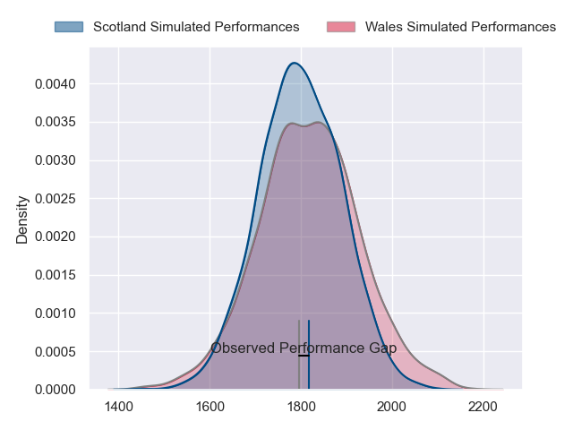
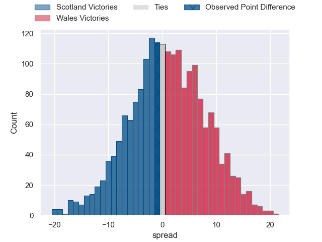
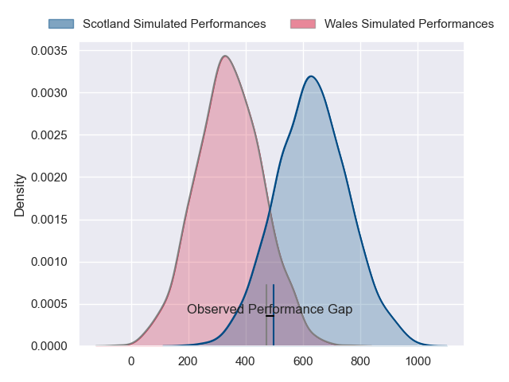
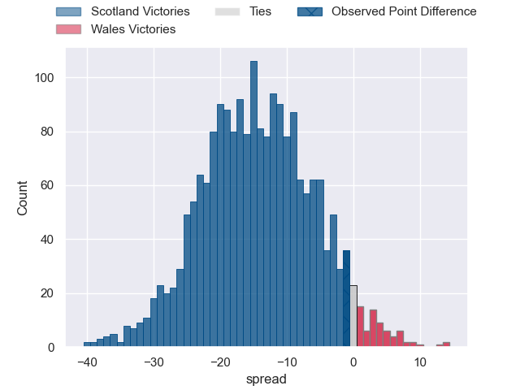
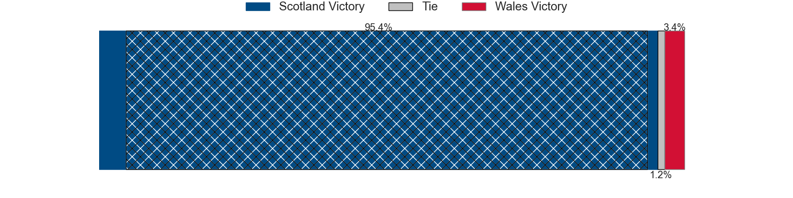

---  
layout: page  
title: Scotland at Wales; 27-26  
date: 2024-02-03 18:00:00 -0500  
categories: "Six Nations Championship 2024" match review  
---
# Scotland at Wales; 27-26

# Club Level Predictions

The first set of predictions treats a club as the smallest object, as the club develops its members, organizes a gameplan, and deploys its players as needed for each match. This club model has a prediction of 0.53, which translates to predicting Wales to win by 1.1.

Our Over/Under is 55.5 - and combined with the spread above, we have a predicted scoreline of 27 to 28

Each club has a rating and a rating deviation (similar to a Glicko rating), and expected performances can be generated. This allows for simulated matches and spreads like the ones below.
## Projected Performances - Club Model

## Projected Spreads - Club Model

## Projected Results - Club Model

# Player Level Predictions - Version 2

Treating teams instead as an entity made up of the currently active players, I have ratings for each player in an altogether different system. These can be combined to form team ratings once teamsheets are announced, weighting starters a bit higher than the reserves. After the match is played, players can be weighted by their minutes on the field, allowing for an accurate measure of the team's composition. With these compiled team ratings, we can make predictions, measure inaccuracy, and update the individual player ratings.
## Prediction with Player Minutes: Scotland by 11.9

Scotland by 16.0 on a neutral field
## Prediction without Player Minutes: Scotland by 12.7

Scotland by 16.8 on a neutral pitch

## Projected Performances - Player Model

## Projected Spreads - Player Model

## Projected Results - Player Model

|   Away Minutes | Away Player         |   Away Percentile |   Number |   Home Percentile | Home Player       |   Home Minutes |
|---------------:|:--------------------|------------------:|---------:|------------------:|:------------------|---------------:|
|             62 | Pierre Schoeman     |             89.28 |        1 |             74.98 | Corey Domachowski |             80 |
|             69 | George Turner       |             99.45 |        2 |             93.07 | Ryan Elias        |             41 |
|             69 | Zander Fagerson     |             99.02 |        3 |             29.04 | Leon Brown        |             41 |
|             32 | Richie Gray         |             77.67 |        4 |             92.09 | Dafydd Jenkins    |             80 |
|             80 | Scott Cummings      |             96.16 |        5 |             93.95 | Adam Beard        |             71 |
|             72 | Luke Crosbie        |             94.24 |        6 |             80.76 | James Botham      |             48 |
|             62 | Jamie Ritchie       |             99.89 |        7 |             89.78 | Tommy Reffell     |             80 |
|             80 | Matt Fagerson       |             95.56 |        8 |             85.75 | Aaron Wainwright  |             80 |
|             69 | Ben White           |             66.4  |        9 |             36.38 | Gareth Davies     |             41 |
|             80 | Finn Russell        |             99.28 |       10 |             43.96 | Sam Costelow      |             36 |
|             80 | Duhan van der Merwe |             80.27 |       11 |             24.26 | Rio Dyer          |             80 |
|             80 | Sione Tuipulotu     |             64.76 |       12 |             97.37 | Nick Tompkins     |             80 |
|             80 | Huw Jones           |             28.2  |       13 |             97.61 | Owen Watkin       |             51 |
|             80 | Kyle Steyn          |             96.52 |       14 |             66.56 | Josh Adams        |             80 |
|             80 | Kyle Rowe           |             73.75 |       15 |             41.29 | Cam Winnett       |             80 |
|             48 | Sam Skinner         |             88.95 |       16 |              3.62 | Ioan Lloyd        |             44 |
|             18 | Jack Dempsey        |             31.31 |       17 |             15.55 | Keiron Assiratti  |             39 |
|             18 | Alec Hepburn        |             69.26 |       18 |             79.92 | Tomos Williams    |             39 |
|             11 | George Horne        |             99.4  |       19 |             90.15 | Elliot Dee        |             39 |
|             11 | Elliot Millar-Mills |             76.14 |       20 |              8.48 | Alex Mann         |             32 |
|             11 | Ewan Ashman         |             81.2  |       21 |             71.84 | Mason Grady       |             29 |
|              8 | Cameron Redpath     |             48.75 |       22 |             16.98 | Teddy Williams    |              9 |

