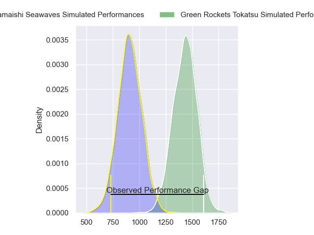
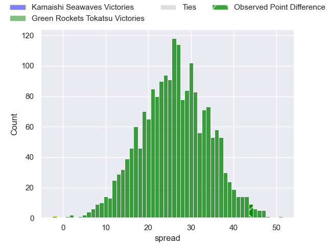
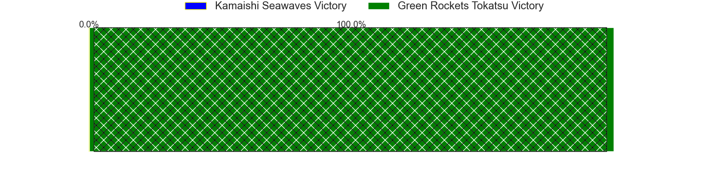
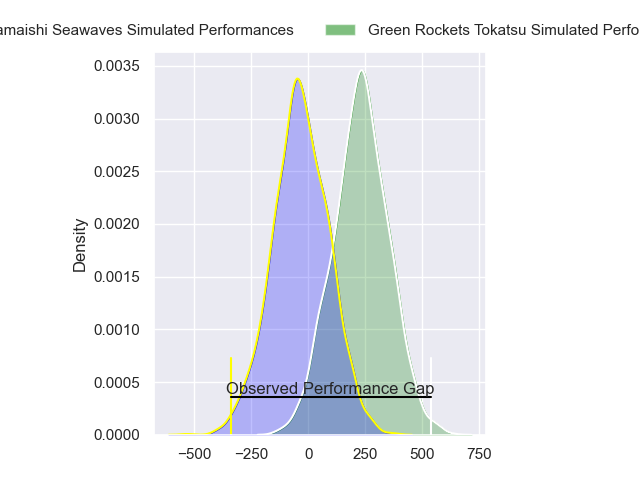
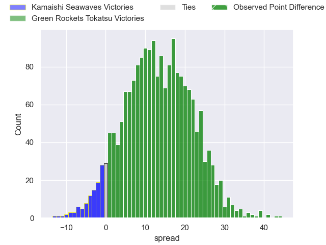
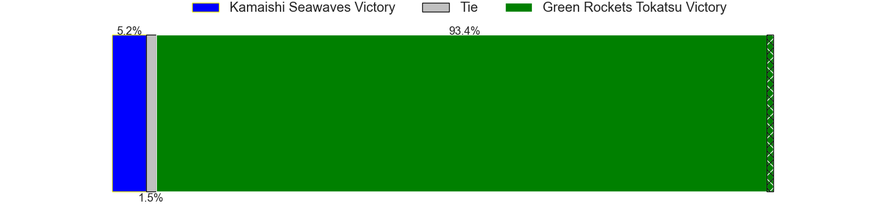

---  
layout: page  
title: Kamaishi Seawaves at Green Rockets Tokatsu; 17-61  
date: 2024-02-04 18:00:00 -0500  
categories: "Japan Rugby League One D2 2023" match review  
---
# Kamaishi Seawaves at Green Rockets Tokatsu; 17-61

# Club Level Predictions

The first set of predictions treats a club as the smallest object, as the club develops its members, organizes a gameplan, and deploys its players as needed for each match. This club model has a prediction of 0.945, which translates to predicting Green Rockets Tokatsu to win by 26.3.

Our Over/Under is 47.5 - and combined with the spread above, we have a predicted scoreline of 11 to 37

Each club has a rating and a rating deviation (similar to a Glicko rating), and expected performances can be generated. This allows for simulated matches and spreads like the ones below.
## Projected Performances - Club Model

## Projected Spreads - Club Model

## Projected Results - Club Model

# Player Level Predictions - Version 2

Treating teams instead as an entity made up of the currently active players, I have ratings for each player in an altogether different system. These can be combined to form team ratings once teamsheets are announced, weighting starters a bit higher than the reserves. After the match is played, players can be weighted by their minutes on the field, allowing for an accurate measure of the team's composition. With these compiled team ratings, we can make predictions, measure inaccuracy, and update the individual player ratings.
## Prediction without Player Minutes: Green Rockets Tokatsu by 15.6

Green Rockets Tokatsu by 12.3 on a neutral pitch

## Projected Performances - Player Model

## Projected Spreads - Player Model

## Projected Results - Player Model

|   Away Minutes | Away Player      |   Away Percentile |   Number |   Home Percentile | Home Player           |   Home Minutes |
|---------------:|:-----------------|------------------:|---------:|------------------:|:----------------------|---------------:|
|             60 | Yusuke Yamada    |             33.69 |        1 |             82.25 | Kosei Yamamoto        |             68 |
|             63 | Daiki Ito        |              5.3  |        2 |             96.71 | Ash Dixon             |             61 |
|             73 | Taiki Noguchi    |             13.51 |        3 |             79.55 | Kanta Higashionna     |             55 |
|             80 | Hamish Dalzell   |             18.82 |        4 |             41.18 | Jake Ball             |             80 |
|             80 | Dallas Tatana    |              7.57 |        5 |             57.63 | Daiki Yamagiwa        |             61 |
|             63 | Sergio Moreira   |             39.44 |        6 |             76.27 | Viliami Lutua Ahofono |             80 |
|             68 | Ryota Kono       |             28.28 |        7 |             65.66 | Ryoi Kamei            |             52 |
|             80 | Seta Koroitamana |             18.2  |        8 |             68.56 | Aseri Masivou         |             80 |
|             66 | Atsushi Minami   |             26.85 |        9 |             91.98 | Nick Phipps           |             63 |
|             80 | Kazuki Ochi      |             33.41 |       10 |             59.76 | Tiaan Swanepoel       |             80 |
|             80 | Jamie Henry      |             78.73 |       11 |              3.28 | Hiroyuki Miyajima     |             80 |
|             80 | Kohei Ishigaki   |             11.75 |       12 |             60.67 | Nathanael Tupou       |             18 |
|             53 | Mosese Tonga     |             16.67 |       13 |              6.59 | Maritino Nemani       |             80 |
|             40 | Kodai Ono        |              1.9  |       14 |             77.67 | Kenta Omata           |             80 |
|             80 | Cam Bailey       |              2.65 |       15 |             62.89 | Lomano Lemeki         |             80 |
|             40 | Ryuji Abe        |             27.41 |       16 |             34.5  | Koichi Matsura        |             53 |
|             27 | Syou Kataoka     |            nan    |       17 |            nan    | Mitieli Tuinakauvadra |             28 |
|             20 | Shoichiro Inada  |             17.57 |       18 |             82.7  | Keisuke Kikuta        |             25 |
|             17 | Yuki Go          |            nan    |       19 |             62.52 | Myuu Arai             |             19 |
|             17 | Ryunosuke Yamada |              8.67 |       20 |             94.08 | Sam Jeffries          |             19 |
|             14 | Takumi Tokairin  |             35.27 |       21 |             85.77 | Fumiaki Tanaka        |             17 |
|             12 | Sotaro Takahashi |            nan    |       22 |              0.99 | Sunao Takizawa        |             12 |
|              7 | Shohei Osada     |            nan    |       23 |             90.24 | Taisetsu Kanai        |              9 |

