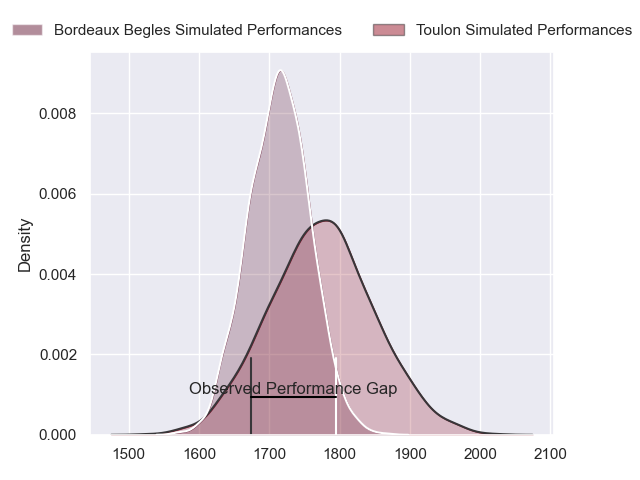
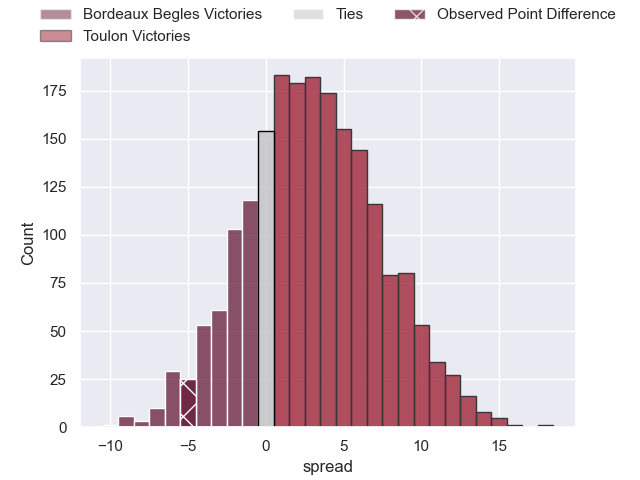
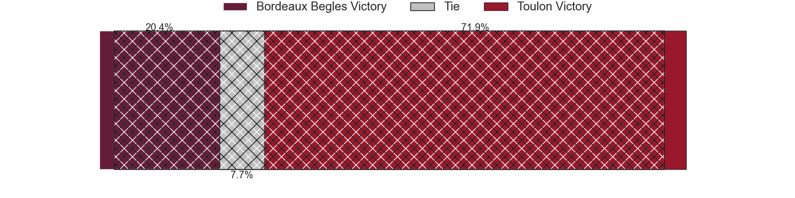
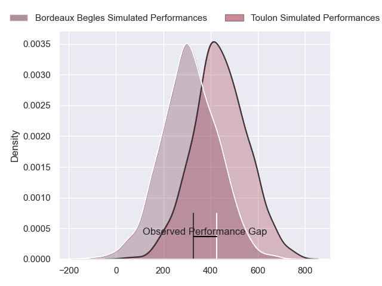
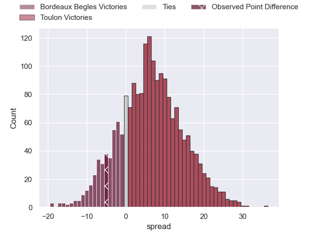
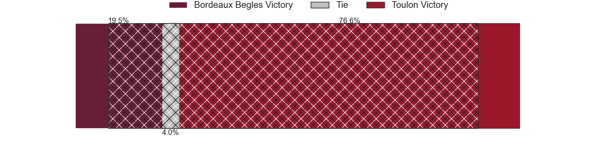

---  
layout: page  
title: Bordeaux Begles at Toulon; 37-32  
date: 2024-02-04 18:00:00 -0500  
categories: "Top 14 Orange 2023" match review  
---
# Bordeaux Begles at Toulon; 37-32

# Club Level Predictions

The first set of predictions treats a club as the smallest object, as the club develops its members, organizes a gameplan, and deploys its players as needed for each match. This club model has a prediction of 0.587, which translates to predicting Toulon to win by 3.1.

Our Over/Under is 56.5 - and combined with the spread above, we have a predicted scoreline of 27 to 30

Each club has a rating and a rating deviation (similar to a Glicko rating), and expected performances can be generated. This allows for simulated matches and spreads like the ones below.
## Projected Performances - Club Model

## Projected Spreads - Club Model

## Projected Results - Club Model

# Player Level Predictions - Version 2

Treating teams instead as an entity made up of the currently active players, I have ratings for each player in an altogether different system. These can be combined to form team ratings once teamsheets are announced, weighting starters a bit higher than the reserves. After the match is played, players can be weighted by their minutes on the field, allowing for an accurate measure of the team's composition. With these compiled team ratings, we can make predictions, measure inaccuracy, and update the individual player ratings.
## Prediction without Player Minutes: Toulon by 6.7

Bordeaux Begles by 0.2 on a neutral pitch

## Projected Performances - Player Model

## Projected Spreads - Player Model

## Projected Results - Player Model

|   Away Minutes | Away Player        |   Away Percentile |   Number |   Home Percentile | Home Player                    |   Home Minutes |
|---------------:|:-------------------|------------------:|---------:|------------------:|:-------------------------------|---------------:|
|             42 | Jefferson Poirot   |             80.54 |        1 |             85.95 | Dany Priso                     |             59 |
|             50 | Clement Maynadier  |             92.87 |        2 |             34.73 | Teddy Baubigny                 |             53 |
|             35 | Ben Tameifuna      |             98.02 |        3 |             47.12 | Beka Gigashvili                |             64 |
|             80 | Alexandre Ricard   |             70.77 |        4 |             76.8  | David Ribbans                  |             80 |
|             59 | Kane Douglas       |             84.85 |        5 |             73.49 | Brian Alainu'uese              |             59 |
|             50 | Antoine Miquel     |             72.16 |        6 |             77.14 | Cornell du Preez               |             80 |
|             53 | Mahamadou Diaby    |             82.77 |        7 |             42.8  | Jules Coulon                   |             80 |
|             80 | Tevita Tatafu      |             87.71 |        8 |             78.72 | Selevasio Tolofua              |             59 |
|             63 | Paul Abadie        |              4.41 |        9 |             11.22 | Vasil Lobzhanidze              |             69 |
|             80 | Mateo Garcia       |             52.68 |       10 |             96.83 | Dan Biggar                     |             64 |
|             80 | Pablo Uberti       |             42.12 |       11 |             86.67 | Leicester Fainga'anuku         |             80 |
|             53 | Ben Tapuai         |             49.28 |       12 |             48.08 | Duncan Paia'aua                |             80 |
|             80 | Nicolas Depoortere |             87.65 |       13 |             97.24 | Waisea Nayacalevu Vuidravuwalu |             80 |
|             80 | Madosh Tambwe      |             96.51 |       14 |              9.63 | Gaël Dréan                     |             40 |
|             80 | Romain Buros       |             98.55 |       15 |             24.1  | Aymeric Luc                    |             80 |
|             38 | Ugo Boniface       |             88.29 |       16 |             15.23 | Bruce Devaux                   |             21 |
|             30 | Romain Laterrade   |             12.61 |       17 |             93.6  | Christopher Tolofua            |             27 |
|             45 | Zaccharie Affane   |            nan    |       18 |             91.71 | Emerick Setiano                |             16 |
|             21 | Pete Samu          |             86.29 |       19 |             39.29 | Matthias Halagahu              |             21 |
|             30 | Pierre Bochaton    |             91.87 |       20 |             85.11 | Facundo Isa                    |             21 |
|             27 | Marko Gazzotti     |             73.89 |       21 |             71.94 | Jules Danglot                  |             11 |
|             17 | Theo Nanette       |              4.61 |       22 |             76.83 | Enzo Herve                     |             16 |
|             27 | Tani Vili          |             61.99 |       23 |             59.83 | Seta Tuicuvu                   |             40 |

