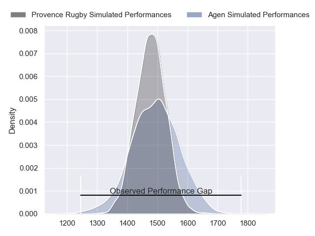
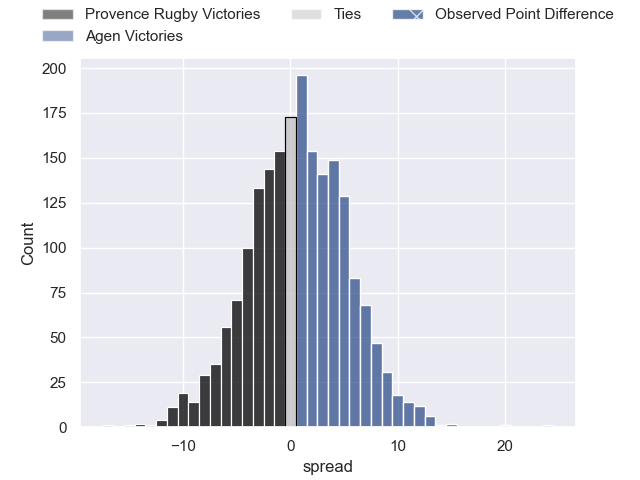
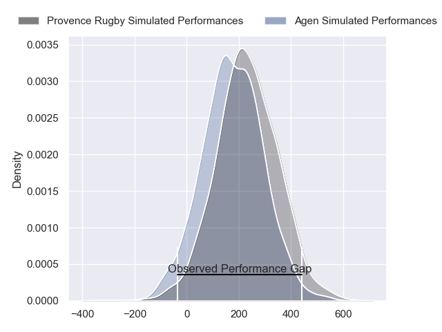
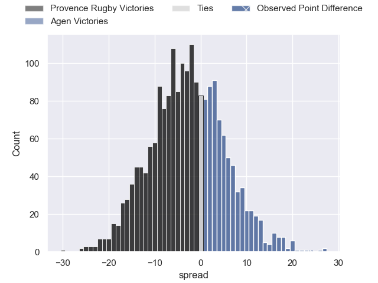
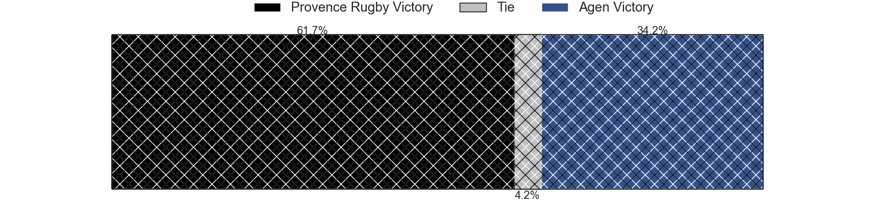

---  
layout: page  
title: Provence Rugby at Agen; 7-31  
date: 2024-02-08 18:00:00 -0500  
categories: "Pro D2 2023" match review  
---
# Provence Rugby at Agen; 7-31

# Club Level Predictions

The first set of predictions treats a club as the smallest object, as the club develops its members, organizes a gameplan, and deploys its players as needed for each match. This club model has a prediction of 0.518, which translates to predicting Agen to win by 0.6.

Our Over/Under is 39.5 - and combined with the spread above, we have a predicted scoreline of 19 to 20

Each club has a rating and a rating deviation (similar to a Glicko rating), and expected performances can be generated. This allows for simulated matches and spreads like the ones below.
## Projected Performances - Club Model

## Projected Spreads - Club Model

## Projected Results - Club Model

# Player Level Predictions - Version 2

Treating teams instead as an entity made up of the currently active players, I have ratings for each player in an altogether different system. These can be combined to form team ratings once teamsheets are announced, weighting starters a bit higher than the reserves. After the match is played, players can be weighted by their minutes on the field, allowing for an accurate measure of the team's composition. With these compiled team ratings, we can make predictions, measure inaccuracy, and update the individual player ratings.
## Prediction without Player Minutes: Provence Rugby by 3.5

Provence Rugby by 11.5 on a neutral pitch

## Projected Performances - Player Model

## Projected Spreads - Player Model

## Projected Results - Player Model

|   Away Minutes | Away Player           |   Away Percentile |   Number |   Home Percentile | Home Player        |   Home Minutes |
|---------------:|:----------------------|------------------:|---------:|------------------:|:-------------------|---------------:|
|             44 | Federico Wegrzyn      |             75.14 |        1 |             17.39 | Florent Guion      |             54 |
|             44 | Jean Charles Orioli   |             50.09 |        2 |             39.85 | Clement Martinez   |             53 |
|             47 | Tomas Francis         |             99.19 |        3 |             61.35 | Alex Burin         |             59 |
|             80 | Andres Zafra Tarazona |              1.89 |        4 |              4.38 | Evan Olmstead      |             80 |
|             44 | Josh Tyrell           |             78.82 |        5 |             85.33 | William Demotte    |             40 |
|             44 | Carl Axtens           |             27.3  |        6 |             19.83 | Julien Lebian      |             57 |
|             80 | Jessy Jegerlehner     |              2.17 |        7 |             75.62 | Arnaud Duputs      |             80 |
|             80 | Malohi Suta           |             35.93 |        8 |             22.46 | Fotu Lokotui       |             80 |
|             44 | Joris Cazenave        |             68.54 |        9 |              6.81 | Sonatane Takulua   |             57 |
|             80 | Jimmy Gopperth        |             85.12 |       10 |             63.17 | Thomas Vincent     |             80 |
|             47 | Hugo Navizet          |             68.04 |       11 |             36.93 | Iban Etcheverry    |             80 |
|             80 | Kaveinga Finau        |             84.05 |       12 |             65.71 | Clement Garrigues  |             65 |
|             44 | Atila Septar          |             45.8  |       13 |             55.04 | Theo Belan         |             80 |
|             80 | Adrien Lapegue-Lafaye |             18.2  |       14 |             91.96 | Henry Purdy        |             80 |
|             80 | Enzo Selponi          |             84.1  |       15 |             51.81 | Romain Darchen     |             66 |
|             36 | Nicolas Toth          |            nan    |       16 |             35.5  | Corentin Vernet    |             40 |
|             36 | Lucas Martin          |             90.86 |       17 |             11.15 | Mike Sosene-Feagai |             27 |
|             36 | Clément Chartier      |             69.23 |       18 |             52.7  | Hans Lombard-Buret |             26 |
|             36 | Guillaume Piazzoli    |             77.79 |       19 |             23.65 | Theo Idjellidaine  |             23 |
|             36 | Arthur Coville        |             62.73 |       20 |             49.41 | Matthieu Bonnet    |             23 |
|             36 | Louis Marrou          |             87.77 |       21 |             39.73 | Beau Farrance      |             21 |
|             33 | Léo Drouet            |             53.23 |       22 |             39.02 | Ben Volavola       |             14 |
|             33 | Thomas Vernet         |             54.41 |       23 |             73.38 | Harry Sloan        |             15 |

