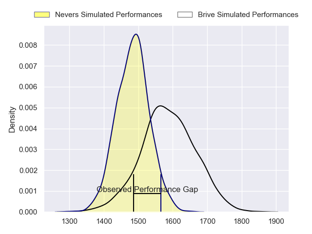
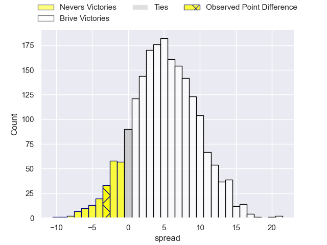
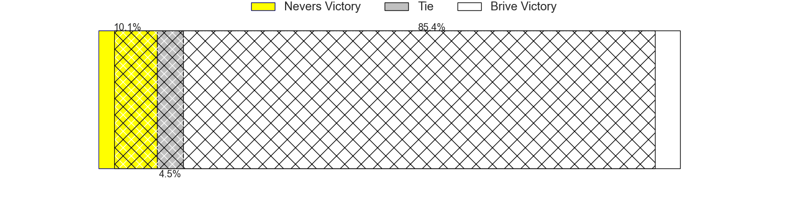
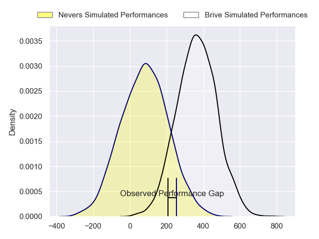
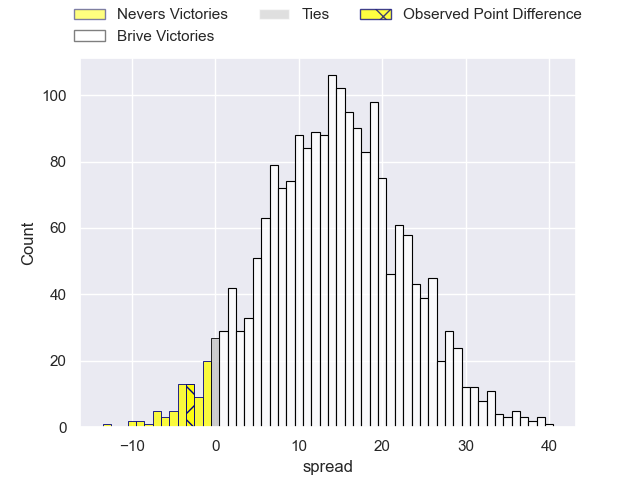
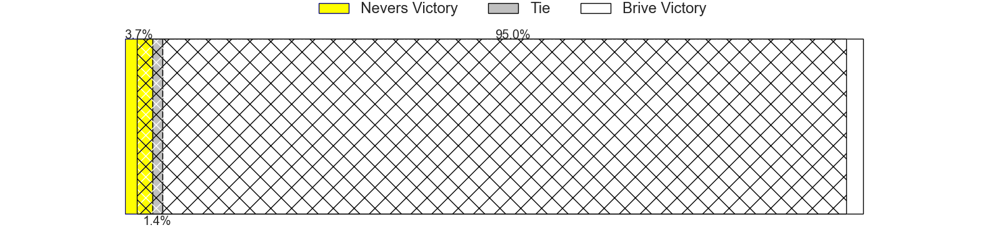

---  
layout: page  
title: Nevers at Brive; 16-13  
date: 2024-02-09 18:00:00 -0500  
categories: "Pro D2 2023" match review  
---
# Nevers at Brive; 16-13

# Club Level Predictions

The first set of predictions treats a club as the smallest object, as the club develops its members, organizes a gameplan, and deploys its players as needed for each match. This club model has a prediction of 0.644, which translates to predicting Brive to win by 5.2.

Our Over/Under is 39.5 - and combined with the spread above, we have a predicted scoreline of 17 to 22

Each club has a rating and a rating deviation (similar to a Glicko rating), and expected performances can be generated. This allows for simulated matches and spreads like the ones below.
## Projected Performances - Club Model

## Projected Spreads - Club Model

## Projected Results - Club Model

# Player Level Predictions - Version 2

Treating teams instead as an entity made up of the currently active players, I have ratings for each player in an altogether different system. These can be combined to form team ratings once teamsheets are announced, weighting starters a bit higher than the reserves. After the match is played, players can be weighted by their minutes on the field, allowing for an accurate measure of the team's composition. With these compiled team ratings, we can make predictions, measure inaccuracy, and update the individual player ratings.
## Prediction without Player Minutes: Brive by 15.3

Brive by 7.6 on a neutral pitch

## Projected Performances - Player Model

## Projected Spreads - Player Model

## Projected Results - Player Model

|   Away Minutes | Away Player              |   Away Percentile |   Number |   Home Percentile | Home Player          |   Home Minutes |
|---------------:|:-------------------------|------------------:|---------:|------------------:|:---------------------|---------------:|
|             50 | Kamaliele Tufele         |             72.7  |        1 |             72.16 | Hugo Reilhes         |             40 |
|             65 | Elia Elia                |             59.96 |        2 |             79.34 | Issam Hamel          |             40 |
|             50 | Cleopas Kundiona         |             34.14 |        3 |             15.5  | Marcel van der Merwe |             40 |
|             80 | Christiaan van der Merwe |              7.1  |        4 |             54.67 | Renger Van Eerten    |             40 |
|             60 | Kevin Noah               |             33.25 |        5 |             35.38 | Julien Delannoy      |             40 |
|             80 | Luka Plataret            |             74.65 |        6 |             52.55 | Sasha Gue            |             80 |
|             80 | Julien Kazubek           |             81.58 |        7 |             72.48 | Retief Marais        |             80 |
|             80 | Robin Dione              |             52.25 |        8 |             52.96 | Taniela Sadrugu      |             40 |
|             64 | Hugo Bouyssou            |             10.82 |        9 |             29.66 | Leo Carbonneau       |             80 |
|             64 | Yohan Le Bourhis         |             70.98 |       10 |             21.46 | Tom Raffy            |             80 |
|             80 | Arthur Mathiron          |             46.88 |       11 |             65.29 | Asaeli Tuivuaka      |             80 |
|             80 | Rudy Derrieux            |             85.25 |       12 |             58.27 | Guillaume Galletier  |             80 |
|             80 | Alifereti Loaloa         |             73.86 |       13 |             36.57 | Kevin Fabien         |             63 |
|             80 | Christian Ambadiang      |             53.44 |       14 |             47.3  | Benjamin Lefranc     |             80 |
|             80 | Dylan Jaminet            |             64.1  |       15 |             86.99 | Stuart Olding        |             40 |
|             30 | Aitor Kitutu             |             63.42 |       16 |             75.03 | Tevita Ratuva        |             40 |
|             30 | Ilia Kaikatsishvili      |             56.13 |       17 |             67.3  | Wesley Tapueluelu    |             40 |
|             20 | Chris Gabriel            |            nan    |       18 |             92.85 | Ross Moriarty        |             40 |
|             16 | Guillaume Manevy         |             17.23 |       19 |             61.21 | Asier Usarraga       |             40 |
|             16 | Shaun Reynolds           |             33.66 |       20 |             71.98 | Vakh Abdaladze       |             40 |
|             15 | Jonathan Maiau           |             21.39 |       21 |             44.24 | Benjamin Boudou      |             40 |
|            nan | nan                      |            nan    |       22 |             65.78 | Mathis Ferté         |             40 |
|            nan | nan                      |            nan    |       23 |             78.94 | Arthur Bonneval      |             17 |

