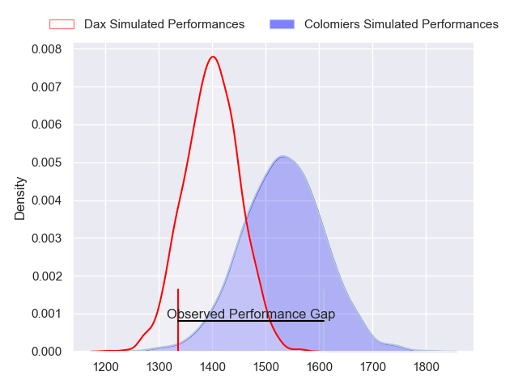
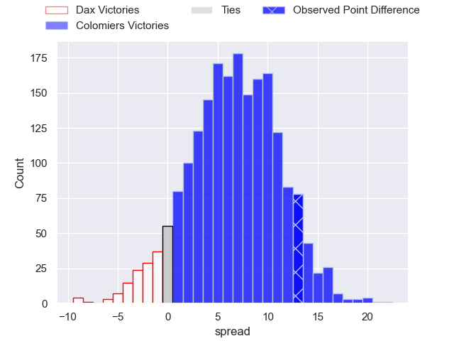
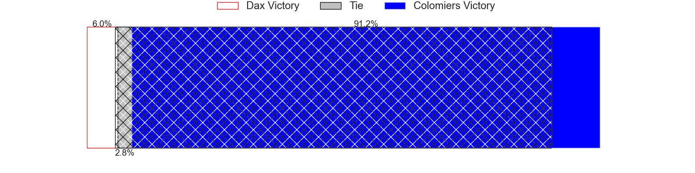
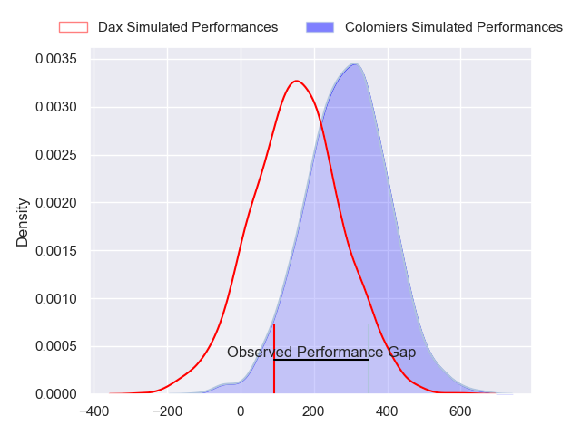
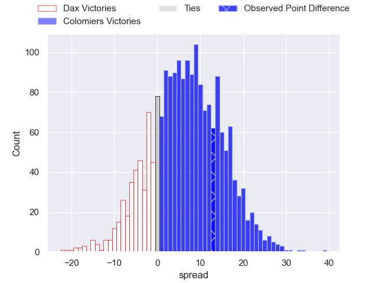
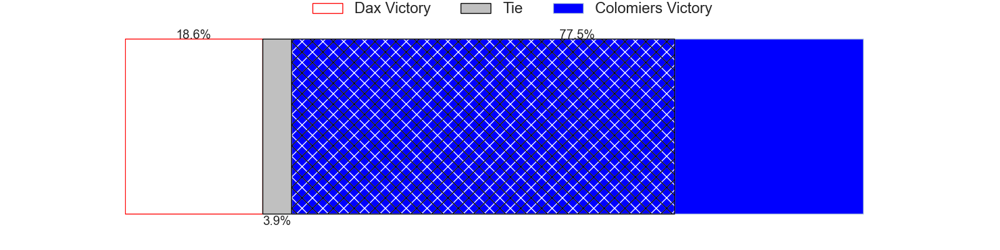

---  
layout: page  
title: Dax at Colomiers; 17-30  
date: 2024-02-09 18:00:00 -0500  
categories: "Pro D2 2023" match review  
---
# Dax at Colomiers; 17-30

# Club Level Predictions

The first set of predictions treats a club as the smallest object, as the club develops its members, organizes a gameplan, and deploys its players as needed for each match. This club model has a prediction of 0.679, which translates to predicting Colomiers to win by 6.6.

Our Over/Under is 44.5 - and combined with the spread above, we have a predicted scoreline of 19 to 26

Each club has a rating and a rating deviation (similar to a Glicko rating), and expected performances can be generated. This allows for simulated matches and spreads like the ones below.
## Projected Performances - Club Model

## Projected Spreads - Club Model

## Projected Results - Club Model

# Player Level Predictions - Version 2

Treating teams instead as an entity made up of the currently active players, I have ratings for each player in an altogether different system. These can be combined to form team ratings once teamsheets are announced, weighting starters a bit higher than the reserves. After the match is played, players can be weighted by their minutes on the field, allowing for an accurate measure of the team's composition. With these compiled team ratings, we can make predictions, measure inaccuracy, and update the individual player ratings.
## Prediction without Player Minutes: Colomiers by 7.5

Dax by 0.2 on a neutral pitch

## Projected Performances - Player Model

## Projected Spreads - Player Model

## Projected Results - Player Model

|   Away Minutes | Away Player          |   Away Percentile |   Number |   Home Percentile | Home Player           |   Home Minutes |
|---------------:|:---------------------|------------------:|---------:|------------------:|:----------------------|---------------:|
|             48 | Asa Faitotoa         |             43.24 |        1 |             76.31 | Hugo Djehi            |             54 |
|             48 | Maxime Delonca       |             44.79 |        2 |             29.25 | Thomas Larrieu        |             58 |
|             48 | Nephi Leatigaga      |             14.32 |        3 |             66.58 | Hugo Pirlet           |             54 |
|             71 | Mattieu Bidau        |             65.92 |        4 |             58.46 | Jean Thomas           |             58 |
|             48 | Mat Luamanu          |             68.99 |        5 |             59.41 | Janse Roux            |             58 |
|             80 | Brice Ferrer         |             35.64 |        6 |             37.05 | Anthony Coletta       |             58 |
|             80 | Théo Tremeau         |             57.1  |        7 |             91.66 | Aldric Lescure        |             80 |
|             80 | Sam Wasley           |             44.92 |        8 |             61.7  | Jorick Dastugue       |             80 |
|             61 | Simon Garrouteigt    |             78.56 |        9 |             62.12 | Ugo Seguela           |             74 |
|             80 | Hugo Cerisier        |             59.51 |       10 |             68.54 | Maxime Javaux         |             80 |
|             80 | Jope Naceava         |             64.34 |       11 |              6.56 | Valentin Saurs        |             80 |
|             80 | Benjamin Puntous     |             16.19 |       12 |             73.26 | Ray Nu'u              |             32 |
|             58 | Bastien Daguerre     |             56.12 |       13 |             15.59 | Martin Dulon          |             80 |
|             80 | Théo Gatelier        |             76.93 |       14 |             86.14 | Vincent Pinto         |             80 |
|             61 | Théo Duprat          |             48.19 |       15 |             49.64 | Thomas Girard         |             80 |
|             32 | Louis Mary           |             72.61 |       16 |             48.2  | Paul Pimienta         |             48 |
|             32 | Louis Barrere        |             15.36 |       17 |             51.03 | Pierre-Samuel Pacheco |             26 |
|             32 | Jean-Baptiste Singer |              8.88 |       18 |             78.92 | Michael Simutoga      |             26 |
|             32 | Diogo Hasse Ferreira |             12.52 |       19 |             22.67 | Andrew Ready          |             22 |
|             22 | Hugo Fourquet        |             88.36 |       20 |             54.44 | Alexandre Manukula    |             22 |
|             19 | Paul Ravier          |             78.16 |       21 |             69.98 | Romain Bezian         |             22 |
|             19 | Romuald Séguy        |             54.15 |       22 |             39.01 | Jeremy Bechu          |             22 |
|              9 | Paul Arnaud Ausset   |             74.43 |       23 |             89.98 | Edoardo Gori          |              6 |

