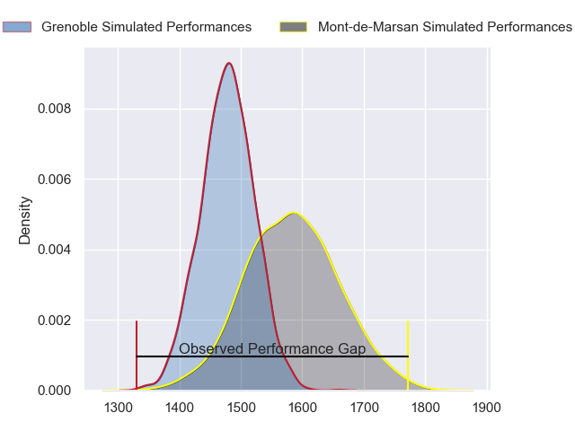
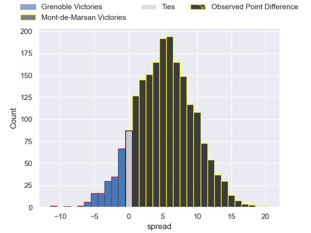
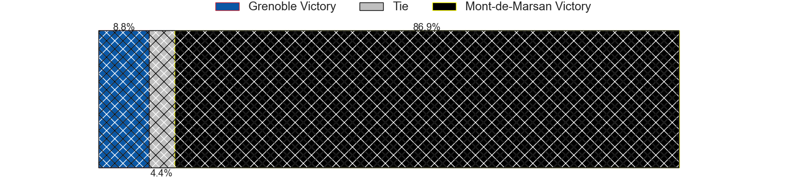
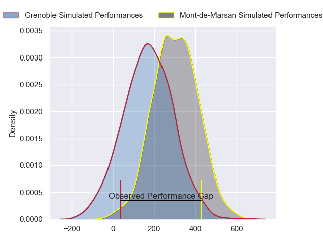
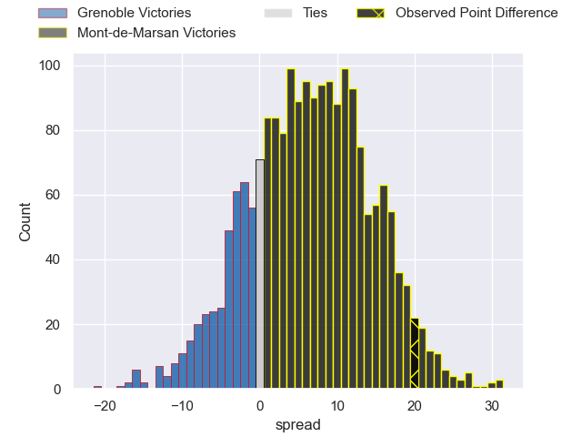
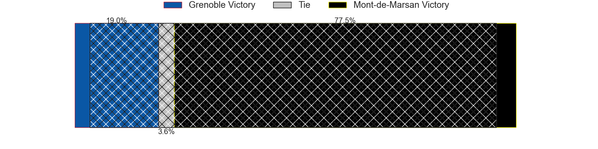

---  
layout: page  
title: Grenoble at Mont-de-Marsan; 19-39  
date: 2024-02-09 18:00:00 -0500  
categories: "Pro D2 2023" match review  
---
# Grenoble at Mont-de-Marsan; 19-39

# Club Level Predictions

The first set of predictions treats a club as the smallest object, as the club develops its members, organizes a gameplan, and deploys its players as needed for each match. This club model has a prediction of 0.649, which translates to predicting Mont-de-Marsan to win by 5.4.

Our Over/Under is 44.5 - and combined with the spread above, we have a predicted scoreline of 19 to 25

Each club has a rating and a rating deviation (similar to a Glicko rating), and expected performances can be generated. This allows for simulated matches and spreads like the ones below.
## Projected Performances - Club Model

## Projected Spreads - Club Model

## Projected Results - Club Model

# Player Level Predictions - Version 2

Treating teams instead as an entity made up of the currently active players, I have ratings for each player in an altogether different system. These can be combined to form team ratings once teamsheets are announced, weighting starters a bit higher than the reserves. After the match is played, players can be weighted by their minutes on the field, allowing for an accurate measure of the team's composition. With these compiled team ratings, we can make predictions, measure inaccuracy, and update the individual player ratings.
## Prediction without Player Minutes: Mont-de-Marsan by 6.9

Grenoble by 0.9 on a neutral pitch

## Projected Performances - Player Model

## Projected Spreads - Player Model

## Projected Results - Player Model

|   Away Minutes | Away Player         |   Away Percentile |   Number |   Home Percentile | Home Player               |   Home Minutes |
|---------------:|:--------------------|------------------:|---------:|------------------:|:--------------------------|---------------:|
|             54 | Luka Goginava       |             50.81 |        1 |             11.26 | Jean-Luc Innocente        |             57 |
|             47 | Mathis Sarragallet  |             25.05 |        2 |             59.05 | Samuel Lagrange           |             54 |
|             71 | Siua Halanukonuka   |             62.07 |        3 |             55.59 | Mattéo Lalanne            |             57 |
|             80 | Thomas Lainault     |             33.02 |        4 |             37.04 | Aston Fortuin             |             80 |
|             80 | Pierce Phillips     |             46.75 |        5 |             25.09 | Myles Edwards             |             50 |
|             63 | Thibaut Martel      |             33.59 |        6 |             80.82 | William Wavrin            |             50 |
|             80 | Steeve Blanc-Mappaz |             55.25 |        7 |             72.37 | Nicolas Garrault          |             80 |
|             24 | Tala Gray           |             41.37 |        8 |             37.83 | Mike Faleafa              |             80 |
|             57 | Eric Escande        |             85.37 |        9 |             51.1  | Christophe Loustalot      |             57 |
|             69 | Romain Barthelemy   |             48.05 |       10 |             90.98 | Willie du Plessis         |             80 |
|             80 | Wilfried Hulleu     |             70.48 |       11 |             76.61 | Pierre Sayerse            |             80 |
|             80 | Bautista Ezcurra    |             95.68 |       12 |             71.46 | Jules Even                |             80 |
|             57 | Romain Fusier       |             15.71 |       13 |             90.29 | Nacani Wakaya             |             57 |
|             80 | Geoffrey Cros       |             42.54 |       14 |             57.99 | Semi Lagivala             |             80 |
|             80 | Hugo Trouilloud     |             14.7  |       15 |             23.37 | Simao Broeiro Bento       |             49 |
|             33 | Lilian Rossi        |             46.8  |       16 |             15.37 | Joris Pialot              |             31 |
|             56 | Barnabé Massa       |             63.99 |       17 |             74.2  | Romain Durand             |             30 |
|             26 | Eli Eglaine         |             13.15 |       18 |             69.77 | Veresa Tuqovu Ramototabua |             30 |
|             23 | Barnabe Couilloud   |              7.21 |       19 |             41.5  | Simon Labouyrie           |             26 |
|             23 | Terrence Hepetema   |             57.67 |       20 |             53.42 | Thomas Bultel             |             23 |
|             17 | Quentin Dubois      |            nan    |       21 |             40.28 | Kevin Viallard            |             23 |
|             11 | Max Clement         |            nan    |       22 |             35.13 | Gatien Masse              |             23 |
|              9 | Regis Montagne      |             70.54 |       23 |             54.68 | Mathis Bats               |             23 |

