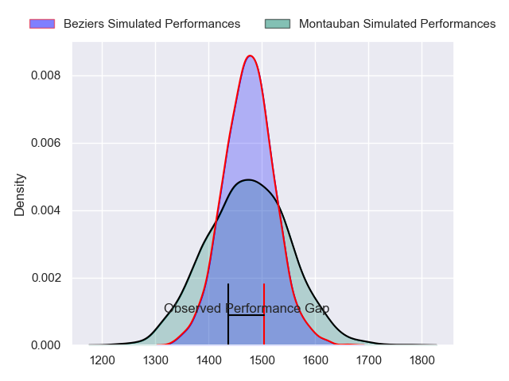
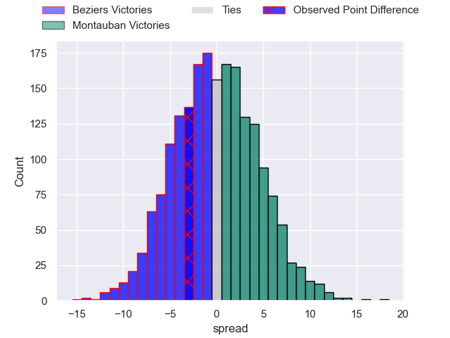
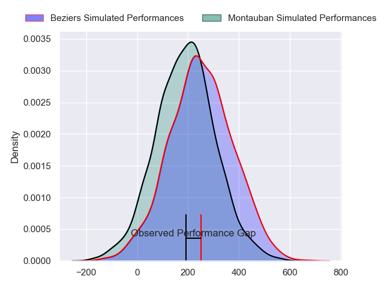
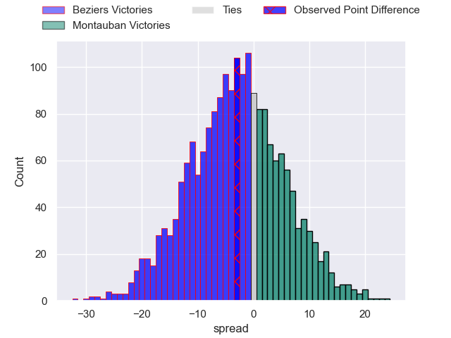
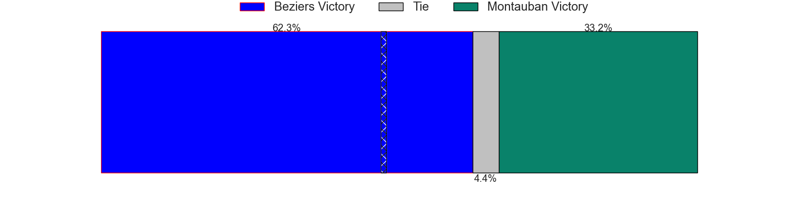

---  
layout: page  
title: Beziers at Montauban; 37-34  
date: 2024-02-09 18:00:00 -0500  
categories: "Pro D2 2023" match review  
---
# Beziers at Montauban; 37-34

# Club Level Predictions

The first set of predictions treats a club as the smallest object, as the club develops its members, organizes a gameplan, and deploys its players as needed for each match. This club model has a prediction of 0.5, which translates to predicting Montauban to win by 0.0.

Our Over/Under is 38.5 - and combined with the spread above, we have a predicted scoreline of 19 to 19

Each club has a rating and a rating deviation (similar to a Glicko rating), and expected performances can be generated. This allows for simulated matches and spreads like the ones below.
## Projected Performances - Club Model

## Projected Spreads - Club Model

## Projected Results - Club Model

# Player Level Predictions - Version 2

Treating teams instead as an entity made up of the currently active players, I have ratings for each player in an altogether different system. These can be combined to form team ratings once teamsheets are announced, weighting starters a bit higher than the reserves. After the match is played, players can be weighted by their minutes on the field, allowing for an accurate measure of the team's composition. With these compiled team ratings, we can make predictions, measure inaccuracy, and update the individual player ratings.
## Prediction without Player Minutes: Beziers by 4.4

Beziers by 10.9 on a neutral pitch

## Projected Performances - Player Model

## Projected Spreads - Player Model

## Projected Results - Player Model

|   Away Minutes | Away Player         |   Away Percentile |   Number |   Home Percentile | Home Player       |   Home Minutes |
|---------------:|:--------------------|------------------:|---------:|------------------:|:------------------|---------------:|
|             47 | Youssef Amrouni     |             47.03 |        1 |             13.42 | Lucas Seyrolle    |             58 |
|             57 | Yanis Boulassel     |             52.65 |        2 |              6.58 | Kevin Firmin      |             58 |
|             80 | Yannick Arroyo      |             73.6  |        3 |             61.98 | Tietie Tuimauga   |             49 |
|             50 | Clément Bitz        |             72.54 |        4 |              9.7  | Tjuee Uanivi      |             80 |
|             57 | John Madigan        |             42.72 |        5 |             35.27 | Dimitri Vaotoa    |             80 |
|             28 | Otonuku Jr Pauta    |             79.63 |        6 |             25.35 | Quentin Witt      |             64 |
|             80 | Clement Ancely      |             83.53 |        7 |             17.88 | Karl Wilkins      |             80 |
|             80 | Thomas Hoarau       |             20.8  |        8 |             26.71 | Corentin Coularis |             51 |
|             68 | Samuel Marques      |             94.79 |        9 |              5.81 | Shaun Venter      |             63 |
|             80 | Tim Nanai-Williams  |             94.63 |       10 |             85.85 | Jérôme Bosviel    |             63 |
|             80 | Paul Alquier        |             27.3  |       11 |             50.16 | Bastien Guillemin |             68 |
|             80 | Taleta Tupuola      |             76.62 |       12 |             80.1  | Dan Goggin        |             80 |
|             80 | Maxime Espeut       |             65.23 |       13 |             53.12 | Yvan Reilhac      |             80 |
|             23 | Raffaele Storti     |             93.86 |       14 |             30.05 | Josua Vici        |             80 |
|             80 | Gabin Lorre         |             92.29 |       15 |             88.43 | Semesa Rokoduguni |             80 |
|             57 | Victor Dreuille     |             27.71 |       16 |              7.75 | Mirian Burduli    |             31 |
|             52 | William van Bost    |             57.2  |       17 |             63.16 | Otar Giorgadze    |             29 |
|             33 | Francisco Fernandes |             24.59 |       18 |             23.17 | Thomas Fortunel   |             17 |
|             30 | Gillian Benoy       |             17.75 |       19 |              1.89 | Malino Vanai      |             22 |
|             23 | Jose Luis Gonzalez  |             87.02 |       20 |             23.95 | Ru-Hann Greyling  |             22 |
|             23 | Pierre Gayraud      |             22.13 |       21 |             67.13 | Alexis Bernadet   |             17 |
|             12 | Jean Victor Goillot |             23.45 |       22 |              6.51 | Kevin Gimeno      |             16 |
|            nan | nan                 |            nan    |       23 |             67.99 | Simon Renda       |             12 |

