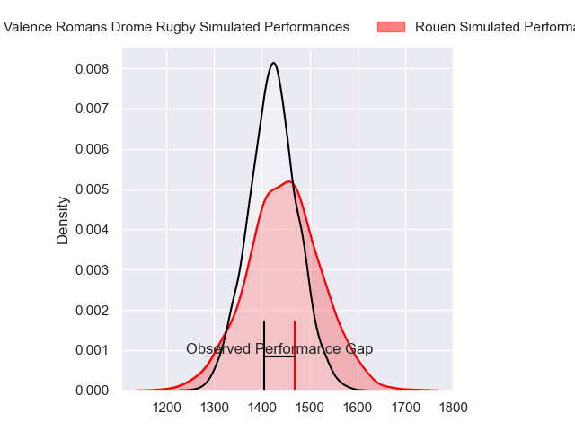
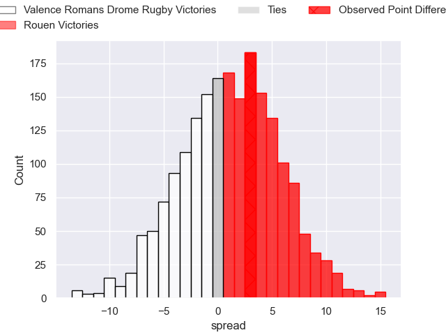
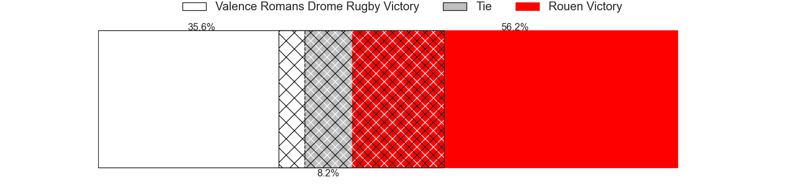
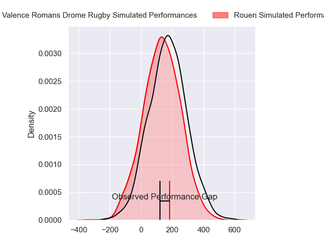
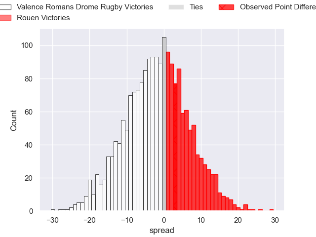
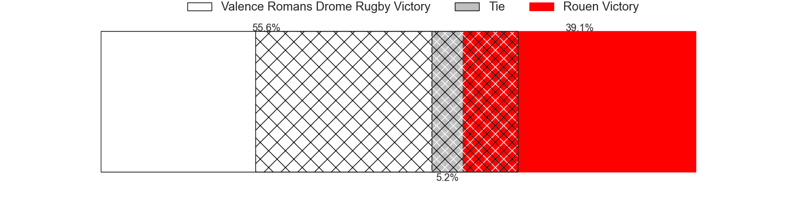

---  
layout: page  
title: Valence Romans Drome Rugby at Rouen; 19-22  
date: 2024-02-09 18:00:00 -0500  
categories: "Pro D2 2023" match review  
---
# Valence Romans Drome Rugby at Rouen; 19-22

# Club Level Predictions

The first set of predictions treats a club as the smallest object, as the club develops its members, organizes a gameplan, and deploys its players as needed for each match. This club model has a prediction of 0.527, which translates to predicting Rouen to win by 1.0.

Our Over/Under is 40.5 - and combined with the spread above, we have a predicted scoreline of 20 to 21

Each club has a rating and a rating deviation (similar to a Glicko rating), and expected performances can be generated. This allows for simulated matches and spreads like the ones below.
## Projected Performances - Club Model

## Projected Spreads - Club Model

## Projected Results - Club Model

# Player Level Predictions - Version 2

Treating teams instead as an entity made up of the currently active players, I have ratings for each player in an altogether different system. These can be combined to form team ratings once teamsheets are announced, weighting starters a bit higher than the reserves. After the match is played, players can be weighted by their minutes on the field, allowing for an accurate measure of the team's composition. With these compiled team ratings, we can make predictions, measure inaccuracy, and update the individual player ratings.
## Prediction without Player Minutes: Valence Romans Drome Rugby by 2.9

Valence Romans Drome Rugby by 6.0 on a neutral pitch

## Projected Performances - Player Model

## Projected Spreads - Player Model

## Projected Results - Player Model

|   Away Minutes | Away Player         |   Away Percentile |   Number |   Home Percentile | Home Player        |   Home Minutes |
|---------------:|:--------------------|------------------:|---------:|------------------:|:-------------------|---------------:|
|             56 | Andrea Pontanier    |             68.02 |        1 |             11.17 | Elias El Ansari    |             59 |
|             63 | Dorian Marco Pena   |             68.56 |        2 |              1.83 | Jeremie Maurouard  |             19 |
|             56 | Chris Talakai       |             23.51 |        3 |             58.38 | Soso Bekoshvili    |             59 |
|             80 | Ryan McCauley       |             26.75 |        4 |             16.8  | John-Charles Astle |             80 |
|             59 | Yassine Maamry      |             47.93 |        5 |             18.93 | Will Witty         |             80 |
|             80 | Axel Bruchet        |             29.79 |        6 |             71.94 | Tienie Burger      |             80 |
|             65 | Loan Real           |             31.85 |        7 |             26.11 | Jean Leleu         |             40 |
|             80 | Ioane Iashagashvili |             81.32 |        8 |             26.24 | Abdelkarim Fofana  |             50 |
|             48 | Thomas Lhusero      |             79.16 |        9 |             35.87 | Florent Campeggia  |             50 |
|             65 | Lucas Meret         |             18.54 |       10 |             77.32 | Franck Pourteau    |             67 |
|             62 | Mosese Mawalu       |             78.62 |       11 |             63.28 | Paul Vallee        |             80 |
|             80 | Mathieu Guillomot   |              9.59 |       12 |             16.55 | JT Jackson         |             67 |
|             80 | Ben Neiceru         |             79.26 |       13 |             51.32 | Pablo Patilla      |             80 |
|             80 | Adam Vargas         |             93.65 |       14 |             60.85 | Benjamin Descamps  |             80 |
|             80 | George Worth        |             18.55 |       15 |             86.75 | Pete Lydon         |             80 |
|             32 | Tim Menzel          |             86.97 |       16 |             30.35 | Efi Ma'afu         |             61 |
|             24 | Anthony Aléo        |             27.3  |       17 |             14.3  | Samuel Maximin     |             40 |
|             24 | Gareth Milasinovich |             24.5  |       18 |              4.55 | Willy N'Diaye      |             30 |
|             21 | Thembelani Bholi    |             71.87 |       19 |             75.15 | Maxime Sidobre     |             30 |
|             18 | Jonathan Quinnez    |             63.81 |       20 |             47.48 | Antoine Fournier   |             21 |
|             17 | Etienne Narmand     |            nan    |       21 |             15.68 | Cody Thomas        |             21 |
|             15 | Joris Moura         |             81.95 |       22 |             75.54 | Taylor Gontineac   |             13 |
|             15 | Charles Brayer      |             60.36 |       23 |             61.2  | Baptiste Mouchous  |             13 |

