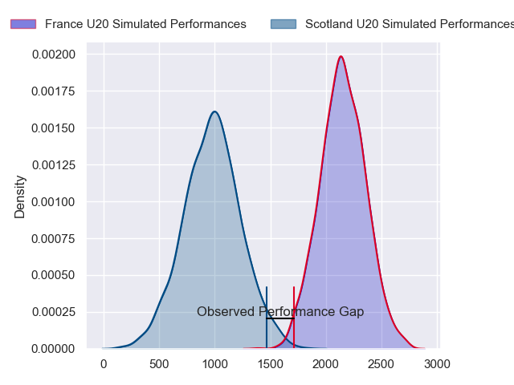
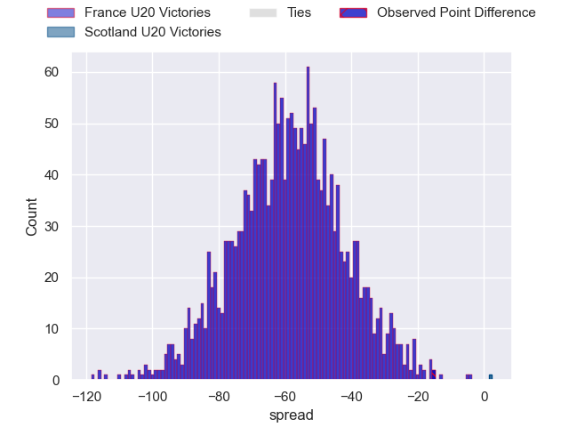
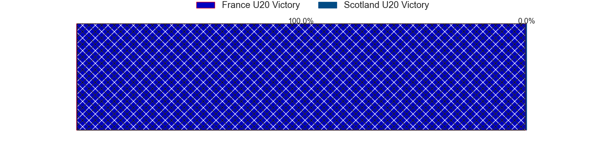

---  
layout: page  
title: France U20 at Scotland U20; 29-14  
date: 2024-02-09 18:00:00 -0500  
categories: "Guinness U20 Six Nations 2024" match review  
---
# France U20 at Scotland U20; 29-14

# Club Level Predictions

The first set of predictions treats a club as the smallest object, as the club develops its members, organizes a gameplan, and deploys its players as needed for each match. This club model has a prediction of 0.003, which translates to predicting France U20 to win by 59.1.

Our Over/Under is 68.5 - and combined with the spread above, we have a predicted scoreline of 64 to 5

Each club has a rating and a rating deviation (similar to a Glicko rating), and expected performances can be generated. This allows for simulated matches and spreads like the ones below.
## Projected Performances - Club Model

## Projected Spreads - Club Model

## Projected Results - Club Model

