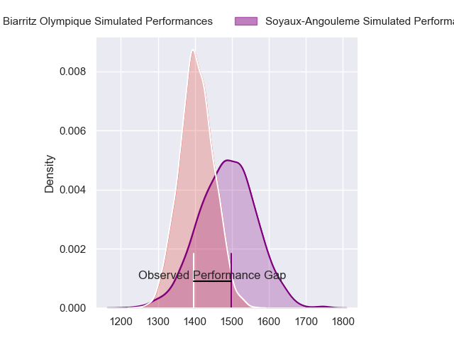
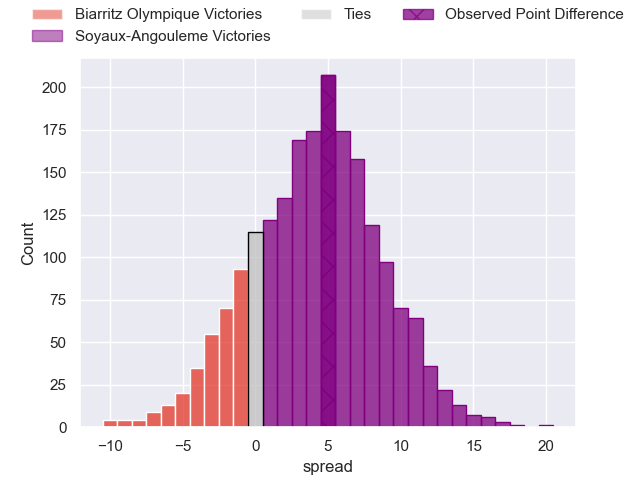
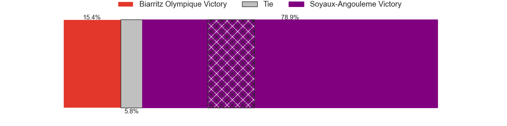
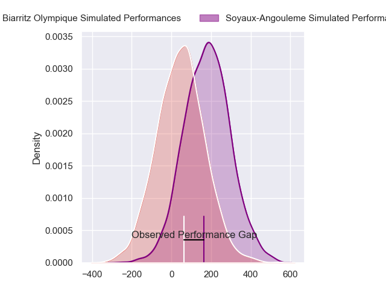
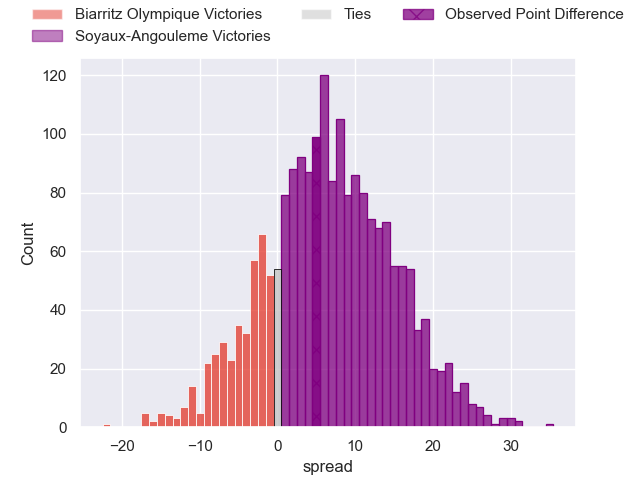
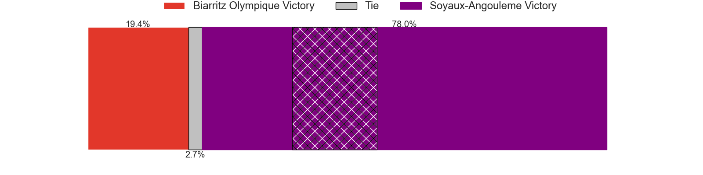

---  
layout: page  
title: Biarritz Olympique at Soyaux-Angouleme; 24-29  
date: 2024-02-09 18:00:00 -0500  
categories: "Pro D2 2023" match review  
---
# Biarritz Olympique at Soyaux-Angouleme; 24-29

# Club Level Predictions

The first set of predictions treats a club as the smallest object, as the club develops its members, organizes a gameplan, and deploys its players as needed for each match. This club model has a prediction of 0.615, which translates to predicting Soyaux-Angouleme to win by 4.1.

Our Over/Under is 38.5 - and combined with the spread above, we have a predicted scoreline of 17 to 21

Each club has a rating and a rating deviation (similar to a Glicko rating), and expected performances can be generated. This allows for simulated matches and spreads like the ones below.
## Projected Performances - Club Model

## Projected Spreads - Club Model

## Projected Results - Club Model

# Player Level Predictions - Version 2

Treating teams instead as an entity made up of the currently active players, I have ratings for each player in an altogether different system. These can be combined to form team ratings once teamsheets are announced, weighting starters a bit higher than the reserves. After the match is played, players can be weighted by their minutes on the field, allowing for an accurate measure of the team's composition. With these compiled team ratings, we can make predictions, measure inaccuracy, and update the individual player ratings.
## Prediction without Player Minutes: Soyaux-Angouleme by 6.0

Soyaux-Angouleme by 2.0 on a neutral pitch

## Projected Performances - Player Model

## Projected Spreads - Player Model

## Projected Results - Player Model

|   Away Minutes | Away Player              |   Away Percentile |   Number |   Home Percentile | Home Player        |   Home Minutes |
|---------------:|:-------------------------|------------------:|---------:|------------------:|:-------------------|---------------:|
|             54 | Zakaria El Fakir         |             19.73 |        1 |             62.97 | Luca Tabarot       |             56 |
|             58 | Thomas Sauveterre        |             71.3  |        2 |             48.26 | Patxi Bidart       |             58 |
|             63 | Mohamed Haouas           |             76.58 |        3 |              8.47 | Yassine Boutemane  |             62 |
|             80 | Charlie Matthews         |             65.68 |        4 |              8.64 | Matthew Dalton     |             67 |
|             80 | Adrian Motoc             |              3.2  |        5 |             63.31 | Léo Morand-Bruyat  |             80 |
|             68 | Charlie Francoz          |              5.09 |        6 |              6.07 | Gautier Gibouin    |             54 |
|             58 | Simon Augry              |             33.15 |        7 |             73.35 | Germain Burgaud    |             80 |
|             80 | Temo Matiu               |             30.97 |        8 |             48.23 | Hubert Texier      |             62 |
|             50 | Kerman Aurrekoetxea      |             54.31 |        9 |             52.3  | Manu Saubusse      |             64 |
|             63 | Billy Searle             |              6.1  |       10 |             42.44 | Corentin Glenat    |             20 |
|             80 | Baptiste Fariscot        |             62.33 |       11 |             36.19 | Marvin Lestremau   |             80 |
|             59 | Tyler Morgan             |             68.71 |       12 |             20.5  | Mathis Lafon       |             80 |
|             80 | Jonathan Joseph          |             85.49 |       13 |             44    | Inaki Ayarza       |             80 |
|             80 | Zach Kibirige            |             12.49 |       14 |             76.72 | Matthys Gratien    |             80 |
|             80 | Joe Jonas                |             59.52 |       15 |             52.53 | Jules Dubecq       |             80 |
|             30 | Imanol Biscay            |             46.89 |       16 |             73.41 | Ben Botica         |             60 |
|             26 | Giorgi Nutsubidze        |              4.95 |       17 |             73.13 | Nicolas Martins    |             26 |
|             22 | Brendan Lebrun           |             61.43 |       18 |             94.23 | Sami Zouhair       |             24 |
|             22 | Thomas Hebert            |             31.53 |       19 |             64.35 | Rayne Barka        |             22 |
|             21 | Yann David               |             81.29 |       20 |             19.55 | Seydou Diakité     |             18 |
|             17 | Alfie Petch              |              5.14 |       21 |             46.57 | Alexander Masibaka |             18 |
|             17 | Ilian Perraux            |             57.8  |       22 |              4.81 | Adrien Bau         |             16 |
|             12 | Pieter Jansen van Vuuren |             42.13 |       23 |             21.78 | Matt Beukeboom     |             13 |

