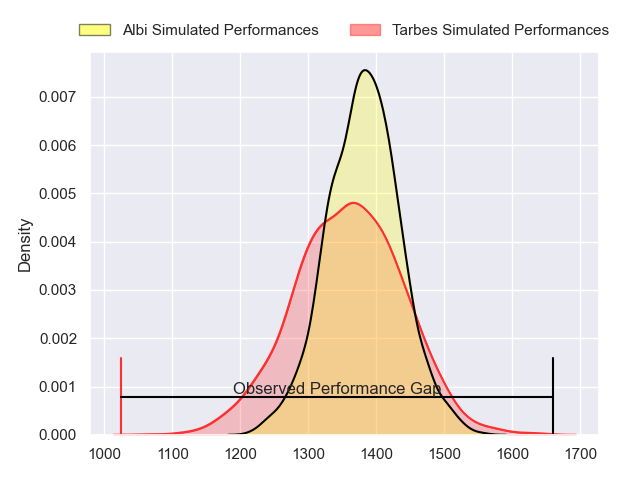
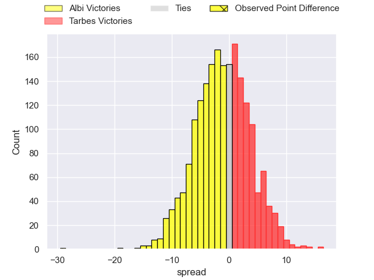
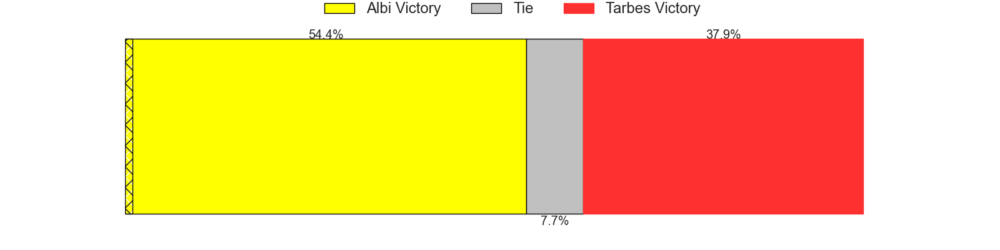
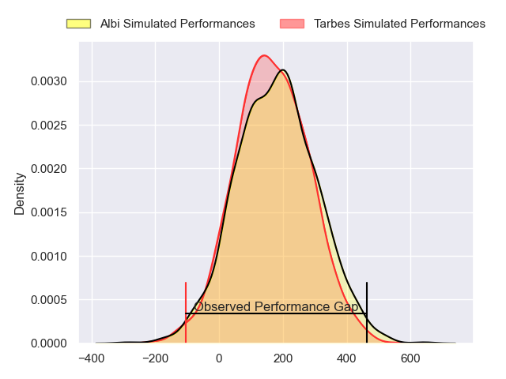
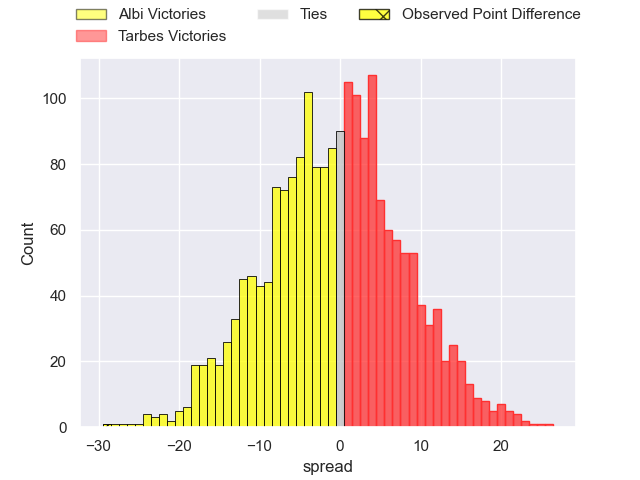
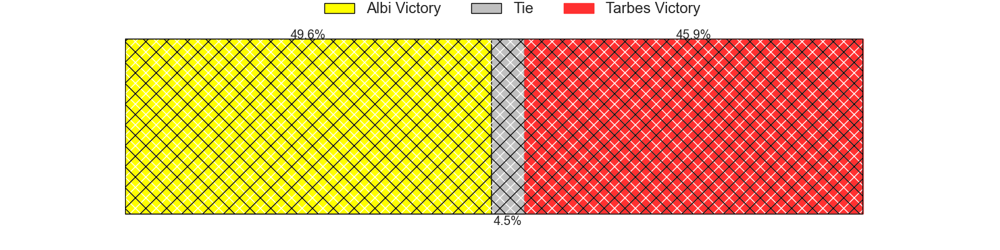

---  
layout: page  
title: Albi at Tarbes; 42-13  
date: 2024-02-09 18:00:00 -0500  
categories: "Nationale 2023" match review  
---
# Albi at Tarbes; 42-13

# Club Level Predictions

The first set of predictions treats a club as the smallest object, as the club develops its members, organizes a gameplan, and deploys its players as needed for each match. This club model has a prediction of 0.469, which translates to predicting Albi to win by 1.1.

Our Over/Under is 27.5 - and combined with the spread above, we have a predicted scoreline of 14 to 13

Each club has a rating and a rating deviation (similar to a Glicko rating), and expected performances can be generated. This allows for simulated matches and spreads like the ones below.
## Projected Performances - Club Model

## Projected Spreads - Club Model

## Projected Results - Club Model

# Player Level Predictions - Version 2

Treating teams instead as an entity made up of the currently active players, I have ratings for each player in an altogether different system. These can be combined to form team ratings once teamsheets are announced, weighting starters a bit higher than the reserves. After the match is played, players can be weighted by their minutes on the field, allowing for an accurate measure of the team's composition. With these compiled team ratings, we can make predictions, measure inaccuracy, and update the individual player ratings.
## Prediction without Player Minutes: Albi by 0.6

Albi by 6.9 on a neutral pitch

## Projected Performances - Player Model

## Projected Spreads - Player Model

## Projected Results - Player Model

|   Away Minutes | Away Player             |   Away Percentile |   Number |   Home Percentile | Home Player        |   Home Minutes |
|---------------:|:------------------------|------------------:|---------:|------------------:|:-------------------|---------------:|
|             61 | Antoine Soave           |             89.1  |        1 |             61.62 | Antoine Palisse    |             30 |
|             61 | Romain Maurice          |             87.2  |        2 |             51.37 | Florian Lamothe    |             53 |
|             66 | Jean Baptiste De Clercq |             76.4  |        3 |             41.89 | Alexandre Duny     |             30 |
|             65 | Yanis Horvath           |             66.75 |        4 |             66.63 | Baptiste Peytavi   |             61 |
|             80 | Dion Evrard Oulai       |             24.26 |        5 |             14.08 | Jone Trevor Seuvou |             80 |
|             80 | Pierre Roussel          |             40.09 |        6 |             59.37 | Aurelien Ricart    |             61 |
|             80 | Simon Meka              |             90.79 |        7 |             62.41 | Léo Saint-Guilhem  |             80 |
|             61 | Sandrick Maciotta       |             82.98 |        8 |             10.87 | Filipe Manu        |             80 |
|             70 | Gilen Queheille         |             81.76 |        9 |              1.4  | Anthony Meric      |             61 |
|             65 | Benjamin Pehau          |             82.2  |       10 |             24.15 | Mathieu Berbizier  |             80 |
|             80 | Kamilieni Raivono       |             47.83 |       11 |              1.48 | Jone Tuva          |             57 |
|             80 | Gabriel Aviragnet       |             62.47 |       12 |             57.91 | Savenaca Rawaca    |             80 |
|             49 | Sean Robinson           |             55.4  |       13 |             67.75 | Pierre Descoubet   |             41 |
|             80 | Simon Hartmann          |             75.03 |       14 |              2.01 | Johan Paulet       |             80 |
|             80 | Téo Dospital            |             26.99 |       15 |             19.28 | Thibaut Trotta     |             80 |
|             19 | Thibaud Sebire          |             55.41 |       16 |             20.99 | Alexandre Combier  |             50 |
|             19 | Arthur Castant          |             87.75 |       17 |             35.05 | Johan Mees Erasmus |             50 |
|             14 | Dimitri Tchapnga        |             85.86 |       18 |             60.15 | Enzo Mondon        |             27 |
|             15 | Vincent Calas           |             50.27 |       19 |             14.79 | Francis Rolland    |             19 |
|             19 | Guillem Calmon          |             27.42 |       20 |             59.48 | Jean Guicherd      |             19 |
|             10 | Théo Vidal              |             95.39 |       21 |             65.13 | Mickael Thébault   |             19 |
|             15 | James Haydn Tedder      |              4.15 |       22 |             66.27 | Yon Camou          |             23 |
|             31 | Baptiste Couchinave     |             89.45 |       23 |             44.66 | Clement Latorre    |             39 |

