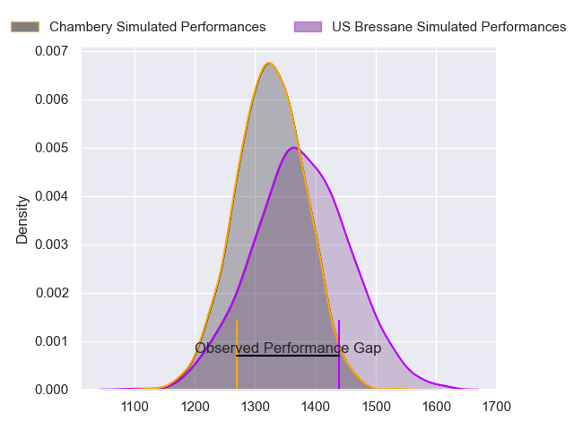
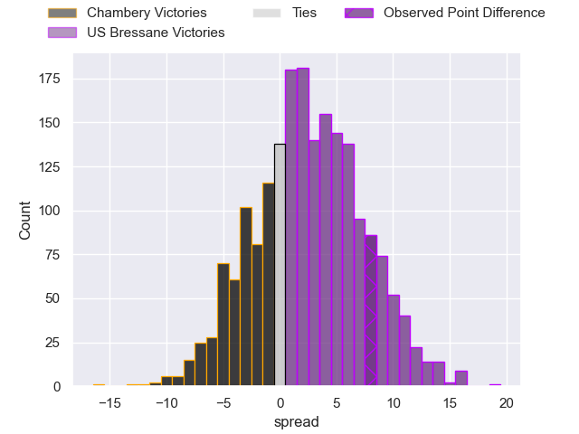
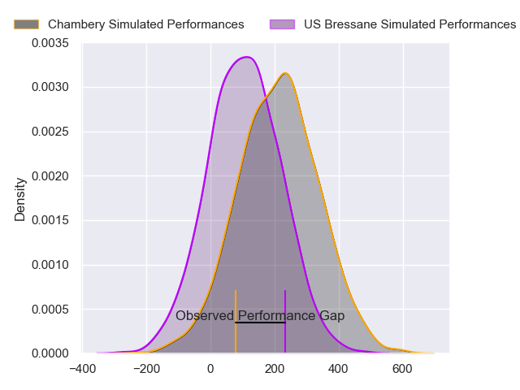
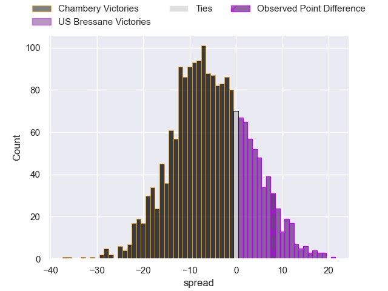
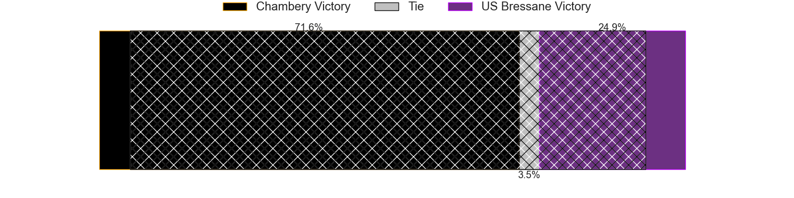

---  
layout: page  
title: Chambery at US Bressane; 27-35  
date: 2024-02-09 18:00:00 -0500  
categories: "Nationale 2023" match review  
---
# Chambery at US Bressane; 27-35

# Club Level Predictions

The first set of predictions treats a club as the smallest object, as the club develops its members, organizes a gameplan, and deploys its players as needed for each match. This club model has a prediction of 0.568, which translates to predicting US Bressane to win by 2.4.

Our Over/Under is 39.5 - and combined with the spread above, we have a predicted scoreline of 19 to 21

Each club has a rating and a rating deviation (similar to a Glicko rating), and expected performances can be generated. This allows for simulated matches and spreads like the ones below.
## Projected Performances - Club Model

## Projected Spreads - Club Model

## Projected Results - Club Model

# Player Level Predictions - Version 2

Treating teams instead as an entity made up of the currently active players, I have ratings for each player in an altogether different system. These can be combined to form team ratings once teamsheets are announced, weighting starters a bit higher than the reserves. After the match is played, players can be weighted by their minutes on the field, allowing for an accurate measure of the team's composition. With these compiled team ratings, we can make predictions, measure inaccuracy, and update the individual player ratings.
## Prediction without Player Minutes: Chambery by 5.5

Chambery by 9.3 on a neutral pitch

## Projected Performances - Player Model

## Projected Spreads - Player Model

## Projected Results - Player Model

|   Away Minutes | Away Player                  |   Away Percentile |   Number |   Home Percentile | Home Player               |   Home Minutes |
|---------------:|:-----------------------------|------------------:|---------:|------------------:|:--------------------------|---------------:|
|             26 | Géraud Clermont              |             83.51 |        1 |             71.89 | Vazha Kapanadze           |             64 |
|             68 | Gauthier Brute de Remur      |             75.69 |        2 |             85.92 | Clement Jullien           |             64 |
|             57 | Zauri Tevdorashvili          |             13.96 |        3 |             63.24 | Erich de Jager            |             64 |
|             57 | Ahmed Tidiane Kane           |             39.41 |        4 |             58.58 | Guillaume Marin           |             54 |
|             80 | Corentin Astier              |             67.69 |        5 |             13.61 | Josh Peters               |             80 |
|             80 | Colin Lebian                 |             69.99 |        6 |             53.63 | Pierre Reynaud            |             80 |
|             59 | Matheo Triki                 |             76.16 |        7 |             66.85 | Loic Baradel              |             80 |
|             80 | Taniela Matakaiongo          |             51.3  |        8 |             64.07 | Joseph Penitito           |             52 |
|             65 | Hugo Deschaux                |             34.07 |        9 |             12.83 | Robin Graulle             |             40 |
|             49 | Jean-Luc Alewyn Cilliers     |             76.34 |       10 |              7.56 | Christian Lacombe         |             59 |
|             80 | Arthur Nennig                |             83.81 |       11 |             37.04 | Élie De Fleurian          |             80 |
|             80 | Bastien Reymond              |             44.24 |       12 |             35.37 | Parataiso Silafai-Lea'ana |             80 |
|             65 | Emmanuel Vaitulukina         |             37.89 |       13 |             58.03 | Dimitri Doucet            |             80 |
|             80 | Paul Baptiste Florent Altier |             56.83 |       14 |             38.31 | Thibaut Perrette          |             11 |
|             80 | Jules Dorrival               |             35.42 |       15 |             84.82 | Florent Massip            |             80 |
|             54 | Nugzar Somkhishvili          |             39.1  |       16 |              4.32 | Alexandre Badet           |             69 |
|             31 | Victor Pisano                |             35.37 |       17 |              3.41 | Nicolas Faure             |             40 |
|             23 | Fabien Witz                  |             69.82 |       18 |             82.12 | Lucas Lyons               |             28 |
|             23 | Nail Audoire                 |             67.75 |       19 |              1.3  | Maselino Paulino          |             26 |
|             21 | Thomas Coignat               |             62.19 |       20 |             76.1  | Thibault Olender          |             21 |
|             15 | Mateo Guerret                |             31.11 |       21 |             27.39 | Quentin Drancourt         |             16 |
|             15 | Vereniki Goneva              |              8.25 |       22 |             16.58 | Atonio Ulutuipalelei      |             16 |
|             12 | Julien Pierdomenico          |            nan    |       23 |             11.88 | Louis Dasalmartini        |             16 |

