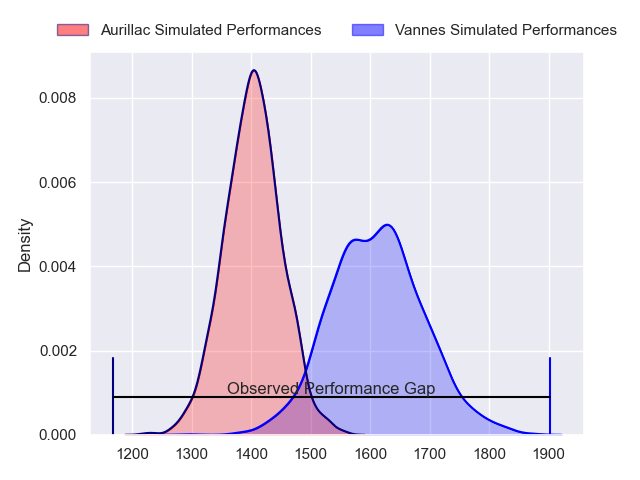
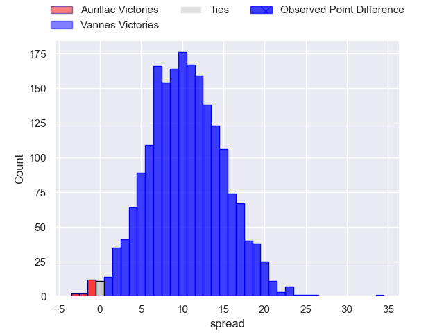
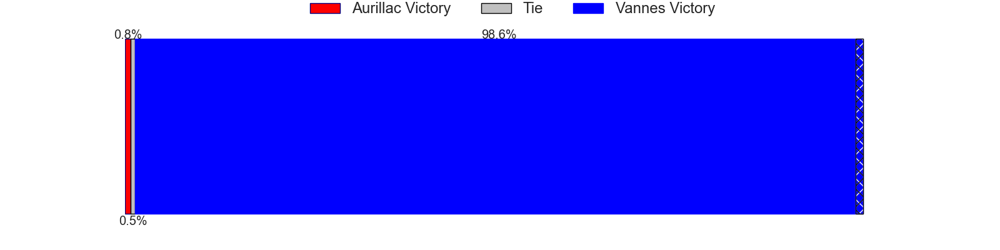
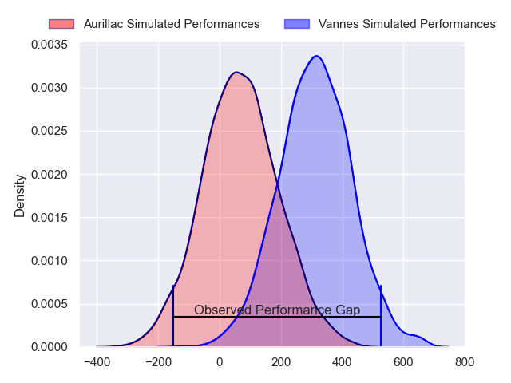
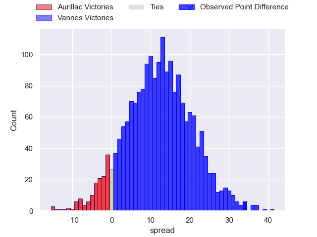
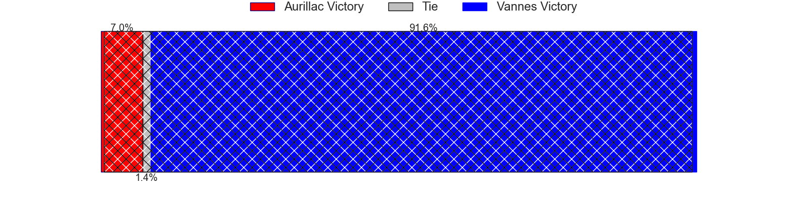

---  
layout: page  
title: Aurillac at Vannes; 6-40  
date: 2024-02-09 18:00:00 -0500  
categories: "Pro D2 2023" match review  
---
# Aurillac at Vannes; 6-40

# Club Level Predictions

The first set of predictions treats a club as the smallest object, as the club develops its members, organizes a gameplan, and deploys its players as needed for each match. This club model has a prediction of 0.764, which translates to predicting Vannes to win by 10.3.

Our Over/Under is 60.5 - and combined with the spread above, we have a predicted scoreline of 25 to 35

Each club has a rating and a rating deviation (similar to a Glicko rating), and expected performances can be generated. This allows for simulated matches and spreads like the ones below.
## Projected Performances - Club Model

## Projected Spreads - Club Model

## Projected Results - Club Model

# Player Level Predictions - Version 2

Treating teams instead as an entity made up of the currently active players, I have ratings for each player in an altogether different system. These can be combined to form team ratings once teamsheets are announced, weighting starters a bit higher than the reserves. After the match is played, players can be weighted by their minutes on the field, allowing for an accurate measure of the team's composition. With these compiled team ratings, we can make predictions, measure inaccuracy, and update the individual player ratings.
## Prediction without Player Minutes: Vannes by 13.8

Vannes by 9.9 on a neutral pitch

## Projected Performances - Player Model

## Projected Spreads - Player Model

## Projected Results - Player Model

|   Away Minutes | Away Player               |   Away Percentile |   Number |   Home Percentile | Home Player             |   Home Minutes |
|---------------:|:--------------------------|------------------:|---------:|------------------:|:------------------------|---------------:|
|             53 | Jean-Jacques Gymael       |             12.97 |        1 |             79.82 | Andy Bordelai           |             56 |
|             53 | Ronan Loughnane           |             37.48 |        2 |             48.81 | Théo Beziat             |             56 |
|             53 | Thomas Cretu              |             39.82 |        3 |             47.3  | Simon Bourgeois         |             68 |
|             59 | Martial Rolland           |             54.91 |        4 |             59.76 | Anton Bresler           |             56 |
|              5 | Mosa'ati Moala            |             19.76 |        5 |             19.17 | Mattéo Desjeux          |             52 |
|             80 | Eoghan Masterson          |             78.22 |        6 |             18.53 | Juan Bautista Pedemonte |             80 |
|             80 | Hugo Huurman              |             66.63 |        7 |             97.72 | Francisco Gorrissen     |             80 |
|             53 | Latuka Maituku            |             10.17 |        8 |             22.93 | Karl Chateau            |             52 |
|             64 | David Delarue             |             20.84 |        9 |             89.38 | Michael Ruru            |             68 |
|             80 | Marc Palmier              |             15.85 |       10 |             95.12 | Maxime Lafage           |             68 |
|             80 | Jordon Janse Van Rensburg |             20    |       11 |             67.2  | Romaric Camou           |             80 |
|             80 | Hugo Bastard              |             43.65 |       12 |             12.11 | Alex Arrate             |             80 |
|             80 | Simeli Yabaki             |             11.51 |       13 |             82.61 | Sacha Valleau           |             80 |
|             59 | Juun Pieters              |             63.92 |       14 |             39.89 | Enzo Benmegal           |             80 |
|             80 | Jules Margarit            |             22.17 |       15 |             98.07 | Gwenaël Duplenne        |             80 |
|             75 | Heath Backhouse           |             82.25 |       16 |             49.17 | Sione Kalamafoni        |             28 |
|             27 | Robert Rodgers            |             10.54 |       17 |             91.96 | Joe Edwards             |             28 |
|             27 | Lilian Djomboue           |             43.14 |       18 |            nan    | Louis-Marie Suta        |             24 |
|             27 | Tim Daniel-Meissen        |             29.19 |       19 |             39.19 | Charles-Henri Berguet   |             24 |
|             27 | Didier Tison              |             44.21 |       20 |             81.54 | Darren O'Shea           |             24 |
|             21 | Théo Cambon               |             13.54 |       21 |             65.33 | Erwan Nicolas           |             12 |
|             21 | Axel Bevia                |            nan    |       22 |             37.32 | Thibault Debaes         |             12 |
|             16 | Leo Salvan                |            nan    |       23 |             74.68 | Jérémy Boyadjis         |             12 |

