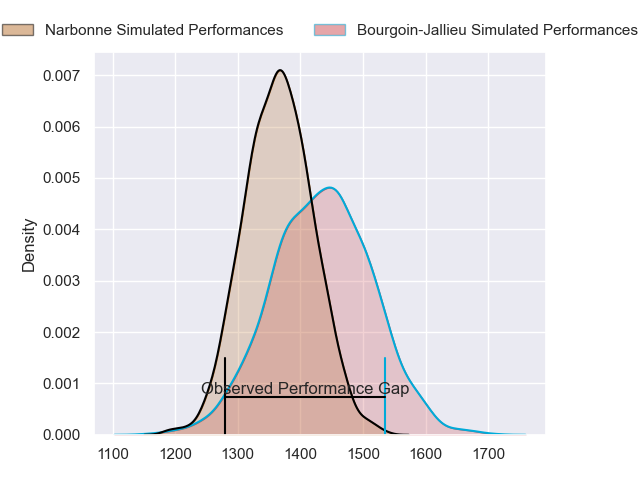
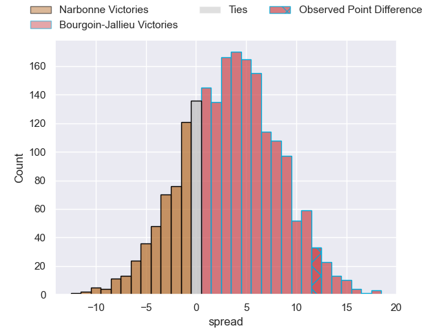
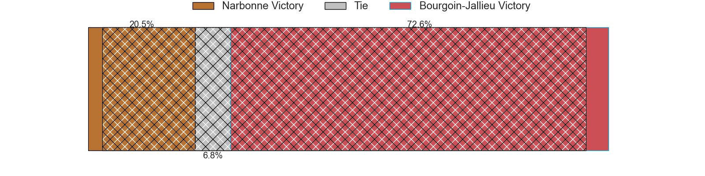
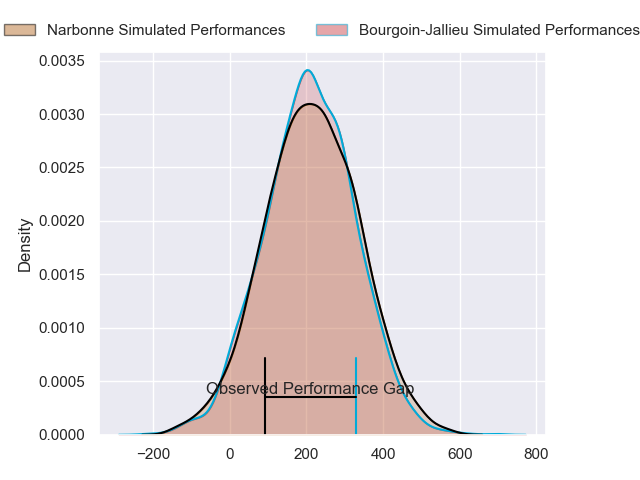
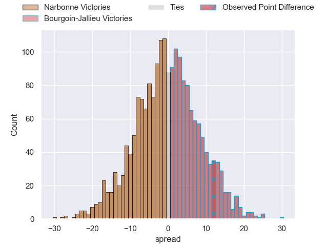
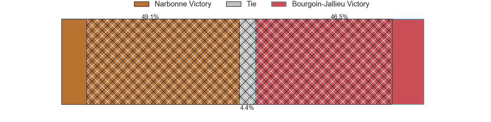

---  
layout: page  
title: Narbonne at Bourgoin-Jallieu; 11-23  
date: 2024-02-10 18:00:00 -0500  
categories: "Nationale 2023" match review  
---
# Narbonne at Bourgoin-Jallieu; 11-23

# Club Level Predictions

The first set of predictions treats a club as the smallest object, as the club develops its members, organizes a gameplan, and deploys its players as needed for each match. This club model has a prediction of 0.6, which translates to predicting Bourgoin-Jallieu to win by 3.6.

Our Over/Under is 35.5 - and combined with the spread above, we have a predicted scoreline of 16 to 20

Each club has a rating and a rating deviation (similar to a Glicko rating), and expected performances can be generated. This allows for simulated matches and spreads like the ones below.
## Projected Performances - Club Model

## Projected Spreads - Club Model

## Projected Results - Club Model

# Player Level Predictions - Version 2

Treating teams instead as an entity made up of the currently active players, I have ratings for each player in an altogether different system. These can be combined to form team ratings once teamsheets are announced, weighting starters a bit higher than the reserves. After the match is played, players can be weighted by their minutes on the field, allowing for an accurate measure of the team's composition. With these compiled team ratings, we can make predictions, measure inaccuracy, and update the individual player ratings.
## Prediction without Player Minutes: Narbonne by 1.3

Narbonne by 8.6 on a neutral pitch

## Projected Performances - Player Model

## Projected Spreads - Player Model

## Projected Results - Player Model

|   Away Minutes | Away Player        |   Away Percentile |   Number |   Home Percentile | Home Player           |   Home Minutes |
|---------------:|:-------------------|------------------:|---------:|------------------:|:----------------------|---------------:|
|             45 | Théo Castinel      |             64.2  |        1 |             53.93 | Romain Favaretto      |             55 |
|             55 | Mehdi Boundjema    |             85.5  |        2 |             23.85 | Mohamed Khribache     |             55 |
|             55 | Levi Tikoipau      |             58.21 |        3 |             30.8  | Osman Dimen           |             55 |
|             67 | Marius Antonescu   |             74.71 |        4 |             28.39 | Léandre Cotte         |             61 |
|             61 | Dennis Visser      |             25.98 |        5 |             72.41 | Jonathan Kpoku        |             80 |
|             80 | Thibault Clauzade  |             44.18 |        6 |             50.26 | Kevin Chaudouard      |             80 |
|             80 | Arthur Christienne |             56.66 |        7 |             63.9  | Theophile Cotte       |             80 |
|             58 | Charles Malet      |             32.39 |        8 |             31.92 | Poutasi Luafutu       |             64 |
|             61 | Josh Valentine     |             96.08 |        9 |             83.92 | Tomas Munilla lo Duca |             61 |
|             80 | Gilles Bosch       |              4.27 |       10 |             87.2  | Nicolas Vuillemin     |             80 |
|             80 | Sébastien Giorgis  |             19.08 |       11 |              5.56 | Remi Bouet            |             61 |
|             80 | Peter Betham       |             98.84 |       12 |             27.64 | Aviata Silago         |             80 |
|             80 | Pierre Nueno       |             46.23 |       13 |             34.26 | Christopher Bosch     |             67 |
|             80 | Pierre-Hugo Ducom  |             23.79 |       14 |             61.11 | Makalea Foliaki       |             80 |
|             67 | Paul Auradou       |             60.92 |       15 |             54.02 | Paul-Hugo Champ       |             80 |
|             35 | Sylvain Abadie     |             55.54 |       16 |             58.39 | Rémy Gaborit          |             25 |
|             25 | Christophe David   |             69.91 |       17 |             70.64 | Killian Tripier       |             25 |
|             25 | Mohammed Loukia    |             28.39 |       18 |             19.29 | Maxime Calliet        |             25 |
|             13 | Mohamed Kbaier     |             58.62 |       19 |             62.41 | Robin Gascou          |             19 |
|             19 | Mauro Rebussone    |             71.95 |       20 |             11.44 | Aitor Hourcade        |             16 |
|             22 | Dorian Peron       |            nan    |       21 |            nan    | Martin Doan           |             19 |
|             19 | Pierrick Nova      |             19.22 |       22 |             78.93 | Quentin Lefort        |             19 |
|             13 | James Kane         |             71.26 |       23 |             72.94 | Isaiah Leota          |             13 |

