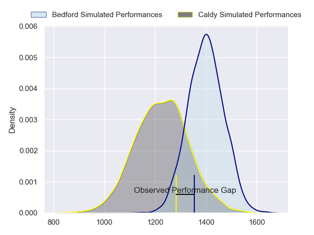
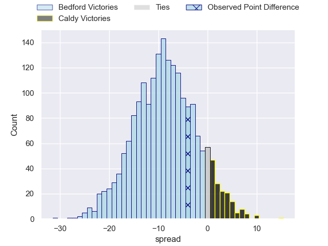
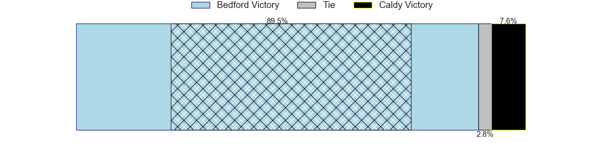
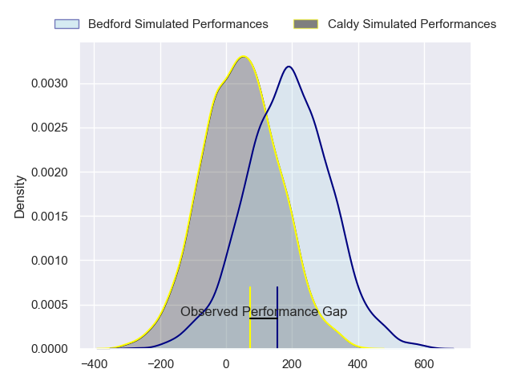
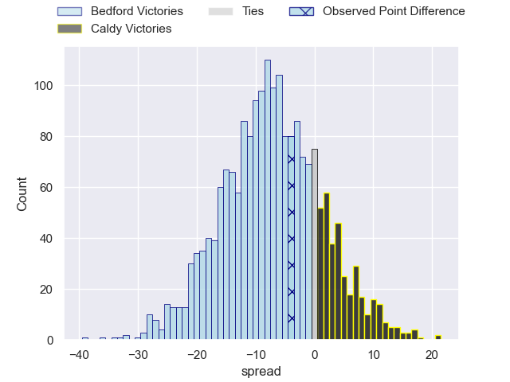
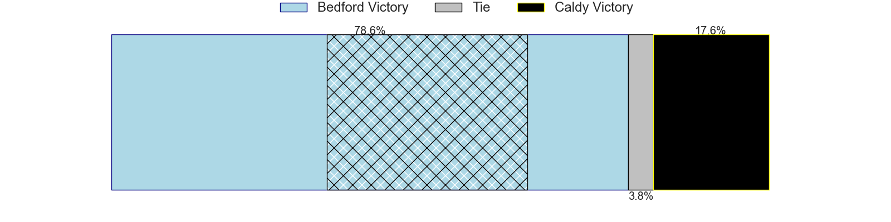

---  
layout: page  
title: Bedford at Caldy; 26-22  
date: 2024-02-10 18:00:00 -0500  
categories: "RFU Championship 2023" match review  
---
# Bedford at Caldy; 26-22

# Club Level Predictions

The first set of predictions treats a club as the smallest object, as the club develops its members, organizes a gameplan, and deploys its players as needed for each match. This club model has a prediction of 0.271, which translates to predicting Bedford to win by 8.8.

Our Over/Under is 63.5 - and combined with the spread above, we have a predicted scoreline of 36 to 27

Each club has a rating and a rating deviation (similar to a Glicko rating), and expected performances can be generated. This allows for simulated matches and spreads like the ones below.
## Projected Performances - Club Model

## Projected Spreads - Club Model

## Projected Results - Club Model

# Player Level Predictions - Version 2

Treating teams instead as an entity made up of the currently active players, I have ratings for each player in an altogether different system. These can be combined to form team ratings once teamsheets are announced, weighting starters a bit higher than the reserves. After the match is played, players can be weighted by their minutes on the field, allowing for an accurate measure of the team's composition. With these compiled team ratings, we can make predictions, measure inaccuracy, and update the individual player ratings.
## Prediction without Player Minutes: Bedford by 7.4

Bedford by 9.7 on a neutral pitch

## Projected Performances - Player Model

## Projected Spreads - Player Model

## Projected Results - Player Model

|   Away Minutes | Away Player          |   Away Percentile |   Number |   Home Percentile | Home Player          |   Home Minutes |
|---------------:|:---------------------|------------------:|---------:|------------------:|:---------------------|---------------:|
|             54 | Jamie Jack           |             16.4  |        1 |             15.14 | Nathan Rushton       |             46 |
|             65 | Jacob Fields         |             55.94 |        2 |             61.61 | Matt Gallagher       |             65 |
|             54 | Oisin Heffernan      |             80.09 |        3 |             66.13 | Monty Weatherby      |             51 |
|             54 | Robin Williams       |             75.74 |        4 |             54.2  | Callum Atkinson      |             60 |
|             80 | Tom Lockett          |             34.08 |        5 |             26.63 | Thomas Sanders       |             80 |
|             80 | Luke Frost           |              9.97 |        6 |             27.74 | Martin Gerrard       |             56 |
|             80 | Jac Arthur           |             55.69 |        7 |             66.2  | Ciaran Booth         |             80 |
|             61 | Cameron King         |             10.64 |        8 |             24.82 | Josiah Dickinson     |             80 |
|             80 | Alex Day             |             85.17 |        9 |             12.42 | Chris Pilgrim        |             32 |
|             80 | William Maisey       |             81.46 |       10 |             10.98 | Lewis Barker         |             69 |
|             80 | Dean Adamson         |             83.17 |       11 |             67.3  | Louis Beer           |             80 |
|             80 | Josh Matavesi        |             31.89 |       12 |             45.56 | Michael Barlow       |             80 |
|             80 | Michael Le Bourgeois |             61.75 |       13 |             40.89 | Connor Wilkinson     |             80 |
|             80 | Sean French          |             43.92 |       14 |             28.15 | Rekeiti Ma'asi-White |             41 |
|             80 | Matthew Worley       |             44.58 |       15 |             20.72 | Rhys Hayes           |             80 |
|             26 | Ed Prowse            |             75.32 |       16 |             28.86 | Joseph Murray        |             48 |
|             26 | Joey Conway          |             61.89 |       17 |              4.8  | Michael Cartmill     |             39 |
|             26 | Emeka Atuanya        |             44.85 |       18 |             23.33 | Adam Aigbokhae       |             34 |
|             19 | Kieran Curran        |             50.92 |       19 |             16.04 | Joe Sproston         |             29 |
|             15 | Aston Gradwick-Light |            nan    |       20 |             61.32 | Ewan Murphy          |             24 |
|            nan | nan                  |            nan    |       21 |             65.33 | Sam Dickinson        |             20 |
|            nan | nan                  |            nan    |       22 |            nan    | Edward Stagg         |             15 |
|            nan | nan                  |            nan    |       23 |             50.6  | Sam Rogers           |             11 |

