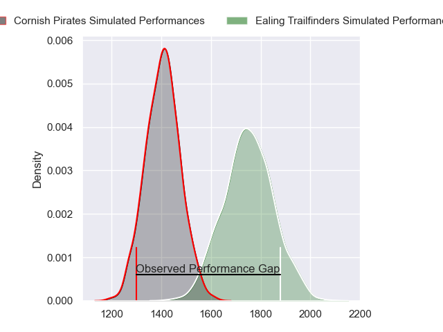
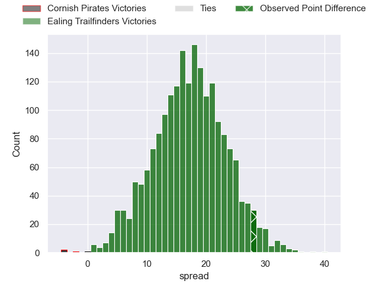
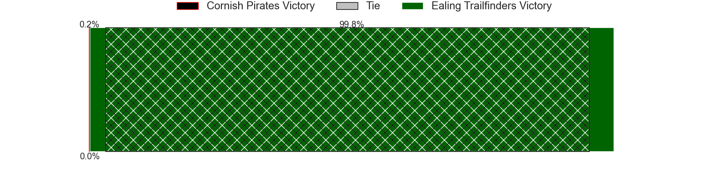
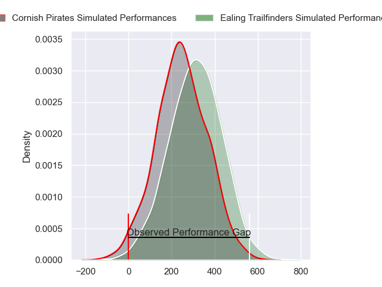
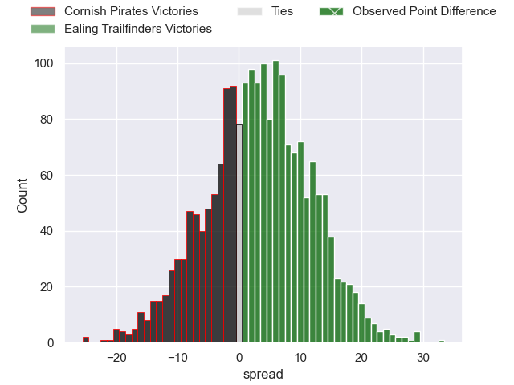

---  
layout: page  
title: Cornish Pirates at Ealing Trailfinders; 12-40  
date: 2024-02-10 18:00:00 -0500  
categories: "RFU Championship 2023" match review  
---
# Cornish Pirates at Ealing Trailfinders; 12-40

# Club Level Predictions

The first set of predictions treats a club as the smallest object, as the club develops its members, organizes a gameplan, and deploys its players as needed for each match. This club model has a prediction of 0.875, which translates to predicting Ealing Trailfinders to win by 17.3.

Our Over/Under is 66.5 - and combined with the spread above, we have a predicted scoreline of 25 to 42

Each club has a rating and a rating deviation (similar to a Glicko rating), and expected performances can be generated. This allows for simulated matches and spreads like the ones below.
## Projected Performances - Club Model

## Projected Spreads - Club Model

## Projected Results - Club Model

# Player Level Predictions - Version 2

Treating teams instead as an entity made up of the currently active players, I have ratings for each player in an altogether different system. These can be combined to form team ratings once teamsheets are announced, weighting starters a bit higher than the reserves. After the match is played, players can be weighted by their minutes on the field, allowing for an accurate measure of the team's composition. With these compiled team ratings, we can make predictions, measure inaccuracy, and update the individual player ratings.
## Prediction without Player Minutes: Ealing Trailfinders by 5.0

Ealing Trailfinders by 1.8 on a neutral pitch

## Projected Performances - Player Model

## Projected Spreads - Player Model

## Projected Results - Player Model

|   Away Minutes | Away Player          |   Away Percentile |   Number |   Home Percentile | Home Player          |   Home Minutes |
|---------------:|:---------------------|------------------:|---------:|------------------:|:---------------------|---------------:|
|             46 | Jake Morris          |             51.71 |        1 |             46.13 | Will Goodrick-Clarke |             60 |
|             46 | Morgan Nelson        |             75.32 |        2 |             69.29 | Matthew Cornish      |             65 |
|             40 | Finlay Richardson    |             71.44 |        3 |             94.14 | Biyi Alo             |             60 |
|             66 | Will Britton         |             14.91 |        4 |             95.5  | Bobby de Wee         |             80 |
|             80 | Steele Robert Barker |             76.57 |        5 |             95.86 | Barney Maddison      |             65 |
|             80 | Peter Everett        |             66.96 |        6 |             71.83 | Rob Farrar           |             73 |
|             80 | John Stevens         |             78.55 |        7 |             58.61 | Jordan Reid          |             80 |
|             46 | Hugh Bokenham        |             65.25 |        8 |              5.91 | Callum Chick         |             80 |
|             46 | Ruaridh Dawson       |             63.73 |        9 |             90.38 | Craig Hampson        |             73 |
|             46 | Tom Pittman          |             71.46 |       10 |              2.44 | Dan Lancaster        |             80 |
|             80 | Matthew McNab        |             30.16 |       11 |             98.84 | Tom Collins          |             19 |
|             80 | Joe Elderkin         |             55.52 |       12 |             86.69 | Billy Twelvetrees    |             80 |
|             80 | Iwan Jenkins         |             50.6  |       13 |             74.34 | Reuben Bird-Tulloch  |             80 |
|             66 | Robin Wedlake        |             71.64 |       14 |             87.3  | Jonah Holmes         |             80 |
|             80 | Will Trewin          |             76.39 |       15 |             60    | Michael Dykes        |             43 |
|             34 | Jack Andrew          |             76.67 |       16 |             86.94 | Kyle John Whyte      |             20 |
|             34 | Josh Williams        |             60.12 |       17 |             68.37 | Mike Willemse        |             15 |
|             40 | Matt Johnson         |             74.5  |       18 |             46.49 | Jimmy Roots          |             20 |
|             14 | Josh King            |             59.53 |       19 |             76.45 | Daniel Cutmore       |             15 |
|             34 | Will Gibson          |             83.64 |       20 |             40.63 | Ollie Newman         |              7 |
|             34 | Alex Schwarz         |             62.32 |       21 |             88.18 | Lloyd Williams       |              7 |
|             34 | Bruce Houston        |             59.02 |       22 |             99.47 | James Cordy-Redden   |             61 |
|             14 | Jack Nowell          |             96.28 |       23 |             44.48 | Dan O'Brien          |             37 |

