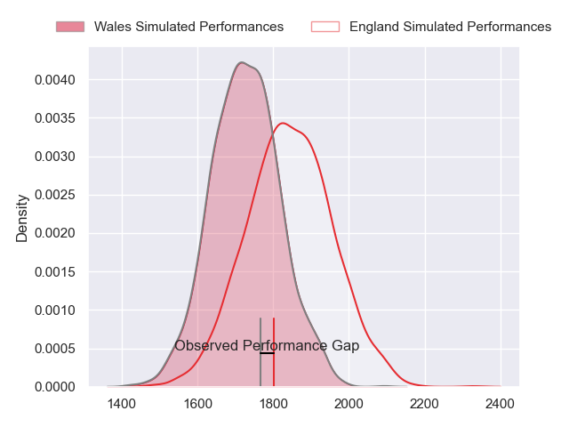
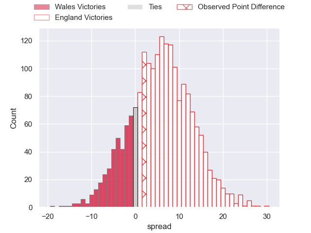
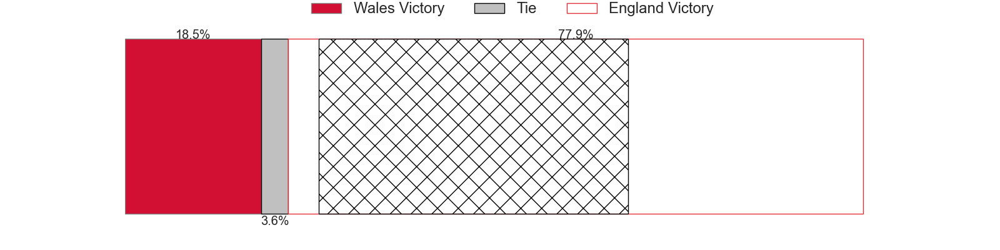
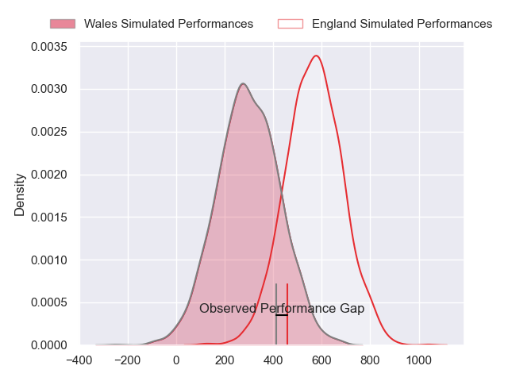
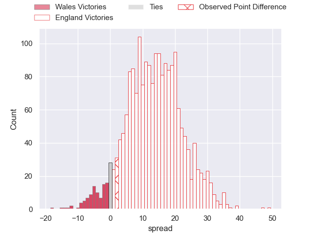
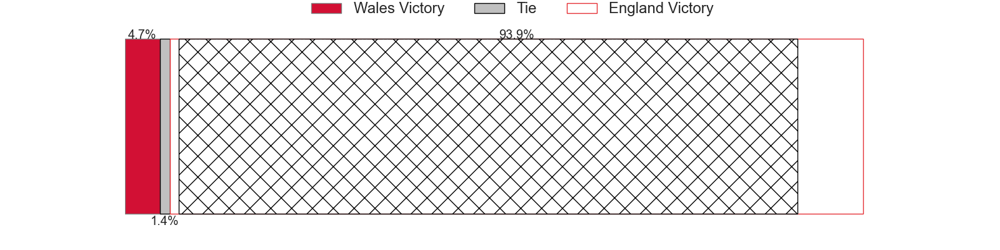

---  
layout: page  
title: Wales at England; 14-16  
date: 2024-02-10 18:00:00 -0500  
categories: "Six Nations Championship 2024" match review  
---
# Wales at England; 14-16

# Club Level Predictions

The first set of predictions treats a club as the smallest object, as the club develops its members, organizes a gameplan, and deploys its players as needed for each match. This club model has a prediction of 0.651, which translates to predicting England to win by 5.6.

Our Over/Under is 43.5 - and combined with the spread above, we have a predicted scoreline of 19 to 25

Each club has a rating and a rating deviation (similar to a Glicko rating), and expected performances can be generated. This allows for simulated matches and spreads like the ones below.
## Projected Performances - Club Model

## Projected Spreads - Club Model

## Projected Results - Club Model

# Player Level Predictions - Version 2

Treating teams instead as an entity made up of the currently active players, I have ratings for each player in an altogether different system. These can be combined to form team ratings once teamsheets are announced, weighting starters a bit higher than the reserves. After the match is played, players can be weighted by their minutes on the field, allowing for an accurate measure of the team's composition. With these compiled team ratings, we can make predictions, measure inaccuracy, and update the individual player ratings.
## Prediction without Player Minutes: England by 17.1

England by 13.2 on a neutral pitch

## Projected Performances - Player Model

## Projected Spreads - Player Model

## Projected Results - Player Model

|   Away Minutes | Away Player       |   Away Percentile |   Number |   Home Percentile | Home Player               |   Home Minutes |
|---------------:|:------------------|------------------:|---------:|------------------:|:--------------------------|---------------:|
|             59 | Gareth Thomas     |             66.25 |        1 |             98.21 | Joe Marler                |             52 |
|             55 | Elliot Dee        |             90.46 |        2 |             97.25 | Jamie George              |             72 |
|             55 | Keiron Assiratti  |             29.38 |        3 |             21.7  | Will Stuart               |             52 |
|             82 | Dafydd Jenkins    |             94.02 |        4 |             94.48 | Maro Itoje                |             82 |
|             69 | Adam Beard        |             94.6  |        5 |             78.16 | Ollie Chessum             |             71 |
|             69 | Alex Mann         |             11.96 |        6 |             75.24 | Ethan Roots               |             73 |
|             82 | Tommy Reffell     |             92.44 |        7 |             85.94 | Sam Underhill             |             64 |
|             82 | Aaron Wainwright  |             86.38 |        8 |             93.43 | Ben Earl                  |             82 |
|             73 | Tomos Williams    |             86.27 |        9 |             94.71 | Alex Mitchell             |             69 |
|             81 | Ioan Lloyd        |              8.53 |       10 |             94.31 | George Ford               |             82 |
|             82 | Rio Dyer          |             32.91 |       11 |             80.29 | Elliot Daly               |             82 |
|             82 | Nick Tompkins     |             98.03 |       12 |             90.71 | Fraser Dingwall           |             82 |
|             82 | George North      |             99.65 |       13 |             97.1  | Henry Slade               |             82 |
|             61 | Josh Adams        |             70.86 |       14 |             95.81 | Tommy Freeman             |             82 |
|             82 | Cameron Winnett   |             62.76 |       15 |             45.06 | Freddie Steward           |             82 |
|             27 | Ryan Elias        |             91.74 |       16 |             37.61 | Theo Dan                  |             10 |
|             23 | Corey Domachowski |             75.98 |       17 |             46.7  | Ellis Genge               |             30 |
|             27 | Archie Griffin    |            nan    |       18 |             37.14 | Dan Cole                  |             30 |
|             13 | Will Rowlands     |             23.22 |       19 |             30.92 | Alex Coles                |             20 |
|             13 | Taine Basham      |             36.41 |       20 |             72.51 | Chandler Cunningham-South |             18 |
|              9 | Kieran Hardy      |             70.78 |       21 |            100    | Danny Care                |             13 |
|              1 | Cai Evans         |             12.87 |       22 |             86.97 | Fin Smith                 |              0 |
|             21 | Mason Grady       |             71.49 |       23 |             74.21 | Immanuel Feyi-Waboso      |              0 |

