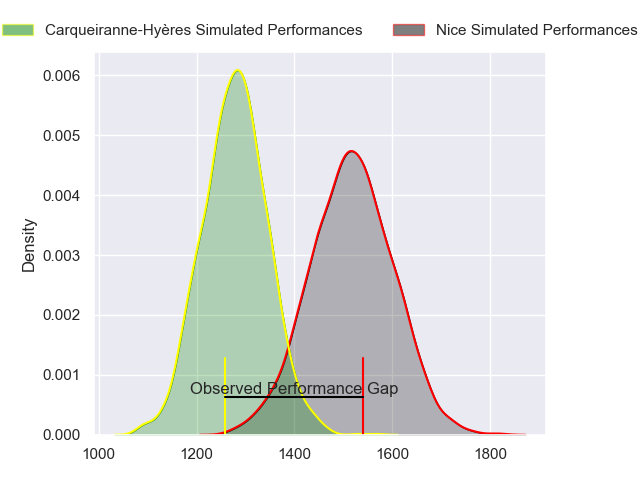
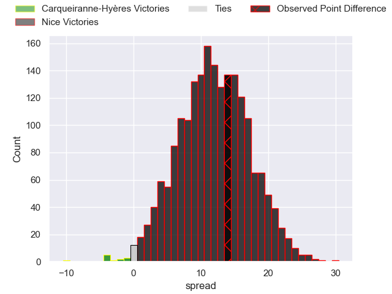
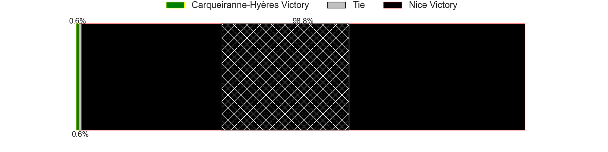
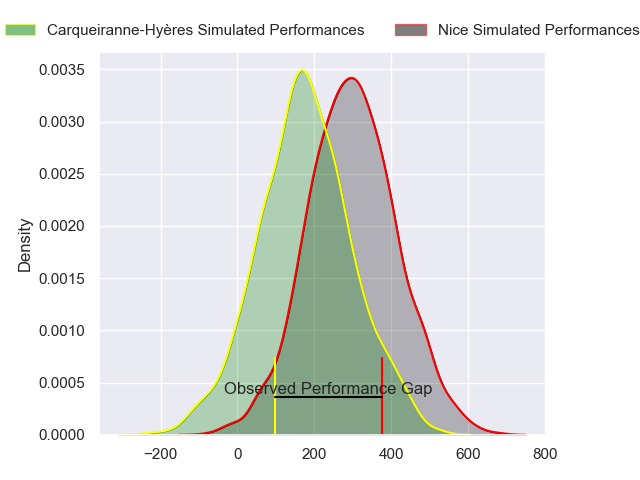
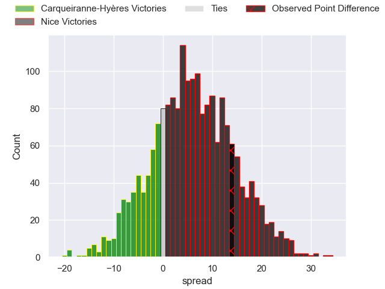
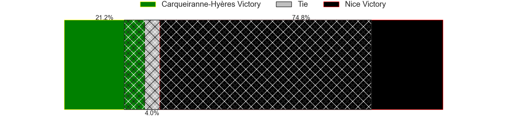

---  
layout: page  
title: Carqueiranne-Hyeres at Nice; 13-27  
date: 2024-02-10 18:00:00 -0500  
categories: "Nationale 2023" match review  
---
# Carqueiranne-Hyeres at Nice; 13-27

# Club Level Predictions

The first set of predictions treats a club as the smallest object, as the club develops its members, organizes a gameplan, and deploys its players as needed for each match. This club model has a prediction of 0.793, which translates to predicting Nice to win by 11.9.

Our Over/Under is 48.5 - and combined with the spread above, we have a predicted scoreline of 18 to 30

Each club has a rating and a rating deviation (similar to a Glicko rating), and expected performances can be generated. This allows for simulated matches and spreads like the ones below.
## Projected Performances - Club Model

## Projected Spreads - Club Model

## Projected Results - Club Model

# Player Level Predictions - Version 2

Treating teams instead as an entity made up of the currently active players, I have ratings for each player in an altogether different system. These can be combined to form team ratings once teamsheets are announced, weighting starters a bit higher than the reserves. After the match is played, players can be weighted by their minutes on the field, allowing for an accurate measure of the team's composition. With these compiled team ratings, we can make predictions, measure inaccuracy, and update the individual player ratings.
## Prediction without Player Minutes: Nice by 8.6

Nice by 5.8 on a neutral pitch

## Projected Performances - Player Model

## Projected Spreads - Player Model

## Projected Results - Player Model

|   Away Minutes | Away Player              |   Away Percentile |   Number |   Home Percentile | Home Player               |   Home Minutes |
|---------------:|:-------------------------|------------------:|---------:|------------------:|:--------------------------|---------------:|
|             45 | Nassim Aanikid           |             35.45 |        1 |              2.68 | Jules Martinez            |             55 |
|             40 | Elandre Huggett          |              7.52 |        2 |             65.87 | Santiago Benjamin Ovejero |             51 |
|             59 | Miguel Mathieu           |             25.54 |        3 |             59.38 | Luvuyo Pupuma             |             59 |
|             80 | Adam Peters              |             93.79 |        4 |             99.89 | Tom Murday                |             69 |
|             51 | Nathan Gendre            |             17.47 |        5 |             90.11 | Adrien Vigne              |             65 |
|             80 | Nicolas Baquer           |             89.09 |        6 |             97.17 | Louis Suaud               |             80 |
|             51 | Marius Pellegrin         |             50.05 |        7 |             68.73 | Arthur Vignolles          |             80 |
|             80 | Johann Afonso Grundlingh |             14.32 |        8 |             91.31 | Laijiasa Bolenaivalu      |             51 |
|             51 | Jérémy Fleury            |              7.84 |        9 |             32.16 | Matéo Jeune-Joly          |             62 |
|             54 | Enzo Miot                |             35.78 |       10 |             52.13 | Mathis Viard              |             80 |
|             54 | Vincent Alessi           |             60.17 |       11 |             89.2  | David Odiete              |             45 |
|             80 | Theo Moitrier            |             72.47 |       12 |              5.34 | Alban Conduche            |             80 |
|             80 | Charles Brousse          |             11.96 |       13 |             91.52 | Nathan Courtade           |             80 |
|             80 | Amaury Bobillon          |             85.53 |       14 |             97.38 | Andrzej Charlat           |             80 |
|             80 | Adrien Amans             |             57.7  |       15 |             73.1  | Corentin Penc'hoat        |             80 |
|             35 | Eli Serra-Miglietti      |             84.11 |       16 |             84.82 | Sunia Vola                |             25 |
|             40 | Yan Tabarot              |             11.38 |       17 |              8.26 | Pierre Strippoli          |             29 |
|             21 | Thomas Lithaud           |             66.07 |       18 |            nan    | Kevin Yameogo             |             21 |
|             29 | Josaia Cama              |             47.01 |       19 |             16.58 | Louis Vincent             |             11 |
|             29 | Joachim Beaumont         |             55.19 |       20 |              3.56 | Thibault Rey              |             15 |
|             29 | Thomas Sonetti           |             90.2  |       21 |             47.13 | Martin Freytes            |             29 |
|             26 | Dylan Sage               |             87.53 |       22 |             87.06 | Jules Solinas             |             18 |
|             26 | Théo Defrance            |              1.84 |       23 |              1.63 | Baptiste Lafond           |             35 |

