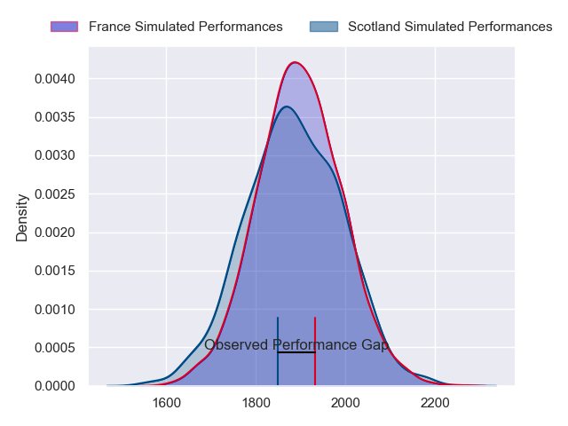
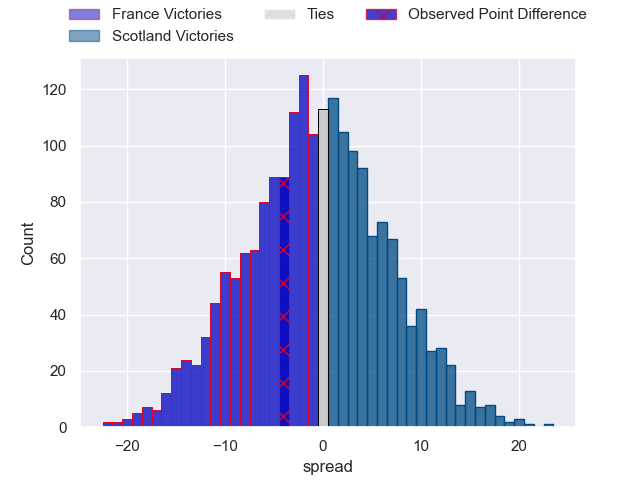
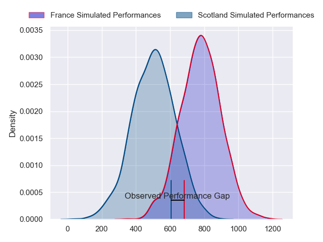
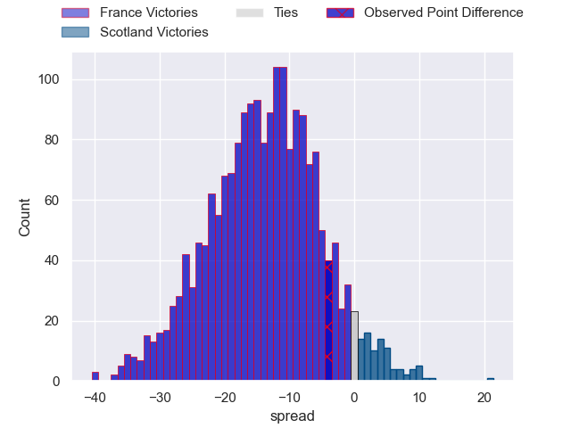
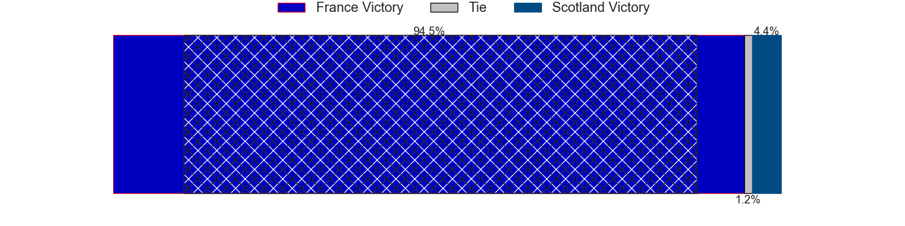

---  
layout: page  
title: France at Scotland; 20-16  
date: 2024-02-10 18:00:00 -0500  
categories: "Six Nations Championship 2024" match review  
---
# France at Scotland; 20-16

# Club Level Predictions

The first set of predictions treats a club as the smallest object, as the club develops its members, organizes a gameplan, and deploys its players as needed for each match. This club model has a prediction of 0.486, which translates to predicting France to win by 0.5.

Our Over/Under is 37.5 - and combined with the spread above, we have a predicted scoreline of 19 to 18

Each club has a rating and a rating deviation (similar to a Glicko rating), and expected performances can be generated. This allows for simulated matches and spreads like the ones below.
## Projected Performances - Club Model

## Projected Spreads - Club Model

## Projected Results - Club Model

# Player Level Predictions - Version 2

Treating teams instead as an entity made up of the currently active players, I have ratings for each player in an altogether different system. These can be combined to form team ratings once teamsheets are announced, weighting starters a bit higher than the reserves. After the match is played, players can be weighted by their minutes on the field, allowing for an accurate measure of the team's composition. With these compiled team ratings, we can make predictions, measure inaccuracy, and update the individual player ratings.
## Prediction without Player Minutes: France by 11.3

France by 15.2 on a neutral pitch

## Projected Performances - Player Model

## Projected Spreads - Player Model

## Projected Results - Player Model

|   Away Minutes | Away Player          |   Away Percentile |   Number |   Home Percentile | Home Player         |   Home Minutes |
|---------------:|:---------------------|------------------:|---------:|------------------:|:--------------------|---------------:|
|             58 | Cyril Baille         |             95.68 |        1 |             92.61 | Pierre Schoeman     |             72 |
|             49 | Peato Mauvaka        |             94.88 |        2 |             99.63 | George Turner       |             58 |
|             58 | Uini Atonio          |             99.82 |        3 |             99.1  | Zander Fagerson     |             80 |
|             49 | Cameron Woki         |             81.42 |        4 |             94.67 | Grant Gilchrist     |             75 |
|             49 | Paul Gabrillagues    |             53.96 |        5 |             96.33 | Scott Cummings      |             80 |
|             80 | Francois Cros        |             98.16 |        6 |             96.32 | Matt Fagerson       |             41 |
|             80 | Charles Ollivon      |             97.4  |        7 |             72.26 | Rory Darge          |             80 |
|             50 | Gregory Alldritt     |             98.11 |        8 |             38.06 | Jack Dempsey        |             80 |
|             50 | Maxime Lucu          |             99.6  |        9 |             69.94 | Ben White           |             80 |
|             80 | Matthieu Jalibert    |             97.07 |       10 |             99.27 | Finn Russell        |             80 |
|             69 | Louis Bielle-Biarrey |             70.79 |       11 |             80.42 | Duhan van der Merwe |             80 |
|             63 | Jonathan Danty       |             96.16 |       12 |             67.87 | Sione Tuipulotu     |             80 |
|             80 | Gael Fickou          |             95.8  |       13 |             32.97 | Huw Jones           |             77 |
|             80 | Damian Penaud        |             95.03 |       14 |             76.51 | Kyle Rowe           |             80 |
|             80 | Thomas Ramos         |             95.42 |       15 |             42.89 | Harry Paterson      |             80 |
|             31 | Julien Marchand      |             98.72 |       16 |             88.67 | Ewan Ashman         |             22 |
|             22 | Sebastien Taofifenua |             13.24 |       17 |             68.29 | Alec Hepburn        |              8 |
|             33 | Dorian Aldegheri     |             97.39 |       18 |            nan    | Elliot Millar-Mills |              0 |
|             31 | Posolo Tuilagi       |            nan    |       19 |             87.81 | Sam Skinner         |              5 |
|             31 | Alexandre Roumat     |             95.27 |       20 |             18.42 | Andy Christie       |             39 |
|             30 | Paul Boudehent       |             26    |       21 |             99.4  | George Horne        |              0 |
|             30 | Nolann Le Garrec     |             76.75 |       22 |             89.02 | Ben Healy           |              0 |
|             17 | Yoram Moefana        |             82.12 |       23 |             54.56 | Cameron Redpath     |              3 |

