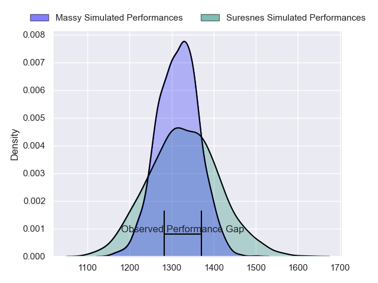
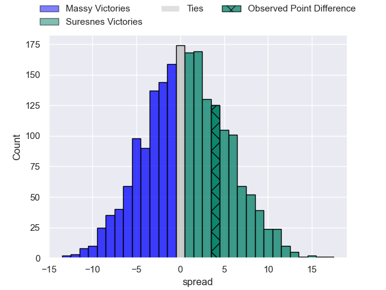
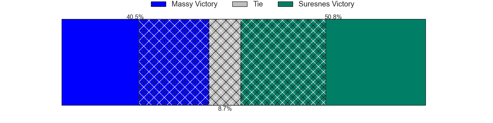
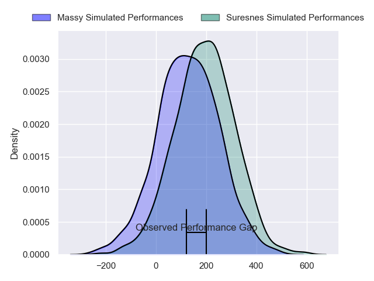
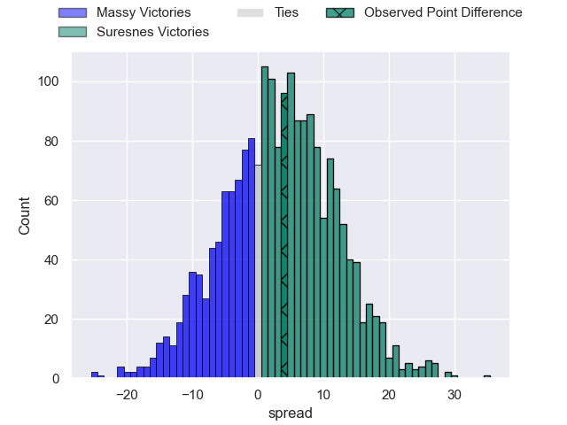
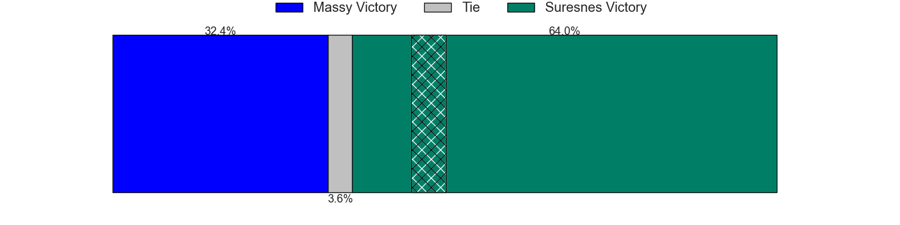

---  
layout: page  
title: Massy at Suresnes; 18-22  
date: 2024-02-10 18:00:00 -0500  
categories: "Nationale 2023" match review  
---
# Massy at Suresnes; 18-22

# Club Level Predictions

The first set of predictions treats a club as the smallest object, as the club develops its members, organizes a gameplan, and deploys its players as needed for each match. This club model has a prediction of 0.52, which translates to predicting Suresnes to win by 0.7.

Our Over/Under is 47.5 - and combined with the spread above, we have a predicted scoreline of 23 to 24

Each club has a rating and a rating deviation (similar to a Glicko rating), and expected performances can be generated. This allows for simulated matches and spreads like the ones below.
## Projected Performances - Club Model

## Projected Spreads - Club Model

## Projected Results - Club Model

# Player Level Predictions - Version 2

Treating teams instead as an entity made up of the currently active players, I have ratings for each player in an altogether different system. These can be combined to form team ratings once teamsheets are announced, weighting starters a bit higher than the reserves. After the match is played, players can be weighted by their minutes on the field, allowing for an accurate measure of the team's composition. With these compiled team ratings, we can make predictions, measure inaccuracy, and update the individual player ratings.
## Prediction without Player Minutes: Suresnes by 1.6

Massy by 1.2 on a neutral pitch

## Projected Performances - Player Model

## Projected Spreads - Player Model

## Projected Results - Player Model

|   Away Minutes | Away Player              |   Away Percentile |   Number |   Home Percentile | Home Player          |   Home Minutes |
|---------------:|:-------------------------|------------------:|---------:|------------------:|:---------------------|---------------:|
|             56 | Robin Poipy              |             74.95 |        1 |             33.87 | Elias Coulibaly      |             53 |
|             50 | Pierre-Alexandre Duclieu |             16.64 |        2 |             82.08 | Hayam El Bibouji     |             64 |
|             56 | Tijde Visser             |             77.66 |        3 |             15.59 | Victor Damian Arias  |             53 |
|             80 | Abongile Nonkontwana     |              1.18 |        4 |             88.28 | Sacha Yahi           |             80 |
|             51 | Lilian Rousset           |             84.62 |        5 |             19.05 | Yakine Djebarri      |             65 |
|             57 | Tony Tissot              |             14.84 |        6 |             67.71 | Florian Desbordes    |             70 |
|             80 | Alexandre Loubiere       |             10.29 |        7 |             41.39 | Louis-Mathieu Jazeix |             80 |
|             80 | Samuel Nollet            |             63.36 |        8 |             32.39 | Lakisipone Lee       |             80 |
|             62 | Benjamin Prier           |             70.54 |        9 |             23.85 | Thomas Lacroix       |             53 |
|             80 | Hugo Verdu               |              4.88 |       10 |             19.27 | Tanguy Lacoste       |             80 |
|             80 | Giorgi Gogoladze         |             50.79 |       11 |             98.52 | Faraj Fartass        |             80 |
|             80 | Victorien Jacomme        |             46.52 |       12 |              1.44 | JJ Taulagi           |             64 |
|             80 | Arthur Seigneuret        |             86.57 |       13 |             89.33 | Petero Tuwai         |             80 |
|             57 | Alex Preira              |             96.83 |       14 |             48.15 | Alexis Clement       |             68 |
|             63 | Martin Carre             |             88.92 |       15 |             37.11 | Thomas Baudy         |             80 |
|             30 | Pierre Trassoudaine      |             92.09 |       16 |             64.53 | Théo Bachiri         |             27 |
|             29 | Andrei Mahu              |             84.38 |       17 |             89.55 | Leandro Mario Assi   |             27 |
|             24 | Charif Mansour           |             26.4  |       18 |             19.01 | Lucas Dycke          |             27 |
|             24 | Nolan Pienaar            |             85.68 |       19 |              9.87 | Jean-Étienne Lesueur |             16 |
|             23 | Kimami Sitauti           |              0.74 |       20 |             94    | Victor Barnier       |             16 |
|             23 | Clément Vidoni           |             95.56 |       21 |             90.3  | Marvin Woki          |             15 |
|             18 | Lucas Rubio              |             76.15 |       22 |              2.17 | Goulwen Gueho        |             12 |
|             17 | Tom Deleuze              |             67.23 |       23 |             23.29 | Damien Bozic         |             10 |

