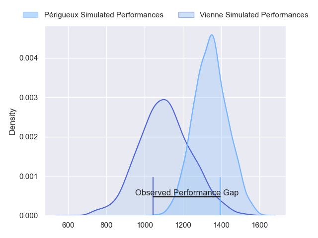
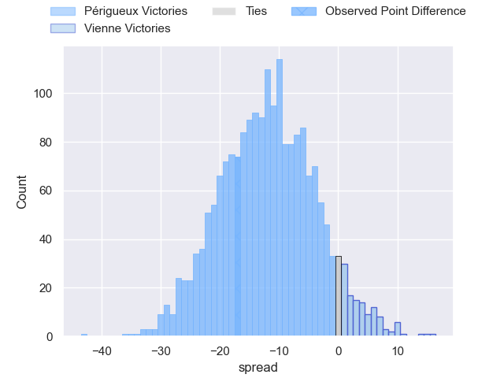
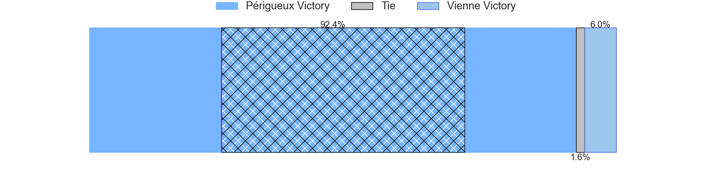
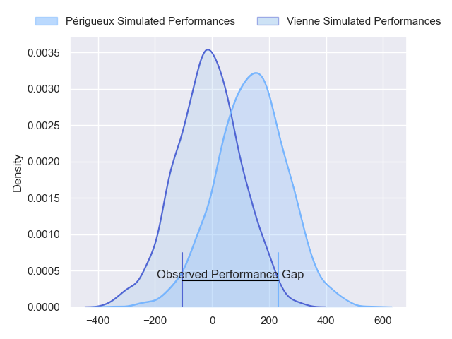
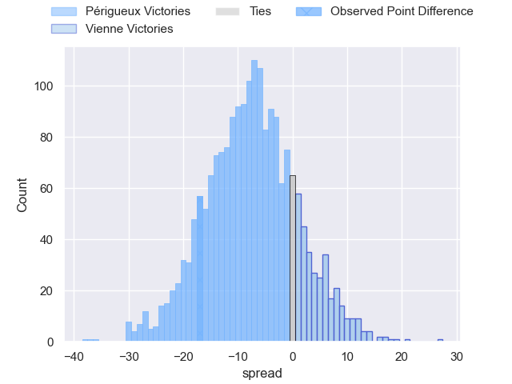
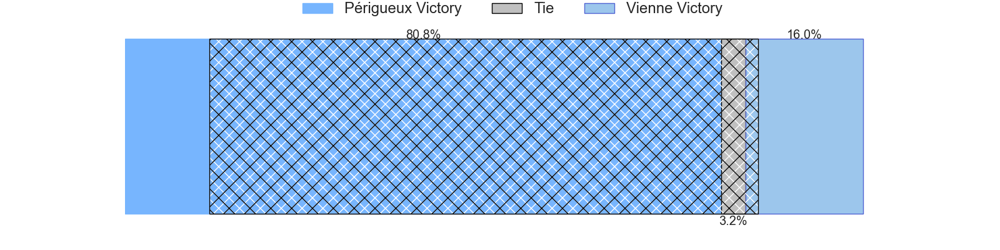

---  
layout: page  
title: Perigueux at Vienne; 20-3  
date: 2024-02-10 18:00:00 -0500  
categories: "Nationale 2023" match review  
---
# Perigueux at Vienne; 20-3

# Club Level Predictions

The first set of predictions treats a club as the smallest object, as the club develops its members, organizes a gameplan, and deploys its players as needed for each match. This club model has a prediction of 0.214, which translates to predicting Périgueux to win by 11.7.

Our Over/Under is 34.5 - and combined with the spread above, we have a predicted scoreline of 23 to 11

Each club has a rating and a rating deviation (similar to a Glicko rating), and expected performances can be generated. This allows for simulated matches and spreads like the ones below.
## Projected Performances - Club Model

## Projected Spreads - Club Model

## Projected Results - Club Model

# Player Level Predictions - Version 2

Treating teams instead as an entity made up of the currently active players, I have ratings for each player in an altogether different system. These can be combined to form team ratings once teamsheets are announced, weighting starters a bit higher than the reserves. After the match is played, players can be weighted by their minutes on the field, allowing for an accurate measure of the team's composition. With these compiled team ratings, we can make predictions, measure inaccuracy, and update the individual player ratings.
## Prediction without Player Minutes: Périgueux by 7.8

Périgueux by 10.0 on a neutral pitch

## Projected Performances - Player Model

## Projected Spreads - Player Model

## Projected Results - Player Model

|   Away Minutes | Away Player        |   Away Percentile |   Number |   Home Percentile | Home Player              |   Home Minutes |
|---------------:|:-------------------|------------------:|---------:|------------------:|:-------------------------|---------------:|
|             69 | Thomas Vidal       |             78.74 |        1 |             20.36 | Louan Capuano            |             48 |
|             54 | Baptiste Arvouet   |             32.36 |        2 |              4.75 | Dimitri Gibierge         |             48 |
|             54 | Anthony Pelmard    |             58.92 |        3 |             19.91 | Guram Kavtidze           |             48 |
|             60 | Richard Fourcade   |             22.6  |        4 |             49.35 | Victor Comptat           |             50 |
|             80 | Damien Lavergne    |             30.41 |        5 |             11.01 | Ciaran O'Flynn           |             80 |
|             54 | Hendri Storm       |             46.37 |        6 |              2.6  | Léon Peyrat              |             60 |
|             80 | Afaesetiti Amosa   |             94.37 |        7 |             49.62 | Guillaume Moroldo        |             80 |
|             80 | Karl Lambert       |             55.56 |        8 |             14.18 | Théo Minodier            |             80 |
|             64 | Enzo Hardy         |             32.46 |        9 |             42.28 | Malory Piet              |             56 |
|             64 | Greg Hutley        |             61.95 |       10 |             10.24 | Tom Richard              |             45 |
|             80 | Arthur Duhau       |             85.61 |       11 |             31.64 | Hippolyte Massa          |             80 |
|             50 | Cyril Couturier    |             80.34 |       12 |             11.63 | Axel Derderian           |             45 |
|             80 | Vincent Fouillade  |             54.32 |       13 |             25.18 | Pierre Mollard           |             80 |
|             80 | Benjamin Yarde     |             20.21 |       14 |             35.98 | Théo Brunel              |             80 |
|             80 | Thibault Rabourdin |             15.66 |       15 |             11.57 | Brandon Bellavia         |             80 |
|             30 | Fred Hickes        |             86.45 |       16 |              9.23 | Matthias Giovale         |             35 |
|             26 | Clement Lanen      |             30.5  |       17 |              5.61 | Julien Hervouet          |             35 |
|             26 | Louis Martin       |             76.6  |       18 |             12.25 | Axel Benjamin            |             32 |
|             26 | Martin Augeix      |             26.31 |       19 |             12.88 | Pierre-Mathieu Fernandes |             32 |
|             20 | Jaco Willemse      |             23.67 |       20 |              8.74 | Benjamin Robin           |             32 |
|             16 | Matteo Bordenave   |             37.68 |       21 |              2.71 | Charles Massot           |             30 |
|             16 | Yann Caillat       |             28.78 |       22 |             10.02 | Enzo Ravanello           |             24 |
|             11 | Emilien Borges     |            nan    |       23 |             45.94 | Romain Falcoz            |             20 |

