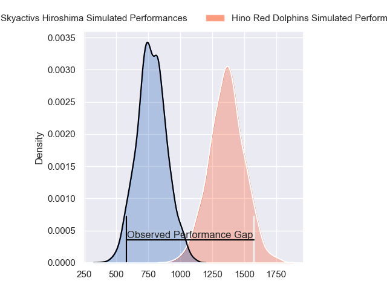
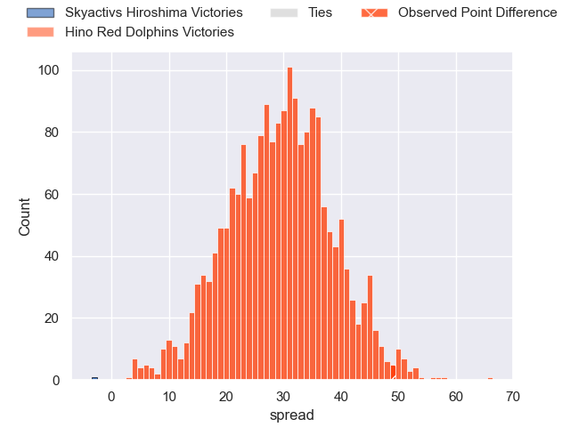
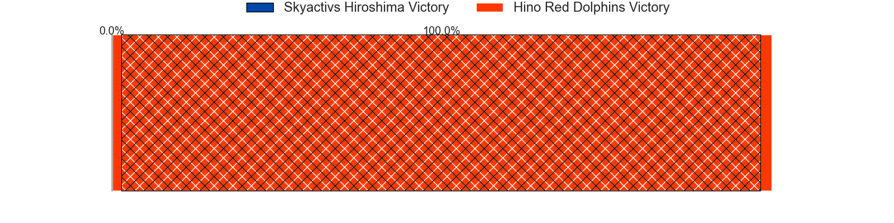
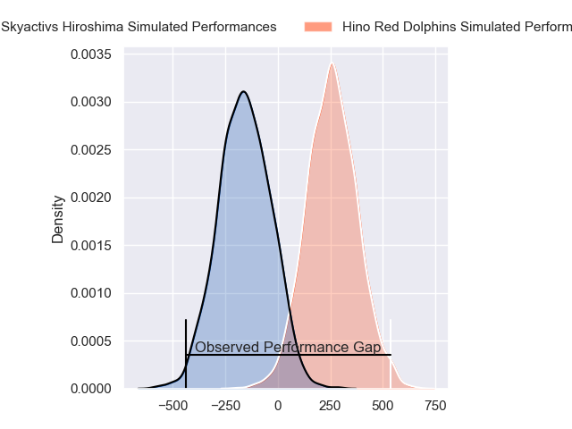
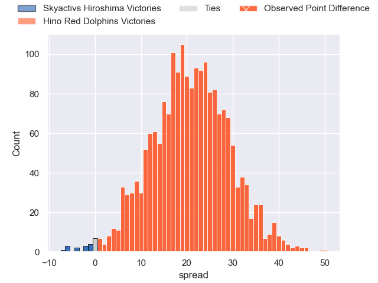
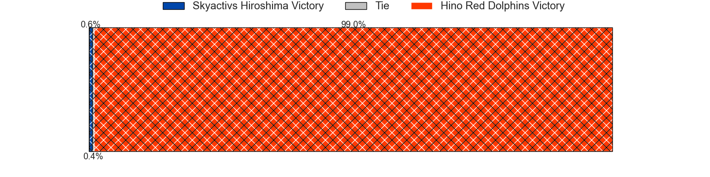

---  
layout: page  
title: Skyactivs Hiroshima at Hino Red Dolphins; 12-61  
date: 2024-02-11 18:00:00 -0500  
categories: "Japan Rugby League One D3 2023" match review  
---
# Skyactivs Hiroshima at Hino Red Dolphins; 12-61

# Club Level Predictions

The first set of predictions treats a club as the smallest object, as the club develops its members, organizes a gameplan, and deploys its players as needed for each match. This club model has a prediction of 0.959, which translates to predicting Hino Red Dolphins to win by 29.1.

Our Over/Under is 76.5 - and combined with the spread above, we have a predicted scoreline of 24 to 53

Each club has a rating and a rating deviation (similar to a Glicko rating), and expected performances can be generated. This allows for simulated matches and spreads like the ones below.
## Projected Performances - Club Model

## Projected Spreads - Club Model

## Projected Results - Club Model

# Player Level Predictions - Version 2

Treating teams instead as an entity made up of the currently active players, I have ratings for each player in an altogether different system. These can be combined to form team ratings once teamsheets are announced, weighting starters a bit higher than the reserves. After the match is played, players can be weighted by their minutes on the field, allowing for an accurate measure of the team's composition. With these compiled team ratings, we can make predictions, measure inaccuracy, and update the individual player ratings.
## Prediction without Player Minutes: Hino Red Dolphins by 23.2

Hino Red Dolphins by 20.7 on a neutral pitch

## Projected Performances - Player Model

## Projected Spreads - Player Model

## Projected Results - Player Model

|   Away Minutes | Away Player        |   Away Percentile |   Number |   Home Percentile | Home Player        |   Home Minutes |
|---------------:|:-------------------|------------------:|---------:|------------------:|:-------------------|---------------:|
|             56 | Koshi Kato         |              1.52 |        1 |             69.64 | Yuto Tokuda        |             57 |
|             56 | Tomohiro Takeda    |              2.75 |        2 |             71.93 | Towa Taniguchi     |             72 |
|             44 | Tomoya Otake       |              2.5  |        3 |             37.95 | Shosuke Funaki     |             57 |
|             80 | Yutaro Tanaka      |             34.71 |        4 |             59.77 | AJ Wolf            |             29 |
|              6 | Lachlan Osborne    |              4.02 |        5 |             97.24 | Rory Arnold        |             65 |
|             66 | Koki Nakano        |             43.76 |        6 |             65.9  | Shun Nakashika     |             80 |
|             80 | Tevin Ferris       |              5.88 |        7 |             70.51 | Shun Tomonaga      |             80 |
|             80 | Iori Suzuki        |             28.4  |        8 |             66.43 | Shohei Ijima       |             80 |
|             80 | Jacob Abel         |             50.39 |        9 |              9.8  | Norifumi Hashimoto |             65 |
|             80 | Beaudein Waaka     |              1.42 |       10 |             88.86 | Simon Hickey       |             80 |
|             53 | Kouhei Kamei       |              2.2  |       11 |             35.95 | Sora Ohchi         |             80 |
|             42 | Shunya Motoyama    |             48.43 |       12 |             59.58 | Augustine Pulu     |             61 |
|             73 | Haruki Kitajima    |              2.79 |       13 |             46.92 | Yuta Matsui        |             50 |
|             80 | Yuto Nanamura      |             61.32 |       14 |             70.23 | Ko Kojima          |             80 |
|             80 | Ginjiro Sakiguchi  |              0.23 |       15 |             54.25 | Kyoji Takano       |             80 |
|             74 | Tye Nash           |            nan    |       16 |             64.83 | Noah Tovio         |             51 |
|             38 | Dai Goto           |              0.59 |       17 |            nan    | Taiki Kawai        |             30 |
|             36 | Tadatsugu Kanayama |             54.46 |       18 |            nan    | Taiga Yamaguchi    |             23 |
|             27 | Ren Ouchi          |             47.9  |       19 |            nan    | Ken Osanai         |             23 |
|             24 | Taichi Yoko        |            nan    |       20 |             53.54 | Keita Doi          |             19 |
|             24 | Tomonori Koyanagi  |             29.2  |       21 |            nan    | Junya Lee          |             15 |
|             14 | Tomoki Ashida      |              1.05 |       22 |            nan    | Yuki Kagoshima     |             15 |
|              7 | Kaito Sasaoka      |             34.17 |       23 |            nan    | Daiki Nakagawa     |              8 |

