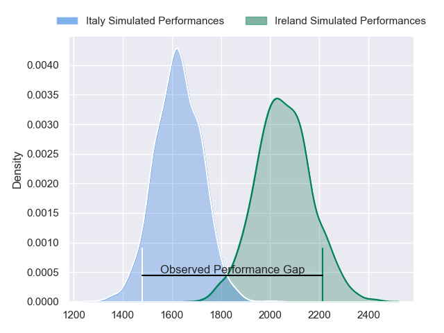
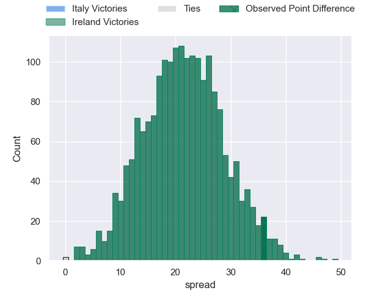
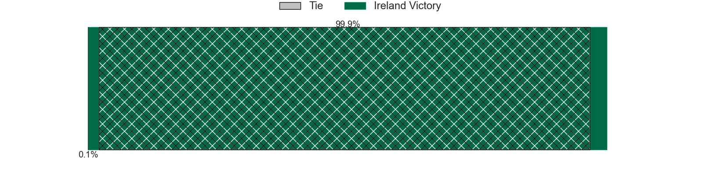
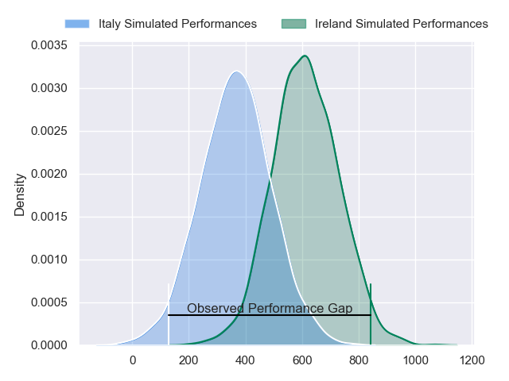
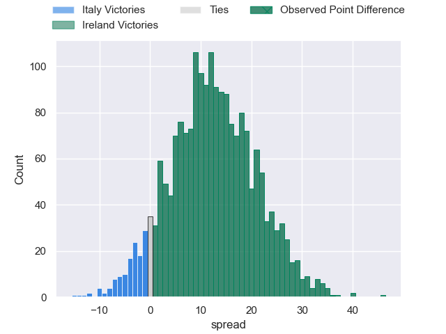
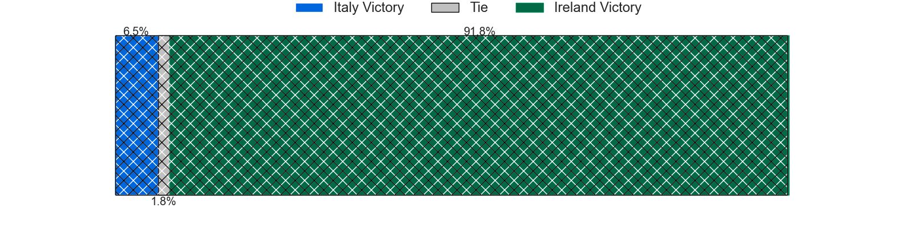

---  
layout: page  
title: Italy at Ireland; 0-36  
date: 2024-02-11 18:00:00 -0500  
categories: "Six Nations Championship 2024" match review  
---
# Italy at Ireland; 0-36

# Club Level Predictions

The first set of predictions treats a club as the smallest object, as the club develops its members, organizes a gameplan, and deploys its players as needed for each match. This club model has a prediction of 0.914, which translates to predicting Ireland to win by 21.4.

Our Over/Under is 55.5 - and combined with the spread above, we have a predicted scoreline of 17 to 38

Each club has a rating and a rating deviation (similar to a Glicko rating), and expected performances can be generated. This allows for simulated matches and spreads like the ones below.
## Projected Performances - Club Model

## Projected Spreads - Club Model

## Projected Results - Club Model

# Player Level Predictions - Version 2

Treating teams instead as an entity made up of the currently active players, I have ratings for each player in an altogether different system. These can be combined to form team ratings once teamsheets are announced, weighting starters a bit higher than the reserves. After the match is played, players can be weighted by their minutes on the field, allowing for an accurate measure of the team's composition. With these compiled team ratings, we can make predictions, measure inaccuracy, and update the individual player ratings.
## Prediction without Player Minutes: Ireland by 16.6

Ireland by 13.0 on a neutral pitch

## Projected Performances - Player Model

## Projected Spreads - Player Model

## Projected Results - Player Model

|   Away Minutes | Away Player        |   Away Percentile |   Number |   Home Percentile | Home Player         |   Home Minutes |
|---------------:|:-------------------|------------------:|---------:|------------------:|:--------------------|---------------:|
|             57 | Danilo Fischetti   |             56.79 |        1 |             95.8  | Andrew Porter       |             56 |
|             57 | Gianmarco Lucchesi |             79.45 |        2 |             83.85 | Dan Sheehan         |             56 |
|             40 | Pietro Ceccarelli  |             58.48 |        3 |             96.96 | Finlay Bealham      |             56 |
|             80 | Niccolo Cannone    |             39.31 |        4 |             88.62 | Joe McCarthy        |             80 |
|             57 | Federico Ruzza     |             95.06 |        5 |             96.21 | James Ryan          |             61 |
|             80 | Alessandro Izekor  |             72.4  |        6 |             88.98 | Ryan Baird          |             66 |
|             69 | Manuel Zuliani     |             68.42 |        7 |             98.85 | Caelan Doris        |             80 |
|             80 | Michele Lamaro     |             91.55 |        8 |             98.12 | Jack Conan          |             80 |
|             58 | Stephen Varney     |             19.8  |        9 |             82.35 | Craig Casey         |             73 |
|             80 | Paolo Garbisi      |             73.7  |       10 |             62.56 | Jack Crowley        |             80 |
|             80 | Monty Ioane        |             97.9  |       11 |            100    | James Lowe          |             80 |
|             80 | Tommaso Menoncello |             80.49 |       12 |             63.65 | Stuart McCloskey    |             80 |
|             80 | Juan Ignacio Brex  |             88.97 |       13 |             94.89 | Robbie Henshaw      |             64 |
|             58 | Lorenzo Pani       |             38.99 |       14 |             92.87 | Calvin Nash         |             80 |
|             80 | Ange Capuozzo      |             92.41 |       15 |             99.77 | Hugo Keenan         |             56 |
|             23 | Giacomo Nicotera   |             98.17 |       16 |             91.56 | Ronan Kelleher      |             24 |
|             23 | Mirco Spagnolo     |            nan    |       17 |             95.27 | Jeremy Loughman     |             24 |
|             40 | Giosue Zilocchi    |             51.88 |       18 |             14.29 | Tom O'Toole         |             24 |
|             23 | Andrea Zambonin    |             45.4  |       19 |             89.08 | Iain Henderson      |             19 |
|             11 | Ross Vintcent      |             63.48 |       20 |             99.06 | Josh van der Flier  |             14 |
|             22 | Martin Page-Relo   |             74.31 |       21 |             98.24 | Jamison Gibson-Park |              7 |
|              0 | Tommaso Allan      |             75.83 |       22 |             88.63 | Harry Byrne         |             24 |
|             22 | Federico Mori      |             52.73 |       23 |             91.4  | Jordan Larmour      |             16 |

