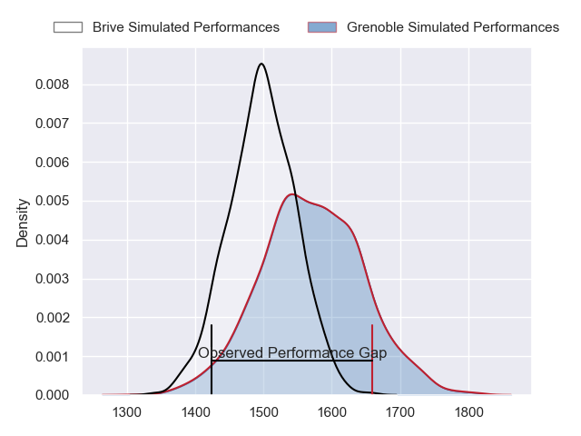
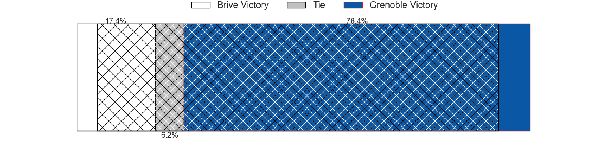
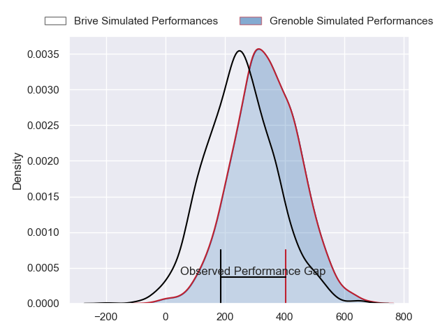
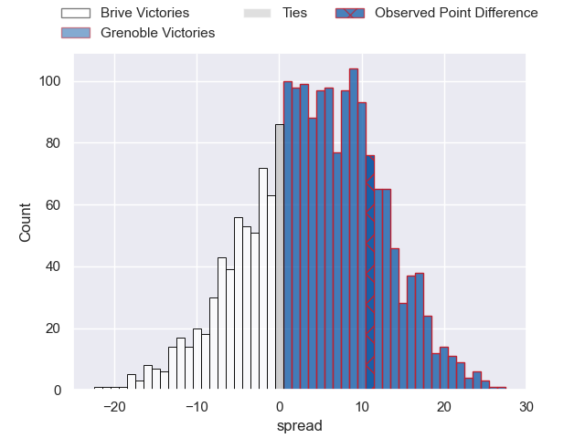
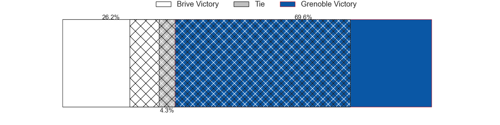

---  
layout: page  
title: Brive at Grenoble; 29-40  
date: 2024-02-15 18:00:00 -0500  
categories: "Pro D2 2023" match review  
---
# Brive at Grenoble; 29-40

# Club Level Predictions

The first set of predictions treats a club as the smallest object, as the club develops its members, organizes a gameplan, and deploys its players as needed for each match. This club model has a prediction of 0.6, which translates to predicting Grenoble to win by 3.6.

Our Over/Under is 46.5 - and combined with the spread above, we have a predicted scoreline of 22 to 25

Each club has a rating and a rating deviation (similar to a Glicko rating), and expected performances can be generated. This allows for simulated matches and spreads like the ones below.
## Projected Performances - Club Model

## Projected Spreads - Club Model

## Projected Results - Club Model

# Player Level Predictions - Version 2

Treating teams instead as an entity made up of the currently active players, I have ratings for each player in an altogether different system. These can be combined to form team ratings once teamsheets are announced, weighting starters a bit higher than the reserves. After the match is played, players can be weighted by their minutes on the field, allowing for an accurate measure of the team's composition. With these compiled team ratings, we can make predictions, measure inaccuracy, and update the individual player ratings.
## Prediction without Player Minutes: Grenoble by 5.2

Brive by 2.6 on a neutral pitch

## Projected Performances - Player Model

## Projected Spreads - Player Model

## Projected Results - Player Model

|   Away Minutes | Away Player               |   Away Percentile |   Number |   Home Percentile | Home Player         |   Home Minutes |
|---------------:|:--------------------------|------------------:|---------:|------------------:|:--------------------|---------------:|
|             48 | Hugo Reilhes              |             70.36 |        1 |             13.04 | Eli Eglaine         |             41 |
|             48 | Issam Hamel               |             78.9  |        2 |             31.01 | Mathis Sarragallet  |             64 |
|             48 | Marcel van der Merwe      |             13.75 |        3 |             51.25 | Vincent Vial        |             53 |
|             48 | Asier Usarraga            |             68.85 |        4 |             35.98 | Thomas Lainault     |             53 |
|             48 | Tevita Ratuva             |             72.07 |        5 |             77.36 | Georgi Javakhia     |             80 |
|             80 | Retief Marais             |             71.46 |        6 |             91.5  | Jose Madeira        |             80 |
|             48 | Ross Moriarty             |             91.71 |        7 |             60.97 | Steeve Blanc-Mappaz |             80 |
|             48 | Rahboni Warren-Vosayaco   |             63.85 |        8 |             42.49 | Thibaut Martel      |             53 |
|             80 | Julien Blanc              |             67.25 |        9 |             86.86 | Eric Escande        |             59 |
|             80 | Jackson Garden-Bachop     |              5.69 |       10 |             53.55 | Romain Barthelemy   |             80 |
|             80 | Asaeli Tuivuaka           |             61.64 |       11 |             73.58 | Wilfried Hulleu     |             80 |
|             80 | Sam Johnson               |             89.2  |       12 |             59.81 | Terrence Hepetema   |             68 |
|             48 | Paula Walisolio           |             33.22 |       13 |             54.36 | Romain Trouilloud   |             80 |
|             80 | Arthur Bonneval           |             76.21 |       14 |             48.43 | Geoffrey Cros       |             80 |
|             80 | Mathis Ferté              |             55.86 |       15 |             95.4  | Julien Farnoux      |             53 |
|             32 | Taniela Sadrugu           |             53.29 |       16 |             51.52 | Luka Goginava       |             39 |
|             32 | Said Hireche              |             91.29 |       17 |             15.56 | Romain Fusier       |             27 |
|             32 | Thomas Laranjeira         |             77.47 |       18 |             46.55 | Pierce Phillips     |             27 |
|             32 | Francisco Coria Marchetti |             16.7  |       19 |             45.77 | Pio Muarua          |             27 |
|             32 | Benjamin Boudou           |             44.04 |       20 |             62.68 | Siua Halanukonuka   |             27 |
|             32 | Nathan Fraissenon         |            nan    |       21 |             46.61 | Lilian Rossi        |             16 |
|             32 | Julien Delannoy           |             34.25 |       22 |              7.25 | Barnabe Couilloud   |             21 |
|             32 | Sasha Gue                 |             53.83 |       23 |            nan    | Max Clement         |             12 |

