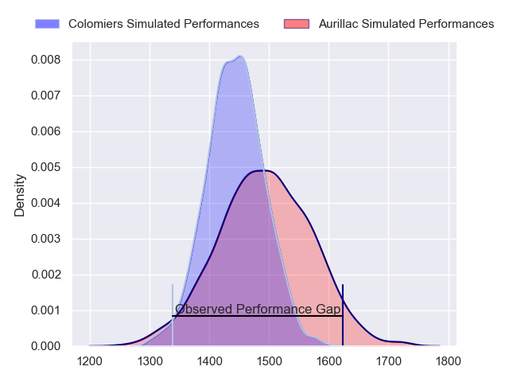
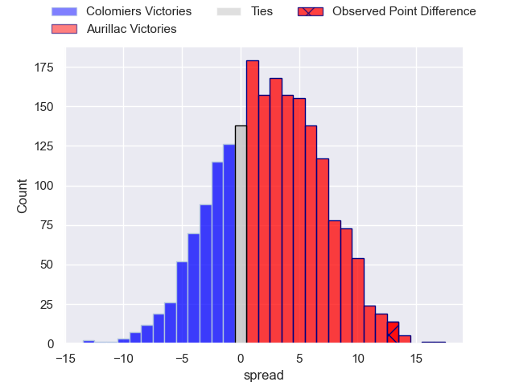
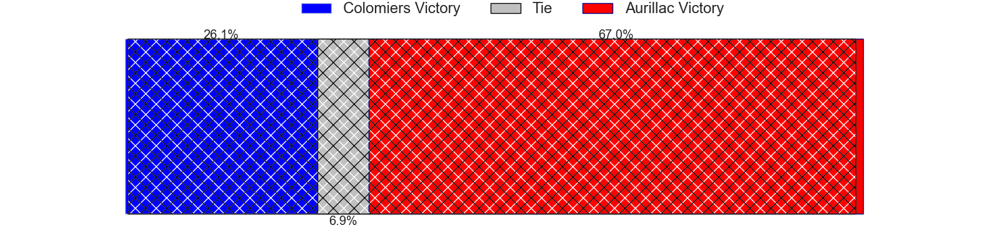
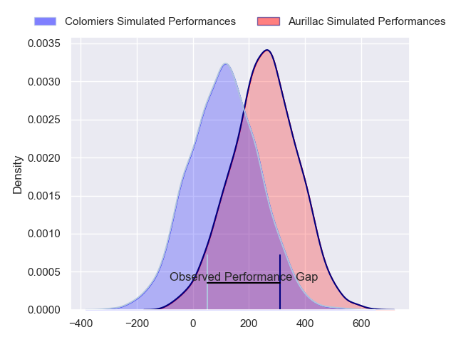
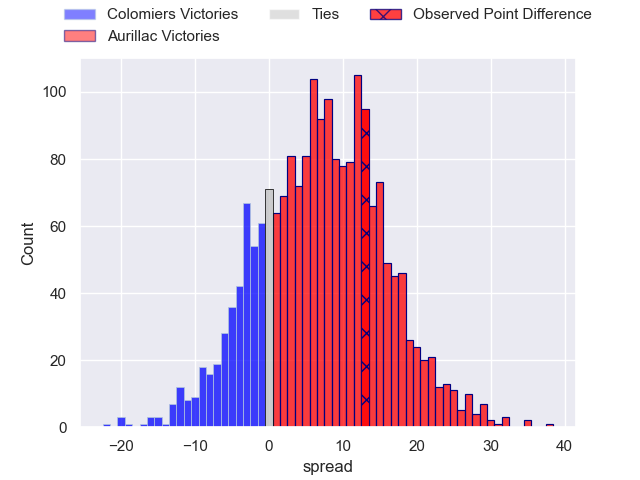
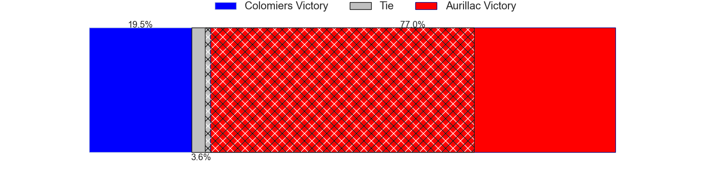

---  
layout: page  
title: Colomiers at Aurillac; 17-30  
date: 2024-02-16 18:00:00 -0500  
categories: "Pro D2 2023" match review  
---
# Colomiers at Aurillac; 17-30

# Club Level Predictions

The first set of predictions treats a club as the smallest object, as the club develops its members, organizes a gameplan, and deploys its players as needed for each match. This club model has a prediction of 0.571, which translates to predicting Aurillac to win by 2.5.

Our Over/Under is 40.5 - and combined with the spread above, we have a predicted scoreline of 19 to 21

Each club has a rating and a rating deviation (similar to a Glicko rating), and expected performances can be generated. This allows for simulated matches and spreads like the ones below.
## Projected Performances - Club Model

## Projected Spreads - Club Model

## Projected Results - Club Model

# Player Level Predictions - Version 2

Treating teams instead as an entity made up of the currently active players, I have ratings for each player in an altogether different system. These can be combined to form team ratings once teamsheets are announced, weighting starters a bit higher than the reserves. After the match is played, players can be weighted by their minutes on the field, allowing for an accurate measure of the team's composition. With these compiled team ratings, we can make predictions, measure inaccuracy, and update the individual player ratings.
## Prediction without Player Minutes: Aurillac by 6.9

Colomiers by 0.8 on a neutral pitch

## Projected Performances - Player Model

## Projected Spreads - Player Model

## Projected Results - Player Model

|   Away Minutes | Away Player           |   Away Percentile |   Number |   Home Percentile | Home Player           |   Home Minutes |
|---------------:|:----------------------|------------------:|---------:|------------------:|:----------------------|---------------:|
|             55 | Hugo Djehi            |             74.55 |        1 |             11.61 | Robert Rodgers        |             62 |
|             55 | Thomas Larrieu        |             26.06 |        2 |             41.47 | Ronan Loughnane       |             51 |
|             55 | Hugo Pirlet           |             64.55 |        3 |             64.82 | Giorgi Kartvelishvili |             67 |
|             59 | Jean Thomas           |             56.09 |        4 |             81.95 | Eoghan Masterson      |             68 |
|             80 | Janse Roux            |             56.67 |        5 |             79.08 | Cam Dodson            |             80 |
|             47 | Joseva Tamani         |             70.83 |        6 |             81.01 | Heath Backhouse       |             57 |
|             80 | Aldric Lescure        |             91.61 |        7 |             72.61 | Hugo Huurman          |             80 |
|             47 | Jorick Dastugue       |             61.97 |        8 |             46.48 | Didier Tison          |             57 |
|             59 | Ugo Seguela           |             59.22 |        9 |             26.47 | David Delarue         |             71 |
|             80 | Brett Herron          |              1.18 |       10 |             39.1  | Antoine Aucagne       |             80 |
|             80 | Farell Delourmel      |             42.35 |       11 |             73.38 | AJ Coertzen           |             80 |
|             59 | Paul Pimienta         |             47.97 |       12 |             71.78 | Ofa Manuofetoa        |             80 |
|             80 | Martin Dulon          |             13.82 |       13 |             48.2  | Hugo Bastard          |             68 |
|             80 | Vincent Pinto         |             85.01 |       14 |             11.01 | Simeli Yabaki         |             80 |
|             80 | Thomas Girard         |             45.52 |       15 |             16.78 | Marc Palmier          |             80 |
|             33 | Anthony Coletta       |             37.46 |       16 |             53.48 | Irakli Mtchedlidze    |             29 |
|             33 | Jeremy Bechu          |             38.97 |       17 |             10.09 | Latuka Maituku        |             23 |
|             25 | Pierre-Samuel Pacheco |             52.26 |       18 |             13.01 | Théo Cambon           |             23 |
|             25 | Marco Fepulea'i       |             22.05 |       19 |             12.68 | Jean-Jacques Gymael   |             18 |
|             25 | Andrew Ready          |             23.3  |       20 |             28.57 | Tim Daniel-Meissen    |             13 |
|             21 | Alexandre Manukula    |             54.48 |       21 |             54.94 | Martial Rolland       |             12 |
|             21 | Edoardo Gori          |             89.8  |       22 |             64.99 | Juun Pieters          |             12 |
|             21 | Dorian Laborde        |             62.95 |       23 |            nan    | Leo Salvan            |              9 |

