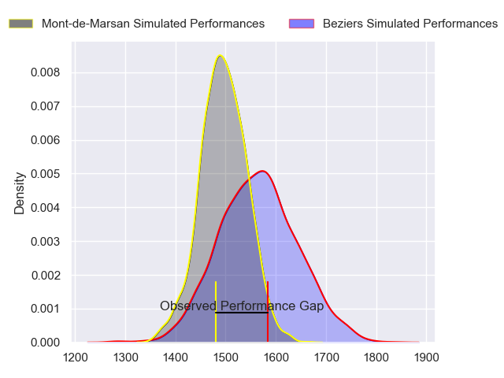
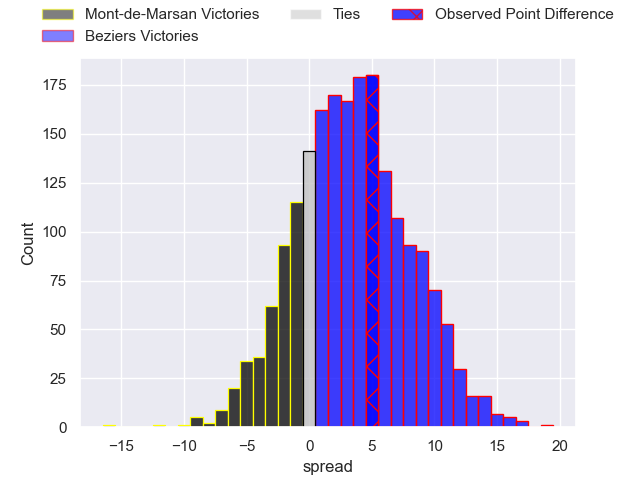
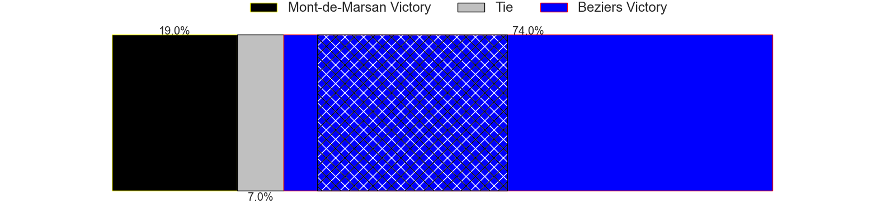
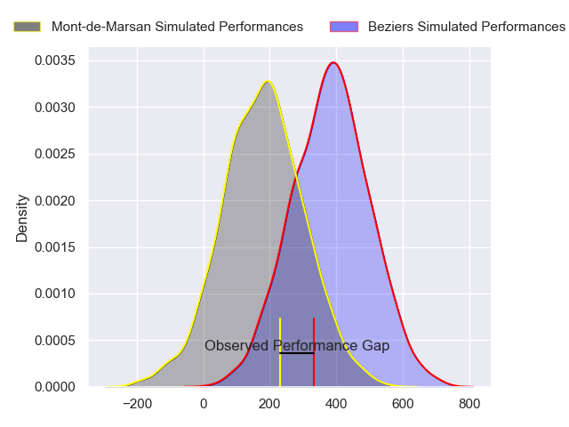
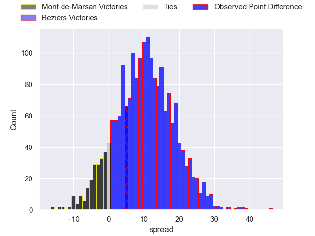
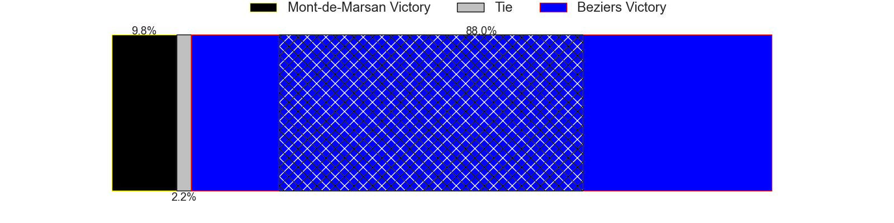

---  
layout: page  
title: Mont-de-Marsan at Beziers; 20-25  
date: 2024-02-16 18:00:00 -0500  
categories: "Pro D2 2023" match review  
---
# Mont-de-Marsan at Beziers; 20-25

# Club Level Predictions

The first set of predictions treats a club as the smallest object, as the club develops its members, organizes a gameplan, and deploys its players as needed for each match. This club model has a prediction of 0.597, which translates to predicting Beziers to win by 3.4.

Our Over/Under is 47.5 - and combined with the spread above, we have a predicted scoreline of 22 to 26

Each club has a rating and a rating deviation (similar to a Glicko rating), and expected performances can be generated. This allows for simulated matches and spreads like the ones below.
## Projected Performances - Club Model

## Projected Spreads - Club Model

## Projected Results - Club Model

# Player Level Predictions - Version 2

Treating teams instead as an entity made up of the currently active players, I have ratings for each player in an altogether different system. These can be combined to form team ratings once teamsheets are announced, weighting starters a bit higher than the reserves. After the match is played, players can be weighted by their minutes on the field, allowing for an accurate measure of the team's composition. With these compiled team ratings, we can make predictions, measure inaccuracy, and update the individual player ratings.
## Prediction without Player Minutes: Beziers by 9.8

Beziers by 1.5 on a neutral pitch

## Projected Performances - Player Model

## Projected Spreads - Player Model

## Projected Results - Player Model

|   Away Minutes | Away Player               |   Away Percentile |   Number |   Home Percentile | Home Player         |   Home Minutes |
|---------------:|:--------------------------|------------------:|---------:|------------------:|:--------------------|---------------:|
|             41 | Dino Casadei              |             59.05 |        1 |             25.36 | Francisco Fernandes |             53 |
|             51 | Torsten van Jaarsveld     |             97.97 |        2 |             48.71 | Yanis Boulassel     |             53 |
|             40 | Mathis Bats               |             70.7  |        3 |             79.93 | Jon Zabala Arrieta  |             53 |
|             80 | Romain Durand             |             79.61 |        4 |             10.83 | Hans N'kinsi        |             80 |
|             80 | Myles Edwards             |             28.57 |        5 |             36.87 | John Madigan        |             80 |
|             80 | Yann Brethous             |             48.04 |        6 |             57.46 | William van Bost    |             80 |
|             41 | Aurélien Lisena           |             54.71 |        7 |             84.02 | Clement Ancely      |             45 |
|             41 | Veresa Tuqovu Ramototabua |             74.07 |        8 |             19.81 | Thomas Hoarau       |             10 |
|             53 | Christophe Loustalot      |             56.19 |        9 |             94.5  | Samuel Marques      |             75 |
|             53 | Joris Pialot              |             18.29 |       10 |             68.88 | Charly Malie        |             80 |
|             80 | Semi Lagivala             |             64.55 |       11 |             68.47 | Maxime Espeut       |             58 |
|             80 | Jules Even                |             75.09 |       12 |             76.02 | Taleta Tupuola      |             80 |
|             68 | Nacani Wakaya             |             91.27 |       13 |             92.4  | Tim Nanai-Williams  |             58 |
|             80 | Eroni Sau                 |             73.97 |       14 |             18.94 | Paul Alquier        |             80 |
|             80 | Théo Cortes               |             45.06 |       15 |             91.72 | Gabin Lorre         |             80 |
|             40 | Mattéo Lalanne            |             56.81 |       16 |             73.89 | Sias Koen           |             70 |
|             39 | Jean-Luc Innocente        |             10.75 |       17 |              9.31 | Gillian Benoy       |             35 |
|             39 | Nicolas Garrault          |             73.96 |       18 |             83.21 | Jose Luis Gonzalez  |             27 |
|             39 | Mike Faleafa              |             38.93 |       19 |             75    | Marco Trauth        |             27 |
|             29 | Florian Dufour            |             49.63 |       20 |             74.73 | Yannick Arroyo      |             27 |
|             27 | Kevin Viallard            |             40.28 |       21 |             59.72 | Paul Recor          |             22 |
|             27 | Willie du Plessis         |             90.26 |       22 |             22.76 | Victor Dreuille     |             22 |
|             12 | Simon Desaubies           |             18.63 |       23 |             21.41 | Jean Victor Goillot |              5 |

