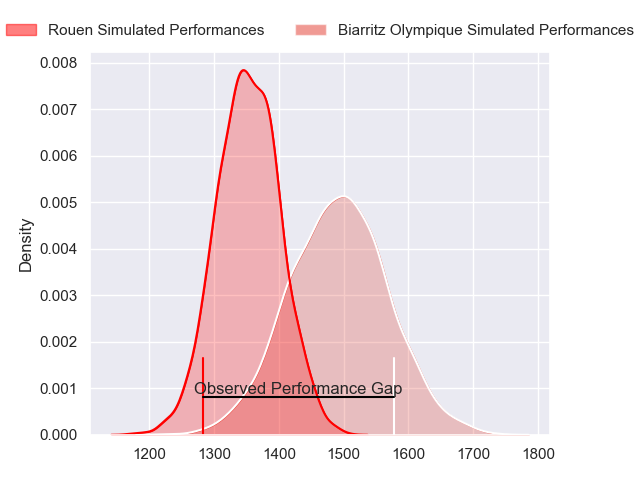
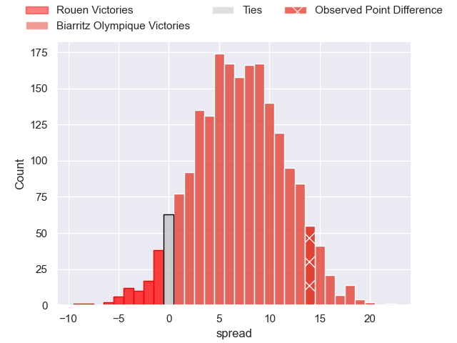
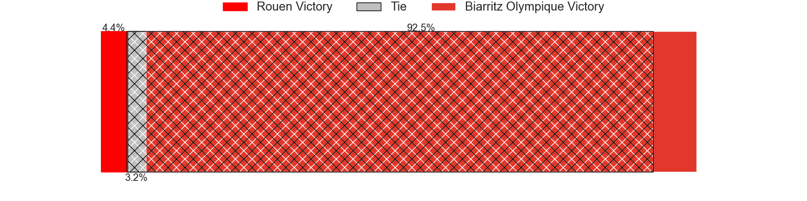
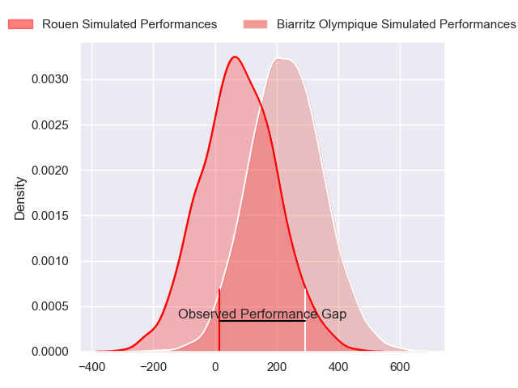
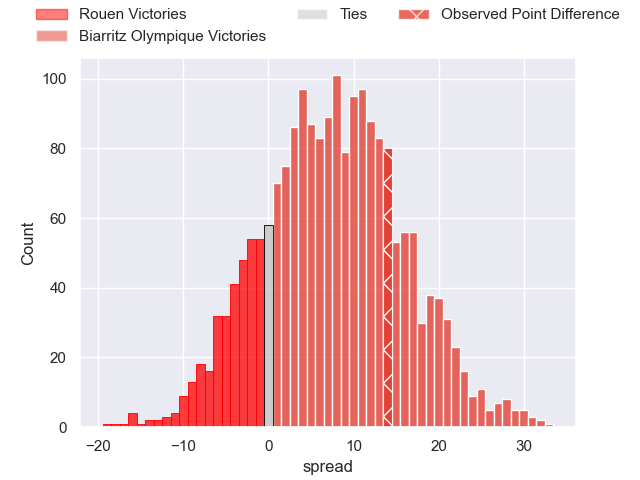
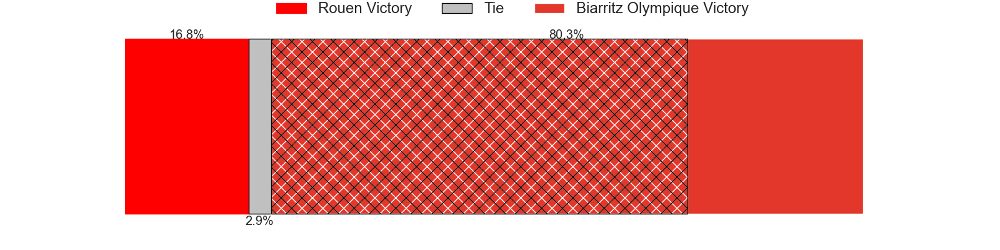

---  
layout: page  
title: Rouen at Biarritz Olympique; 8-22  
date: 2024-02-16 18:00:00 -0500  
categories: "Pro D2 2023" match review  
---
# Rouen at Biarritz Olympique; 8-22

# Club Level Predictions

The first set of predictions treats a club as the smallest object, as the club develops its members, organizes a gameplan, and deploys its players as needed for each match. This club model has a prediction of 0.691, which translates to predicting Biarritz Olympique to win by 7.1.

Our Over/Under is 52.5 - and combined with the spread above, we have a predicted scoreline of 23 to 30

Each club has a rating and a rating deviation (similar to a Glicko rating), and expected performances can be generated. This allows for simulated matches and spreads like the ones below.
## Projected Performances - Club Model

## Projected Spreads - Club Model

## Projected Results - Club Model

# Player Level Predictions - Version 2

Treating teams instead as an entity made up of the currently active players, I have ratings for each player in an altogether different system. These can be combined to form team ratings once teamsheets are announced, weighting starters a bit higher than the reserves. After the match is played, players can be weighted by their minutes on the field, allowing for an accurate measure of the team's composition. With these compiled team ratings, we can make predictions, measure inaccuracy, and update the individual player ratings.
## Prediction without Player Minutes: Biarritz Olympique by 10.3

Biarritz Olympique by 1.6 on a neutral pitch

## Projected Performances - Player Model

## Projected Spreads - Player Model

## Projected Results - Player Model

|   Away Minutes | Away Player       |   Away Percentile |   Number |   Home Percentile | Home Player              |   Home Minutes |
|---------------:|:------------------|------------------:|---------:|------------------:|:-------------------------|---------------:|
|             45 | Cody Thomas       |             18.39 |        1 |             23.93 | Zakaria El Fakir         |             59 |
|             45 | Lucas Malbert     |             18.9  |        2 |             76.33 | Thomas Sauveterre        |             59 |
|             45 | Luka Azariashvili |              3.3  |        3 |             78.93 | Mohamed Haouas           |             59 |
|             80 | Will Witty        |             16.9  |        4 |             70.34 | Charlie Matthews         |             80 |
|             52 | Toby Salmon       |             66.67 |        5 |             63.1  | Nafi Ma'afu              |             54 |
|             45 | Lucas Costa       |             48.48 |        6 |             29.17 | Thomas Hebert            |             30 |
|             80 | Jean Leleu        |             21.83 |        7 |             40.92 | Simon Augry              |             80 |
|             80 | Willy N'Diaye     |              4.69 |        8 |             34.98 | Temo Matiu               |             80 |
|             57 | Maxime Sidobre    |             74.71 |        9 |             51.18 | Imanol Biscay            |             51 |
|             80 | Franck Pourteau   |             76.78 |       10 |             59.95 | Ilian Perraux            |             30 |
|             57 | Benito Masilevu   |             78.41 |       11 |             47.8  | Gervais Cordin           |             80 |
|             80 | Alex Luatua       |              8.48 |       12 |             82.23 | Yann David               |             80 |
|             52 | Opetera Peleseuma |              4.53 |       13 |             70.62 | Tyler Morgan             |             10 |
|             80 | Kevin Bly         |             86.79 |       14 |             13.73 | Zach Kibirige            |             80 |
|             80 | Pete Lydon        |             86.21 |       15 |             67.13 | Joe Jonas                |             80 |
|             35 | Elias El Ansari   |             10.54 |       16 |             12.31 | Vincent Martin           |             70 |
|             35 | Efi Ma'afu        |             30.28 |       17 |              2.99 | Adrian Motoc             |             50 |
|             35 | Soso Bekoshvili   |             59.11 |       18 |              5.45 | Billy Searle             |             50 |
|             35 | Samuel Maximin    |             13.75 |       19 |             55.29 | Kerman Aurrekoetxea      |             29 |
|             28 | Pablo Patilla     |             53.66 |       20 |             41.72 | Pieter Jansen van Vuuren |             26 |
|             28 | Julien Ruaud      |             82.06 |       21 |             18.84 | Kevin Tougne             |             21 |
|             23 | Florent Campeggia |             35.69 |       22 |            nan    | Lasha Tabidze            |             21 |
|             23 | JT Jackson        |             16.38 |       23 |             73.58 | Bastien Soury            |             21 |

