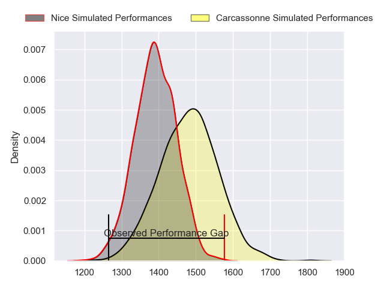
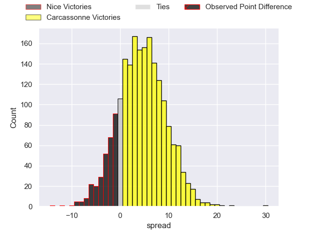
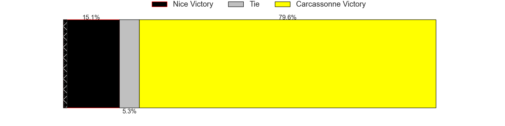
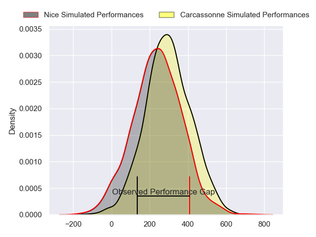
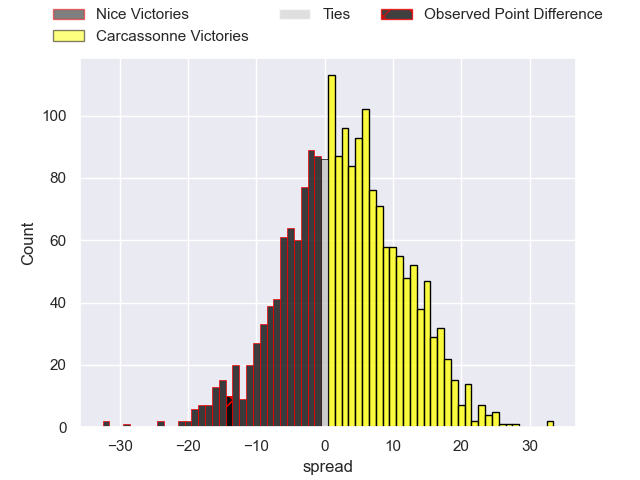
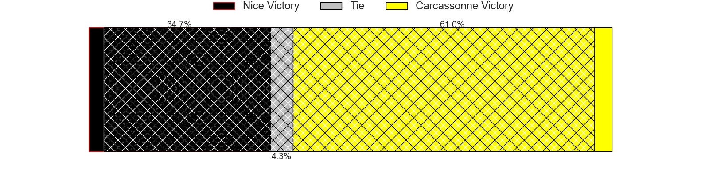

---  
layout: page  
title: Nice at Carcassonne; 23-9  
date: 2024-02-16 18:00:00 -0500  
categories: "Nationale 2023" match review  
---
# Nice at Carcassonne; 23-9

# Club Level Predictions

The first set of predictions treats a club as the smallest object, as the club develops its members, organizes a gameplan, and deploys its players as needed for each match. This club model has a prediction of 0.625, which translates to predicting Carcassonne to win by 4.5.

Our Over/Under is 27.5 - and combined with the spread above, we have a predicted scoreline of 12 to 16

Each club has a rating and a rating deviation (similar to a Glicko rating), and expected performances can be generated. This allows for simulated matches and spreads like the ones below.
## Projected Performances - Club Model

## Projected Spreads - Club Model

## Projected Results - Club Model

# Player Level Predictions - Version 2

Treating teams instead as an entity made up of the currently active players, I have ratings for each player in an altogether different system. These can be combined to form team ratings once teamsheets are announced, weighting starters a bit higher than the reserves. After the match is played, players can be weighted by their minutes on the field, allowing for an accurate measure of the team's composition. With these compiled team ratings, we can make predictions, measure inaccuracy, and update the individual player ratings.
## Prediction without Player Minutes: Carcassonne by 6.0

Nice by 0.0 on a neutral pitch

## Projected Performances - Player Model

## Projected Spreads - Player Model

## Projected Results - Player Model

|   Away Minutes | Away Player          |   Away Percentile |   Number |   Home Percentile | Home Player           |   Home Minutes |
|---------------:|:---------------------|------------------:|---------:|------------------:|:----------------------|---------------:|
|             55 | Jules Martinez       |              3.76 |        1 |             91.67 | Andrei Ursache        |             62 |
|             55 | Pierre Strippoli     |             12.55 |        2 |             50    | Raphael Carbou        |             62 |
|             55 | Nicolas Ciancio      |              9.77 |        3 |             78.32 | Fabien Lorenzon       |             55 |
|             77 | Tom Murday           |             99.88 |        4 |             18.66 | Romain Manchia        |             80 |
|             59 | Martin Freytes       |             57.37 |        5 |             26.96 | Clément Fontaine      |             80 |
|             80 | Louis Suaud          |             97.46 |        6 |             32.59 | Corentin Bousquet     |             55 |
|             80 | Arthur Vignolles     |             75.45 |        7 |             65.29 | Romain Guyot          |             62 |
|             60 | Laijiasa Bolenaivalu |             93.01 |        8 |             68.78 | Etienne Herjean       |             74 |
|             76 | Jules Solinas        |             90.18 |        9 |             20.04 | Gaetan Pichon         |             80 |
|             80 | Romain Riguet        |             84.32 |       10 |             28.74 | Enahemo Artaud        |             80 |
|             80 | Simon Delas          |             94.5  |       11 |             78.73 | Léo Darrelatour       |             80 |
|             71 | Baptiste Lafond      |              2.21 |       12 |             14.32 | Jordan Puletua        |             64 |
|             80 | Luca Cutayar         |             12.34 |       13 |             63.8  | Pierre Aguillon       |             80 |
|             80 | Andrzej Charlat      |             97.57 |       14 |             26.56 | Sakiusa Bureitakiyaca |             80 |
|             80 | David Odiete         |             92.87 |       15 |             68.51 | Maxime Gianet         |             71 |
|             25 | Sunia Vola           |             84.77 |       16 |             49.46 | Florent Lorenzon      |             18 |
|             25 | Sione Anga'aelangi   |             85.42 |       17 |             71.4  | Luka Petriashvili     |             18 |
|             25 | Luvuyo Pupuma        |             74.28 |       18 |              3.23 | Vakhtangi Akhobadze   |             25 |
|              3 | Louis Vincent        |             16.93 |       19 |             60.14 | Shaun Adendorff       |             25 |
|             21 | Thibault Rey         |              5.07 |       20 |             37.25 | Valentin Sese         |             18 |
|             20 | Bastien Berenguel    |             51.22 |       21 |             49.88 | Ferdinand Dreno       |              6 |
|              4 | Corentin Penc'hoat   |             73.33 |       22 |             47.03 | Tutuila Vaea          |             16 |
|              9 | Alban Conduche       |              5.36 |       23 |             33.02 | Damien Añon           |              9 |

