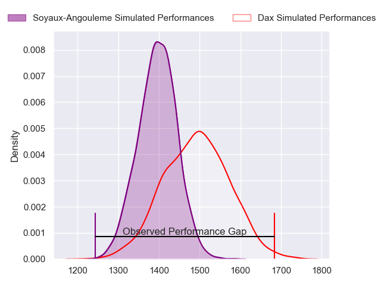
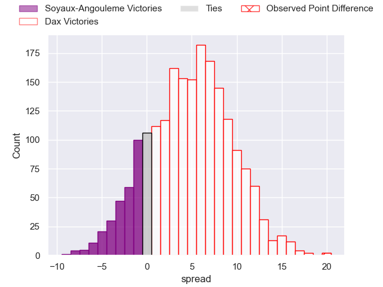
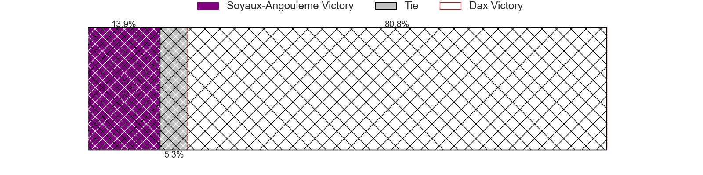
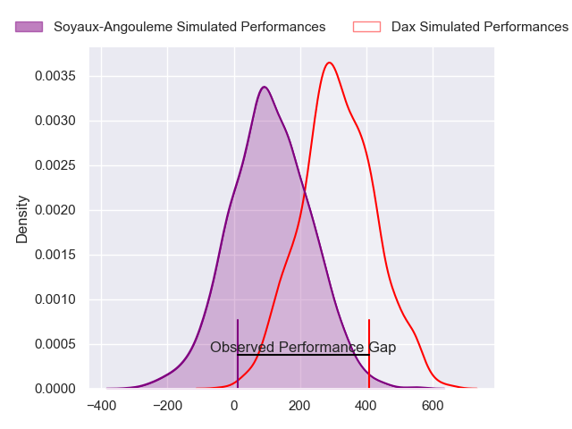
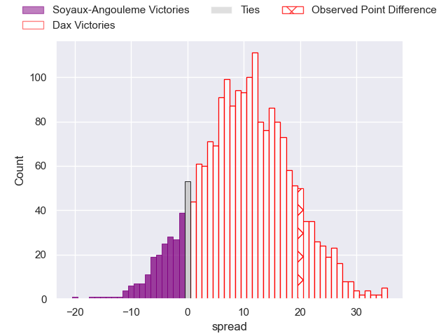
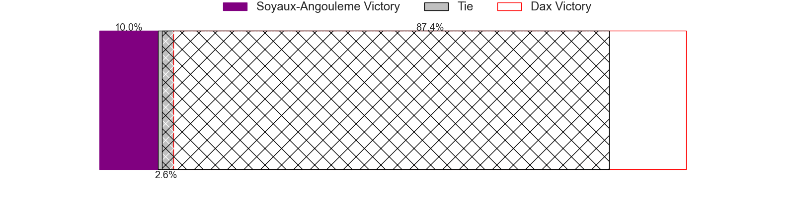

---  
layout: page  
title: Soyaux-Angouleme at Dax; 5-25  
date: 2024-02-16 18:00:00 -0500  
categories: "Pro D2 2023" match review  
---
# Soyaux-Angouleme at Dax; 5-25

# Club Level Predictions

The first set of predictions treats a club as the smallest object, as the club develops its members, organizes a gameplan, and deploys its players as needed for each match. This club model has a prediction of 0.631, which translates to predicting Dax to win by 4.7.

Our Over/Under is 42.5 - and combined with the spread above, we have a predicted scoreline of 19 to 23

Each club has a rating and a rating deviation (similar to a Glicko rating), and expected performances can be generated. This allows for simulated matches and spreads like the ones below.
## Projected Performances - Club Model

## Projected Spreads - Club Model

## Projected Results - Club Model

# Player Level Predictions - Version 2

Treating teams instead as an entity made up of the currently active players, I have ratings for each player in an altogether different system. These can be combined to form team ratings once teamsheets are announced, weighting starters a bit higher than the reserves. After the match is played, players can be weighted by their minutes on the field, allowing for an accurate measure of the team's composition. With these compiled team ratings, we can make predictions, measure inaccuracy, and update the individual player ratings.
## Prediction without Player Minutes: Dax by 10.3

Dax by 2.9 on a neutral pitch

## Projected Performances - Player Model

## Projected Spreads - Player Model

## Projected Results - Player Model

|   Away Minutes | Away Player            |   Away Percentile |   Number |   Home Percentile | Home Player           |   Home Minutes |
|---------------:|:-----------------------|------------------:|---------:|------------------:|:----------------------|---------------:|
|             48 | Luca Tabarot           |             60.71 |        1 |             48.39 | Asa Faitotoa          |             51 |
|             48 | Patxi Bidart           |             43.67 |        2 |             49.72 | Maxime Delonca        |             51 |
|             52 | Yassine Boutemane      |              6.61 |        3 |             16.25 | Nephi Leatigaga       |             51 |
|             48 | Matt Beukeboom         |             18.39 |        4 |             51.72 | Josh Furno            |             80 |
|             80 | Matthew Dalton         |              7.01 |        5 |             71.49 | Mat Luamanu           |             56 |
|             80 | Gautier Gibouin        |              4.62 |        6 |             24.55 | Jean-Baptiste Barrère |             52 |
|             61 | Hubert Texier          |             41.55 |        7 |             26.86 | Ratu Nacika           |             80 |
|             80 | Maxence Lemardelet     |             27    |        8 |             87.09 | Genesis Mamea Lemalu  |             80 |
|             48 | Manu Saubusse          |             50.59 |        9 |             72.75 | Sylvère Reteau        |             48 |
|             44 | Ben Botica             |             71.33 |       10 |             63.74 | Hugo Cerisier         |             56 |
|             80 | Marvin Lestremau       |             31.34 |       11 |             69.29 | Jope Naceava          |             80 |
|             44 | Nasoni Naqiri Kunavore |             88.5  |       12 |             81.07 | Ilikena Bolakoro      |             80 |
|             80 | Ledua Mau              |             77.82 |       13 |             62.02 | Bastien Daguerre      |             80 |
|             80 | Inaki Ayarza           |             40.57 |       14 |             79.56 | Théo Gatelier         |             61 |
|             80 | Jules Dubecq           |             46.9  |       15 |             55.63 | Théo Duprat           |             80 |
|             36 | Akuila Joeli Tabualevu |             80.37 |       16 |             79.22 | Simon Garrouteigt     |             32 |
|             36 | Jacob Botica           |             34.36 |       17 |             67.52 | Iban Hiriart-Urruty   |             29 |
|             32 | Sami Zouhair           |             94.2  |       18 |             73.21 | Louis Mary            |             29 |
|             32 | German Kessler         |             41.28 |       19 |             22.59 | David Lolohea         |             29 |
|             32 | Alexis Levron          |             28.43 |       20 |             61.28 | Arnaud Aletti         |             28 |
|             32 | Saba Pesvianidze       |             21.3  |       21 |             68.97 | Étienne Loiret        |             24 |
|             28 | Seydou Diakité         |             19.38 |       22 |             54.5  | Romuald Séguy         |             24 |
|             19 | Germain Burgaud        |             75.03 |       23 |             10.48 | Maxime Oltmann        |             19 |

